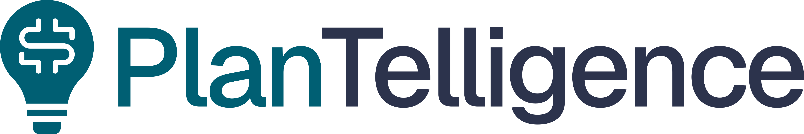

  

<!-- 

  <i align="center">Educational Video Generator</i>

 -->

## Overview

The **Plantelligence Video Generator** is an AI-powered tool that provides Plantelligence’s clients with customizable, professional retirement plan education videos. Built with TypeScript, Next.js, and Tailwind CSS and leveraging Synthesia’s video generation capabilities, it enables clients to easily deliver vital retirement information to employees, promoting financial literacy and helping participants understand their retirement options.

<!-- ## Table of Contents

- [Overview](#overview)
- [Table of Contents](#table-of-contents)
- [Features](#features)
- [Tech Stack](#tech-stack)
- [Getting Started](#getting-started)
- [Environment Variables](#environment-variables)
- [Usage](#usage)
- [Contributing](#contributing)
- [License](#license) -->

## Features

- **Customizable Videos**: Seamless customization to match specific needs.
- **User-Friendly Interface**: Responsive interface for managing content requests.
- **Synthesia AI Integration**: Utilizes Synthesia’s API for pro video creation.
- **Secure and Scalable**: Built with Next.js and TypeScript for robustness.

## Tech Stack

- Next.js
- TypeScript
- Tailwind CSS
- Synthesia API

## Getting Started

To set up the project locally, follow these steps:

1. **Clone the repository**:  
   `git clone https://github.com/camconrad/plantelligence.git`  
   `cd plantelligence`

2. **Install dependencies**:  
   `yarn`

3. **Start the development server**:  
   `yarn dev`

4. Open [http://localhost:3000](http://localhost:3000) in your browser to view the app.

## Environment Variables

Create a `.env.local` file in the root directory and add the following environment variables:

- `NEXT_PUBLIC_SYNTHESIA_API_KEY`: Your Synthesia API key.
- `NEXTAUTH_SECRET`: Secret key for NextAuth.
- `NEXTAUTH_URL`: Base URL for the application.

Example `.env.local` file:

NEXT_PUBLIC_SYNTHESIA_API_KEY=your_synthesia_api_key  
NEXTAUTH_SECRET=your_nextauth_secret  
NEXTAUTH_URL=http://localhost:3000

## Usage

After setting up environment variables and running the development server:

1. **Access the Platform**: Use the app to create new educational videos.
2. **Customize your Content**: Insert branding, specify details, and link plan resources.
3. **Generate and Publish**: Once satisfied, initiate the video generation process.

## License

This project is not yet licensed, and the source code is proprietary. Unauthorized distribution, modification, or use of this code is prohibited. Access is limited to authorized personnel only, and any use outside of granted permissions is strictly forbidden. For inquiries regarding permissions or potential licensing, please contact the project owner via email: Ty Rogers, ty at waypointfas.com.
