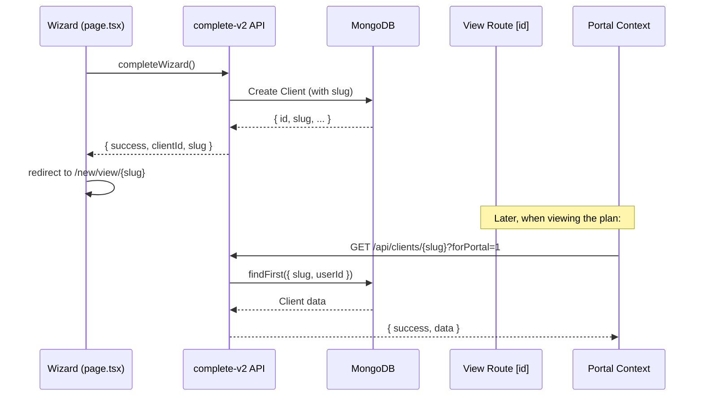

# Slug-Based Plan URLs — Implementation Plan

## Overview

Replace MongoDB ObjectId-based plan view URLs with human-readable slugs generated from the company name.

- **Current:** `/new/view/6a46839839929d77fa05f0c7/retirement`
- **Target:** `/new/view/acme-corp/retirement`

The `[id]` dynamic route in `app/new/view/[id]/` will support **both** ObjectIds and slugs, ensuring full backward compatibility.

---

## Architecture

```mermaid
flowchart TD
    A[Wizard Complete] --> B[/api/new-client-wizard/complete-v2]
    B --> C[Create Client record]
    C --> D[Generate unique slug from companyName]
    D --> E[Store slug on Client model]
    E --> F[Redirect to /new/view/slug]
    
    G[Browser visits /new/view/slug/retirement] --> H[ClientPortalProvider]
    H --> I[GET /api/clients/slug?forPortal=1]
    I --> J{Is it an ObjectId?}
    J -->|Yes| K[findUnique by _id]
    J -->|No| L[findFirst by slug + userId]
    K --> M[Return client data]
    L --> M
    
    N[hub-url.ts] --> O[getBenefitsHubPath uses slug]
    P[All /new/view/ links] --> O
```

## Data Flow (Sequence)



---

## Implementation Steps

### 1. Add `slug` field to Prisma `Client` model

**File:** [`prisma/schema.prisma`](prisma/schema.prisma:650)

Add a new optional, unique field to the `Client` model:

```prisma
model Client {
  // ... existing fields ...
  slug String? @unique  // URL-friendly identifier (e.g., "acme-corp")
  // ...
}
```

**Why nullable?** Existing records won't have slugs — they'll continue working via ObjectId lookup. A backfill migration can be run later.

**Why `@unique` (global)?** The portal-facing lookup (`forPortal=1`) doesn't have a user session, so we can't scope uniqueness by `userId`. Global uniqueness prevents any ambiguity.

### 2. Create slug generation utility

**New file:** `lib/slug.ts`

Two functions:

- `generatePlanSlug(companyName: string): string`
  - Lowercase the name
  - Replace spaces, underscores, and special characters with hyphens
  - Collapse consecutive hyphens
  - Strip leading/trailing hyphens
  - Example: `"Acme Corp!"` → `"acme-corp"`

- `generateUniquePlanSlug(companyName: string): Promise<string>`
  - Generate base slug
  - Query DB for existing slugs with the same prefix
  - If collision, append `-2`, `-3`, etc. until unique
  - Example: second "Acme Corp" → `"acme-corp-2"`

### 3. Generate slug in `complete-v2` API

**File:** [`app/api/new-client-wizard/complete-v2/route.ts`](app/api/new-client-wizard/complete-v2/route.ts:313)

In the `prisma.client.create()` call (around line 313), add:

```typescript
const client = await (prisma.client as any).create({
  data: {
    // ... existing fields ...
    slug: await generateUniquePlanSlug(companyBasics.companyName),
  },
});
```

Also update the response (around line 807) to include the slug:

```typescript
return NextResponse.json({
  success: true,
  message: "New client wizard completed successfully",
  clientId: client.id,
  slug: client.slug,        // ← NEW
  documentsCount: documents.length
});
```

### 4. Update `GET /api/clients/[id]` for dual lookup

**File:** [`app/api/clients/[id]/route.ts`](app/api/clients/[id]/route.ts:20)

The `GET` handler currently does `prisma.client.findUnique({ where: { id: clientId } })`. Update to:

```typescript
import { ObjectId } from "mongodb";

const clientId = params.id;
const isObjectId = ObjectId.isValid(clientId);

// Try ObjectId lookup first
let client = null;
if (isObjectId) {
  client = await prisma.client.findUnique({ where: { id: clientId } });
}

// Fallback to slug lookup
if (!client) {
  if (forPortal) {
    // Public portal: no user session, match slug globally
    client = await prisma.client.findFirst({ where: { slug: clientId } });
  } else {
    // Authenticated: scope slug by userId
    client = await prisma.client.findFirst({
      where: { slug: clientId, userId: session.user.id },
    });
  }
}
```

**Apply the same dual-lookup pattern** to `PUT` and `DELETE` handlers in the same file.

### 5. Update `hub-url.ts` to use slug

**File:** [`lib/marketing/hub-url.ts`](lib/marketing/hub-url.ts:6)

The `getBenefitsHubPath` function already returns `/new/view/${id}`. Since the `[id]` route now handles both IDs and slugs, this function works as-is — no signature change needed. However, we should update its JSDoc to clarify it accepts both.

Optionally, add a new convenience function:

```typescript
export function getBenefitsHubPathFromSlug(slug: string): string {
  return `/new/view/${slug}`;
}
```

### 6. Update wizard redirect after completion

**File:** [`lib/new-client-wizard-store.ts`](lib/new-client-wizard-store.ts:1168)

Currently line 1168 redirects to `/new/clients`:

```typescript
if (result.success && result.clientId) {
  set({ sessionId: result.clientId });
  window.location.href = "/new/clients";  // ← change this
}
```

Update to use the slug:

```typescript
if (result.success && result.clientId) {
  set({ sessionId: result.clientId });
  if (result.slug) {
    window.location.href = `/new/view/${result.slug}`;
  } else {
    window.location.href = "/new/clients";
  }
}
```

### 7. All `/new/view/${clientId}` link constructions

There are **19 locations** across the codebase that construct `/new/view/${clientId}` URLs. Since the `[id]` route now handles both IDs and slugs via dual lookup, **all existing links continue to work without changes**. 

When new links are generated from client data that includes a `slug` field, they should prefer `slug` over `id` for cleaner URLs.

| File | Line | Description |
|------|------|-------------|
| [`lib/marketing/hub-url.ts`](lib/marketing/hub-url.ts:11) | 11 | `getBenefitsHubPath` — central URL builder |
| [`contexts/client-portal-context.tsx`](contexts/client-portal-context.tsx:81) | 81 | `fetchClient` API call |
| [`app/new/view/[id]/layout.tsx`](app/new/view/[id]/layout.tsx:56) | 56 | Portal `basePath` |
| [`components/pages/clients-list-dashboard.tsx`](components/pages/clients-list-dashboard.tsx:261) | 261 | `handleViewClient` |
| [`components/pages/clients-list-dashboard.tsx`](components/pages/clients-list-dashboard.tsx:649) | 649 | Table row click |
| [`components/pages/client-portal/sections/portal-header.tsx`](components/pages/client-portal/sections/portal-header.tsx:104) | 104 | Nav `baseUrl` |
| [`components/pages/client-portal/sections/portal-benefits.tsx`](components/pages/client-portal/sections/portal-benefits.tsx:61) | 61 | Benefit card `basePath` |
| [`components/pages/client-portal/sections/portal-plan-header.tsx`](components/pages/client-portal/sections/portal-plan-header.tsx:42) | 42 | Plan header `baseUrl` |
| [`components/pages/client-portal/sections/how-can-we-help-section.tsx`](components/pages/client-portal/sections/how-can-we-help-section.tsx:68) | 68 | Help section `basePath` |
| [`components/pages/edit-client/edit-client-header.tsx`](components/pages/edit-client/edit-client-header.tsx:33) | 33 | "View" button |
| [`components/wizard/benefits-steps/step-1.tsx`](components/wizard/benefits-steps/step-1.tsx:1511) | 1511 | "Preview" button |
| [`components/pages/marketing/flyer-generator/page.tsx`](components/pages/marketing/flyer-generator/page.tsx:122) | 122 | Flyer QR URL |
| [`app/new/documents/page.tsx`](app/new/documents/page.tsx:220) | 220 | "View" button |
| [`app/new/communications/webinars/page.tsx`](app/new/communications/webinars/page.tsx:479) | 479 | "View" button |
| [`app/new/communications/meetings/page.tsx`](app/new/communications/meetings/page.tsx:330) | 330 | "View" button |
| [`app/new/communications/marketing/page.tsx`](app/new/communications/marketing/page.tsx:236) | 236 | "View" button |

### 8. No middleware changes required

The existing [`middleware.ts`](middleware.ts) only protects `/new/:path*` routes with authentication — the slug lives within the existing `[id]` dynamic segment, so the middleware matcher pattern already covers it.

---

## Backward Compatibility

- All existing ObjectId-based URLs continue to work (the API checks `ObjectId.isValid()` first)
- Existing clients without a `slug` are unaffected (`slug` is nullable)
- A migration script can be run later to backfill slugs for existing records:
  ```typescript
  // scripts/backfill-client-slugs.ts
  const clients = await prisma.client.findMany({ where: { slug: null } });
  for (const client of clients) {
    const slug = await generateUniquePlanSlug(client.companyName);
    await prisma.client.update({ where: { id: client.id }, data: { slug } });
  }
  ```

---

## Key Design Decisions

1. **Slug uniqueness scope**: Global (`@unique`) rather than per-user, because the portal-facing lookup (`forPortal=1`) doesn't have a user session to scope by.

2. **Dual lookup pattern**: ObjectId first, slug fallback. Zero breaking changes.

3. **No new routes needed**: The existing `[id]` dynamic route handles both. No directory restructuring required.

4. **Slug is not user-editable in this MVP phase** — auto-generated from `companyName` at creation time. An "edit slug" feature can be added later.

5. **Slug does not update when company name changes** — this prevents broken external links/bookmarks. If the company renames, the slug stays stable.

---

## Files Changed (Summary)

| File | Action | Description |
|------|--------|-------------|
| [`prisma/schema.prisma`](prisma/schema.prisma:650) | Modify | Add `slug String? @unique` to Client model |
| `lib/slug.ts` | **Create** | Slug generation utility |
| [`app/api/new-client-wizard/complete-v2/route.ts`](app/api/new-client-wizard/complete-v2/route.ts:313) | Modify | Generate slug on client creation; return slug in response |
| [`app/api/clients/[id]/route.ts`](app/api/clients/[id]/route.ts:20) | Modify | Dual lookup: ObjectId → slug fallback (GET, PUT, DELETE) |
| [`lib/marketing/hub-url.ts`](lib/marketing/hub-url.ts:6) | Modify | Update JSDoc; optional convenience function |
| [`lib/new-client-wizard-store.ts`](lib/new-client-wizard-store.ts:1168) | Modify | Redirect to slug-based URL after wizard completion |
