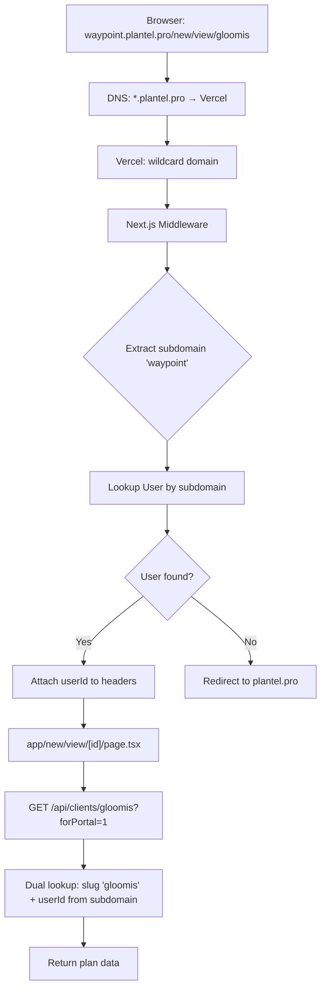

# Subdomain-Based Plan Portal URLs — Implementation Plan

## Target URL Structure

```
waypoint.plantel.pro/new/view/gloomis
│         │           │         │
│         │           │         └── plan slug (from Client.slug)
│         │           └────────── existing portal path
│         └────────────────────── root domain (Namecheap)
└──────────────────────────────── advisor's company subdomain (User.subdomain)
```

- `plantel.pro` = Namecheap domain → points to Vercel
- `waypoint` = the Plantelligence advisor's company subdomain (stored in `User.subdomain`)
- `gloomis` = the plan/client slug (stored in `Client.slug`)

---

## Architecture Overview



---

## Implementation Steps

### Phase 1: Infrastructure (External)

#### 1.1 Namecheap DNS

Add a wildcard CNAME record on `plantel.pro`:

| Type | Host | Value | TTL |
|------|------|-------|-----|
| CNAME | `*` | `cname.vercel-dns.com` | Automatic |

This routes all subdomains (`waypoint.plantel.pro`, `acme.plantel.pro`, etc.) to Vercel.

#### 1.2 Vercel Domain Setup

In the Vercel project settings → Domains:
1. Add `plantel.pro` as a custom domain
2. Enable wildcard subdomain support (requires Pro plan)

Verify in Vercel dashboard that `*.plantel.pro` resolves correctly.

---

### Phase 2: Application Code

#### 2.1 Update `middleware.ts`

**File:** [`middleware.ts`](middleware.ts)

Add subdomain extraction and advisor lookup logic:

```typescript
// Extract subdomain from host header
const host = req.headers.get("host") || "";
const rootDomain = process.env.ROOT_DOMAIN || "plantel.pro";
const subdomain = extractSubdomain(host, rootDomain);

if (subdomain) {
  // Portal request — find the advisor by subdomain
  const user = await prisma.user.findFirst({
    where: { subdomain },
    select: { id: true },
  });

  if (!user) {
    // Invalid subdomain — redirect to root
    return NextResponse.redirect(new URL("/", `https://${rootDomain}`));
  }

  // Pass the advisor's userId to all downstream handlers
  response.headers.set("x-advisor-id", user.id);
  // Also set the root domain for URL resolution
  response.headers.set("x-root-domain", rootDomain);
}
```

Helper function:
```typescript
function extractSubdomain(host: string, rootDomain: string): string | null {
  // "waypoint.plantel.pro" → "waypoint"
  // "plantel.pro" → null (no subdomain)
  // "localhost:3000" → null (local dev)
  if (host === rootDomain || host.startsWith("localhost")) return null;
  const parts = host.replace(`.${rootDomain}`, "").split(".");
  return parts[0] || null;
}
```

**Middleware matcher** — expand to also match portal paths on subdomains:
```typescript
export const config = {
  matcher: [
    "/dashboard/:path*",
    "/new/:path*",
    "/onboarding/:path*",
    "/view/:path*",  // also protect public portal routes
  ]
};
```

#### 2.2 Update Headers for Cross-Subdomain Auth

**File:** [`next.config.js`](next.config.js)

Add cross-origin header support so the dashboard can call portal API endpoints:

```javascript
async headers() {
  return [
    {
      source: "/api/:path*",
      headers: [
        { key: "Access-Control-Allow-Origin", value: "https://*.plantel.pro" },
        { key: "Access-Control-Allow-Credentials", value: "true" },
      ],
    },
  ];
},
```

#### 2.3 Scope Portal Slug Lookup by Advisor

**File:** [`app/api/clients/[id]/route.ts`](app/api/clients/[id]/route.ts:46)

Portal requests (`forPortal=1`) need to be scoped to the advisor identified by the subdomain. The middleware passes `x-advisor-id` header — read it in the API:

```typescript
const forPortal = request.nextUrl.searchParams.get("forPortal") === "1";
// When accessed via subdomain, the advisor ID comes from middleware
const advisorId = request.headers.get("x-advisor-id") || session?.user?.id;

// ... dual lookup ...

if (!client) {
  if (forPortal) {
    // Scope slug lookup to the advisor identified by the subdomain
    client = await prisma.client.findFirst({
      where: { slug: clientId, userId: advisorId },
    });
  } else {
    client = await prisma.client.findFirst({
      where: { slug: clientId, userId: session.user.id },
    });
  }
}
```

This ensures that `waypoint.plantel.pro/new/view/gloomis` only shows plans belonging to the "waypoint" advisor.

#### 2.4 Update Hub URL Generation

**File:** [`lib/marketing/hub-url.ts`](lib/marketing/hub-url.ts:29)

Update `getBenefitsHubAbsoluteUrl` to include the subdomain when available:

```typescript
export function getBenefitsHubAbsoluteUrl(
  clientIdOrSlug: string,
  userSubdomain?: string,
): string {
  const path = getBenefitsHubPath(clientIdOrSlug);
  const rootDomain = process.env.NEXT_PUBLIC_ROOT_DOMAIN || "plantel.pro";

  if (userSubdomain) {
    // Production: https://waypoint.plantel.pro/new/view/gloomis
    return `https://${userSubdomain}.${rootDomain}${path}`;
  }

  // Fallback for local dev or when no subdomain is configured
  const base =
    process.env.NEXT_PUBLIC_APP_URL?.replace(/\/$/, "") ||
    process.env.NEXTAUTH_URL?.replace(/\/$/, "") ||
    "";

  if (!base) {
    throw new Error(
      "Set NEXT_PUBLIC_APP_URL or NEXTAUTH_URL to build flyer Hub QR links",
    );
  }

  return `${base}${path}`;
}
```

#### 2.5 Update Flyer Render Route

**File:** [`app/api/marketing/flyers/render/route.ts`](app/api/marketing/flyers/render/route.ts:84)

The flyer QR code generator currently calls `getBenefitsHubAbsoluteUrl(clientId)`. It needs the user's subdomain:

```typescript
// Fetch the user's subdomain for the flyer QR URL
const user = await prisma.user.findUnique({
  where: { id: session.user.id },
  select: { subdomain: true },
});
hubAbsoluteUrl = getBenefitsHubAbsoluteUrl(clientId, user?.subdomain ?? undefined);
```

#### 2.6 Environment Variables

Add to `.env` and Vercel environment variables:

| Variable | Value | Purpose |
|----------|-------|---------|
| `NEXT_PUBLIC_ROOT_DOMAIN` | `plantel.pro` | Root domain for URL construction |
| `ROOT_DOMAIN` | `plantel.pro` | Server-side domain for subdomain extraction |

Locally, the subdomain logic is skipped (host is `localhost`).

#### 2.7 All Other `/new/view/${clientId}` Constructions

The 19 places that construct `/new/view/${clientId}` URLs use **relative paths** — they don't need changes. Only absolute URL generation (flyer QR codes, email links) needs the subdomain prefix.

---

## Auth Considerations

### NextAuth Session Cookies

For the dashboard (`plantel.pro`) and portals (`waypoint.plantel.pro`) to share auth:

**File:** [`lib/auth-options.ts`](lib/auth-options.ts)

Update the session cookie configuration:

```typescript
cookies: {
  sessionToken: {
    name: `__Secure-next-auth.session-token`,
    options: {
      httpOnly: true,
      sameSite: "lax",
      path: "/",
      secure: true,
      domain: process.env.NODE_ENV === "production"
        ? ".plantel.pro"  // shared across subdomains
        : undefined,       // localhost doesn't support domain cookies
    },
  },
},
```

The leading dot in `.plantel.pro` makes the cookie accessible to all subdomains.

### Portal Access (Unauthenticated)

Portal viewers (employees) don't log in. The `forPortal=1` API parameter bypasses auth. With subdomains, the advisor is identified by the subdomain itself — the middleware extracts it and passes `x-advisor-id` to the API.

---

## Development / Local Testing

Local dev uses `localhost:3000` — subdomain extraction is skipped:

```typescript
function extractSubdomain(host: string, rootDomain: string): string | null {
  if (host === rootDomain || host.startsWith("localhost")) return null;
  // ...
}
```

To test subdomains locally, add to the hosts file (`C:\Windows\System32\drivers\etc\hosts`):
```
127.0.0.1 waypoint.localhost
```

And configure Next.js to allow it:
```javascript
// next.config.js
experimental: {
  allowedHosts: ["waypoint.localhost"],
}
```

Then visit `http://waypoint.localhost:3000/new/view/gloomis`.

---

## Rollout Plan

| Step | Action | Reversible? |
|------|--------|-------------|
| 1 | Add `ROOT_DOMAIN` env vars | Yes |
| 2 | Update middleware with subdomain extraction | Yes |
| 3 | Update `hub-url.ts` with subdomain support | Yes |
| 4 | Scope portal slug lookup by advisor | Yes |
| 5 | Update NextAuth cookie domain | Yes (requires re-login) |
| 6 | Add wildcard CNAME on Namecheap | Yes |
| 7 | Add wildcard domain on Vercel | Yes |
| 8 | Deploy and verify `waypoint.plantel.pro/new/view/gloomis` | — |

---

## Files Changed (Summary)

| File | Action | Description |
|------|--------|-------------|
| `middleware.ts` | Modify | Extract subdomain, lookup User, attach `x-advisor-id` header |
| `app/api/clients/[id]/route.ts` | Modify | Scope `forPortal` slug lookup by advisor (from `x-advisor-id`) |
| `lib/marketing/hub-url.ts` | Modify | Add subdomain prefix to absolute URLs |
| `app/api/marketing/flyers/render/route.ts` | Modify | Pass user subdomain to `getBenefitsHubAbsoluteUrl` |
| `lib/auth-options.ts` | Modify | Set cookie domain to `.plantel.pro` for cross-subdomain auth |
| `next.config.js` | Modify | Add CORS headers for `*.plantel.pro` subdomains |
| `.env` | Modify | Add `NEXT_PUBLIC_ROOT_DOMAIN` and `ROOT_DOMAIN` |
