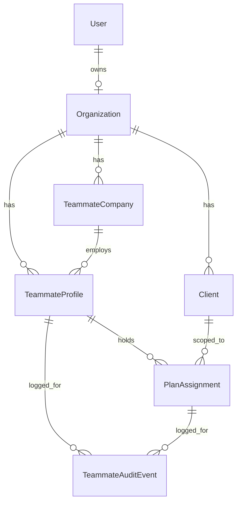

# Teammates Module

Source spec: `Team_Collaborator_Access_Developer_Spec (1).pdf`
T1 design + rationale: [`plans/teammates-t1-data-model.md`](../plans/teammates-t1-data-model.md)

This document covers the data foundation (ticket **T1**) that the rest of the
Team & Collaborator Access feature builds on: T2 (enforcement), T2a (Custom role
grid), T3-T8.

---

## 1. Where things live

| Concern | Location |
|---|---|
| Permission-grid contract (pure) | [`types/teammate.ts`](../types/teammate.ts) |
| Permission rules engine (pure) | [`lib/teammates/permissions.ts`](../lib/teammates/permissions.ts) |
| Company-picker scope rule (pure) | [`lib/teammates/company-scope.ts`](../lib/teammates/company-scope.ts) |
| Teammate data access (server) | [`lib/teammates/`](../lib/teammates) |
| Organization helpers (server) | [`lib/organization.ts`](../lib/organization.ts) |
| Session/org resolution | [`lib/organization-session.ts`](../lib/organization-session.ts) |
| Verification + ops scripts | [`scripts/teammates/`](../scripts/teammates) |

The data-access modules are named `*.server.ts` deliberately: they import Prisma
and must never be pulled into a client bundle.

---

## 2. Data model



- **`Organization`** — tenancy root. One per advisor `User` (`ownerUserId`),
  created at signup or by the backfill script.
- **`TeammateCompany`** — Partner Company (spec Part B item 2). Always
  `entityType = partner_provider`. One company serves many profiles.
- **`TeammateProfile`** — the reusable person (spec Part B item 1): identity,
  contact details, specialty, optional partner company, optional global
  `loginUserId`, and the Team-Member-only `allPlans` flag.
- **`PlanAssignment`** — one record per person per plan (spec Part B item 3):
  category scope, role, the full `permissionSet` grid, and the hub-visibility
  toggle.
- **`TeammateAuditEvent`** — who changed what, when, and which soft warnings were
  confirmed.

### Org anchoring is additive by design

`User.id` remains the anchor for every pre-existing query (300+ call sites across
`app/api`). T1 adds `organizationId` *alongside* the legacy `userId` on `User`
and `Client` rather than renaming it:

- `Client.userId` is untouched, so nothing that already works breaks.
- New teammate code scopes exclusively by `organizationId`, obtained via
  [`lib/organization.ts`](../lib/organization.ts) — never from the session
  directly.
- `Client.organizationId` is nullable; helpers that need it tolerate an unstamped
  plan by falling back to the owner comparison (see
  `assertPlanInOrganization` in [`lib/teammates/assignments.server.ts`](../lib/teammates/assignments.server.ts)).

Teammate collections intentionally use plain scalar `organizationId` fields
instead of Prisma `@relation`s: the Mongo connector requires both sides of a
relation to be declared and adds referential-action semantics that an additive
migration does not want.

---

## 3. Permission grid

[`types/teammate.ts`](../types/teammate.ts) is the single source of truth for the
14 grid functions from spec T2a:

`plan_details_branding`, `create_benefits`, `key_contacts`, `documents`,
`meetings`, `marketing`, `video`, `disclaimers_compliance`,
`benefits_hub_preview`, `publish`, `invite`, `delete`, `org_settings`, `billing`.

Levels are `no_access | view | edit` for content rows and
`not_allowed | allowed` for `publish`, `invite`, `delete` (see
`permissionOptionsFor`).

**Preset grids** (`PRESET_PERMISSION_GRIDS`) — Owner (everything), Admin
(everything except Billing), Editor (create/edit, no publish/invite/delete/org/
billing), Contributor (category-scoped edit for collaborators), Viewer and
Reviewer (read-only).

**Collaborator hard blocks** (`COLLABORATOR_LOCKED_FUNCTIONS`) — Publish, Invite,
Delete, Org Settings, Billing. These can never be granted, including by a direct
API call: [`upsertAssignment`](../lib/teammates/assignments.server.ts) finalizes
the grid and then *validates* the caller's raw input, rejecting a request that
tried to smuggle a locked permission through.

Per spec T2a, the full grid is always stored on the assignment, never a reference
to a preset — so editing a preset later cannot alter existing Custom users.

---

## 4. Rules engine

[`lib/teammates/permissions.ts`](../lib/teammates/permissions.ts) exports:

- `resolveAssignmentGrid` / `finalizePermissionSet` — preset lookup plus
  normalization, auto-enforced rules, and hard blocks.
- `applyAutoEnforcedRules` — Edit implies View; Publish requires Disclaimers View;
  Delete requires Edit on at least one content function.
- `applyHardBlocks` / `lockedFunctionViolations` — collaborator hard blocks.
- `validatePermissionSet` — structural violations (including
  `collaborator_all_plans` when a plan scope is supplied).
- `evaluateSoftWarnings` — all ten spec soft warnings, checked per plan.
- `summarizePermissionSet` — the plan-aware line from T2a Step 3,
  e.g. `Custom · Edits Documents on Ayres · Views Precision Optical`.
- `matchPreset` — backs the "This matches [Editor]. Use the preset instead?" warning.

---

## 5. Scripts

| Command | What it does |
|---|---|
| `npm run teammates:check-schema` | Verifies the 5 T1 collections and 15 indexes exist. |
| `npm run teammates:indexes` | Applies the T1 indexes directly (idempotent). |
| `npm run teammates:backfill` | Creates one Organization per existing User and stamps `organizationId` onto User + Client rows. Supports `--dry-run`. |
| `npm run teammates:verify` | Runs the 24-assertion T1 acceptance suite against the real data layer with self-cleaning fixtures. |
| `npm run teammates:verify-backfill` | Asserts the post-backfill invariants (every User/Client org'd, legacy `Client.userId` intact). |
| `npm run repair:unique-conflicts` | Finds (and with `--apply`, removes) duplicate session rows that block unique-index builds. |
| `npm run repair:partial-indexes` | Re-applies the partial unique index on `Client.slug`. |
| `npm run repair:purge-orphaned-user` | Inventories (dry run) then with `--apply` removes everything left behind by a deleted User account. |

`prisma db push` now completes cleanly and reports "already in sync" on a second
run. The `teammates:indexes` script remains as a fallback for the case where a
push aborts part-way and leaves new collections without their indexes.

---

## 6. T1 status

Status: **implemented and verified** (not yet reviewed/accepted).

Acceptance criteria from the spec, all asserted by
[`scripts/teammates/verify-t1.ts`](../scripts/teammates/verify-t1.ts):

| Criterion | Result |
|---|---|
| Jane holds assignments on three plans from one profile | Pass |
| Editing Jane's profile in Org A does not change her profile in Org B | Pass |
| Partner companies never appear in Plan Sponsor search | Pass |
| Two collaborators from ABC Benefits share one company record | Pass |

Extra assertions cover the compound unique (one assignment per person per plan),
full-grid persistence, the collaborator Publish hard block surviving a DB round
trip, reuse-or-create by email, and cross-organization isolation of both profiles
and companies.

### Verifying locally

```bash
npx prisma generate
npm run teammates:check-schema
npm run teammates:verify-backfill
npm run teammates:verify
```

All three must pass. As of the last run: schema check OK (5 collections, 15
indexes), backfill verification all assertions passed, T1 acceptance suite
24/24 passed, and `npx tsc --noEmit` reports no errors.

---

## 7. Database repairs applied

`npx prisma db push` was blocked by pre-existing data / schema problems unrelated
to T1. Because MongoDB pushes are not transactional, each blocker revealed the
next one. All are now resolved, and a push reports "already in sync".

### 7.1 Duplicate session rows (14 removed)

Several wizard step models declare `sessionId @unique`, but the wizard writes
those rows with a read-then-write pattern (`findFirst` → update or create), so a
retried or concurrent step save leaves a second row for the same session. One such
duplicate aborts the entire push, skipping every index after it.

Removed: 1 `WizardClientProfile`, 5 `WizardTeamSize`, 2 `WizardServices`,
2 `WizardUserSetup`, 4 `NewClientKeyContacts` — the most recently updated row per
session is kept. Backups:

- `scripts/repair/backups/wizard-client-profile-<ts>.json`
- `scripts/repair/backups/unique-conflicts-<ts>.json`

`npm run repair:unique-conflicts` re-checks this (dry run by default). It also
scans `Client.slug`, `PortalSlug.slug`, and `Benefit(clientId, category)` and
**reports** conflicts there without deleting anything — a duplicate in primary
business data is a decision, not a repair. That scan currently reports none.

### 7.2 `Client.slug` — `@unique` removed

`slug String? @unique` is unsatisfiable on MongoDB once two plans have no slug: a
Mongo unique index treats every null as a real key, so the build fails with
`dup key: { slug: null }`. Three plans currently have a null slug.

Resolution:

- `@unique` removed from `Client.slug` in [`prisma/schema.prisma`](../prisma/schema.prisma)
  (the only affected call site, `findUnique` in
  [`app/api/check-portal-url/route.ts`](../app/api/check-portal-url/route.ts), was
  switched to `findFirst`).
- Global slug uniqueness is unaffected: it is guaranteed by `PortalSlug.slug`
  (`@unique`, non-null), which registers every current **and retired** slug.
- A partial unique index (`partialFilterExpression: { slug: { $type: "string" } }`)
  is additionally applied to `Client.slug` so real slugs stay unique at the
  database level. Prisma cannot express this declaratively, so it is managed by
  `npm run repair:partial-indexes` and survives `db push`.

### 7.3 Prisma/MongoDB `null` filter semantics (important)

On this Prisma + MongoDB combination, `{ field: null }` matches **only explicit
nulls — never absent fields**. This silently broke plan stamping in the first
backfill run (`plans stamped: 0`) and the `listTeammateProfiles` deactivation
filter.

Any "not yet set" filter must therefore cover both shapes:

```ts
where: {
  OR: [{ field: null }, { field: { isSet: false } }],
}
```

All occurrences are fixed: [`stampPlansWithOrganization`](../lib/organization.ts),
the backfill script, [`listTeammateProfiles`](../lib/teammates/profiles.server.ts)
and [`listAllPlansTeamMembers`](../lib/teammates/profiles.server.ts).

### 7.5 Duplicate-profile guard at the writer

`TeammateProfile(organizationId, email)` carries no unique constraint, and only
[`findOrCreateProfile`](../lib/teammates/profiles.server.ts) was de-duplicating —
so a caller using [`createTeammateProfile`](../lib/teammates/profiles.server.ts)
directly could create the duplicate the spec forbids. The guard now lives at
`createTeammateProfile`, the only writer: it refuses with
`profile_email_exists` (409), or `profile_email_deactivated` when the existing
row is deactivated and should be reactivated instead. Covered by two assertions
in `verify-t1`.

### 7.4 Orphaned rows from a deleted account — purged

Two plans (`Gloomis`, `Loading LLC`) and their content were owned by
`userId=6a9b1976b81208c857a6922b`, an account deleted during this work. Deleting a
`User` only removes the `User` row, so everything that referenced it survived as
unattributable data — the backfill could not assign it an Organization, and
teammate assignment on those plans would have been refused.

```
npm run repair:purge-orphaned-user            # dry run: inventory only
npm run repair:purge-orphaned-user -- --apply # delete
```

Removed **20 rows across 13 tables**: 2 plans, 4 documents, 2 benefits, 2 meetings,
4 meeting custom types, 2 wizard sessions + their step rows, 1 new-client wizard
session, plus the plan-scoped portal slugs and videos the cascade owns. Full dump
written first to
`scripts/repair/backups/purged-user-6a9b1976b81208c857a6922b-<ts>.json`.

Deletion reuses the app's own cascades
([`deleteClientAndScopedData`](../lib/delete-client-scoped-data.ts) and
[`deletePlansAndScopedDataForUser`](../lib/delete-user-plans-and-scoped-data.ts)),
so plan-scoped children are removed in the order their required relations demand.
The script refuses to run while the `User` still exists, and verifies zero
remaining references afterwards. `verify-backfill` now reports no orphans.

---

## 8. Residual migration debt

Tracked, deliberately **not** part of T1:

1. **`userId` → `organizationId` across ~300 call sites.** New code must use
   `lib/organization.ts`; the T2 enforcement layer in particular should read only
   org-scoped helpers.
2. **R2 key prefixes.** Object keys are `org/{userId}/…` and validated by prefix
   (`app/api/r2/signed-url`, `r2/delete`, `r2/presign-upload`, and the
   `buildUploadKey({ orgId })` callers). Moving to a stable organization id
   invalidates existing keys, so it needs a copy/alias plan.
3. **Portal owner resolution.** `lib/portal-access.ts` derives the owning advisor
   from `Client.userId`; it should resolve through `organizationId`.
4. **Organization membership.** `Organization` currently models a single
   `ownerUserId`. If a firm ever needs multiple owners/admins at the org level,
   that belongs on `Organization` rather than on this feature's models.
5. **New-plan auto-assignment.** Spec Part B item 4 ("All Plans" generates an
   assignment for every new plan) has its data support (`listAllPlansTeamMembers`)
   but is not yet wired into plan creation — that lands with T3/T6.

---

## 9. Next tickets

- **T2** — permission enforcement layer at the API boundary. Should consume
  `lib/organization.ts` + `lib/teammates/permissions.ts` and add signed-URL
  assignment checks.
- **T2a** — Custom role UI over the existing grid contract (no schema change).
- **T3** — Settings → Team, seat counter, onboarding invite step.
