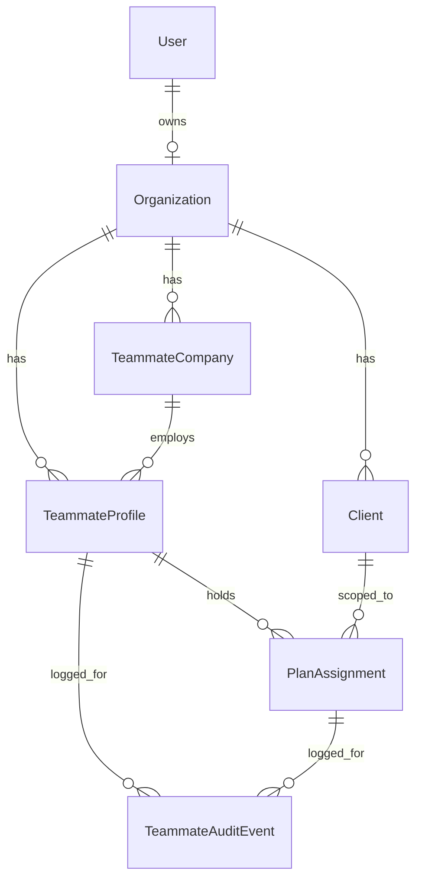

# Teammates Module

Source spec: `Team_Collaborator_Access_Developer_Spec (1).pdf`
T1 design + rationale: [`plans/teammates-t1-data-model.md`](../plans/teammates-t1-data-model.md)

This document covers the data foundation (ticket **T1**) that the rest of the
Team & Collaborator Access feature builds on: T2 (enforcement), T2a (Custom role
grid), T3-T8.

---

## 1. Where things live

| Concern | Location |
|---|---|
| Permission-grid contract (pure) | [`types/teammate.ts`](../types/teammate.ts) |
| Permission rules engine (pure) | [`lib/teammates/permissions.ts`](../lib/teammates/permissions.ts) |
| Role descriptions for the UI (pure, derived from the grids) | [`lib/teammates/role-summary.ts`](../lib/teammates/role-summary.ts) |
| Company-picker scope rule (pure) | [`lib/teammates/company-scope.ts`](../lib/teammates/company-scope.ts) |
| Teammate data access (server) | [`lib/teammates/`](../lib/teammates) |
| Organization helpers (server) | [`lib/organization.ts`](../lib/organization.ts) |
| Session/org resolution | [`lib/organization-session.ts`](../lib/organization-session.ts) |
| Verification + ops scripts | [`scripts/teammates/`](../scripts/teammates) |

The data-access modules are named `*.server.ts` deliberately: they import Prisma
and must never be pulled into a client bundle.

---

## 2. Data model



- **`Organization`** — tenancy root. One per advisor `User` (`ownerUserId`),
  created at signup or by the backfill script.
- **`TeammateCompany`** — Partner Company (spec Part B item 2). Always
  `entityType = partner_provider`. One company serves many profiles.
- **`TeammateProfile`** — the reusable person (spec Part B item 1): identity,
  contact details, specialty, optional partner company, optional global
  `loginUserId`, and the Team-Member-only `allPlans` flag.
- **`PlanAssignment`** — one record per person per plan (spec Part B item 3):
  category scope, role, the full `permissionSet` grid, and the hub-visibility
  toggle.
- **`TeammateAuditEvent`** — who changed what, when, and which soft warnings were
  confirmed.

### Org anchoring is additive by design

`User.id` remains the anchor for every pre-existing query (300+ call sites across
`app/api`). T1 adds `organizationId` *alongside* the legacy `userId` on `User`
and `Client` rather than renaming it:

- `Client.userId` is untouched, so nothing that already works breaks.
- New teammate code scopes exclusively by `organizationId`, obtained via
  [`lib/organization.ts`](../lib/organization.ts) — never from the session
  directly.
- `Client.organizationId` is nullable; helpers that need it tolerate an unstamped
  plan by falling back to the owner comparison (see
  `assertPlanInOrganization` in [`lib/teammates/assignments.server.ts`](../lib/teammates/assignments.server.ts)).

Teammate collections intentionally use plain scalar `organizationId` fields
instead of Prisma `@relation`s: the Mongo connector requires both sides of a
relation to be declared and adds referential-action semantics that an additive
migration does not want.

---

## 3. Permission grid

[`types/teammate.ts`](../types/teammate.ts) is the single source of truth for the
14 grid functions from spec T2a:

`plan_details_branding`, `create_benefits`, `key_contacts`, `documents`,
`meetings`, `marketing`, `video`, `disclaimers_compliance`,
`benefits_hub_preview`, `publish`, `invite`, `delete`, `org_settings`, `billing`.

Levels are `no_access | view | edit` for content rows and
`not_allowed | allowed` for `publish`, `invite`, `delete` (see
`permissionOptionsFor`).

**Preset grids** (`PRESET_PERMISSION_GRIDS`) — Owner (everything), Admin
(everything except Billing), Editor (create/edit, no publish/invite/delete/org/
billing), Contributor (category-scoped edit for collaborators), Viewer and
Reviewer (read-only).

**Collaborator hard blocks** (`COLLABORATOR_LOCKED_FUNCTIONS`) — Publish, Invite,
Delete, Org Settings, Billing. These can never be granted, including by a direct
API call: [`upsertAssignment`](../lib/teammates/assignments.server.ts) finalizes
the grid and then *validates* the caller's raw input, rejecting a request that
tried to smuggle a locked permission through.

Per spec T2a, the full grid is always stored on the assignment, never a reference
to a preset — so editing a preset later cannot alter existing Custom users.

---

## 4. Rules engine

[`lib/teammates/permissions.ts`](../lib/teammates/permissions.ts) exports:

- `resolveAssignmentGrid` / `finalizePermissionSet` — preset lookup plus
  normalization, auto-enforced rules, and hard blocks.
- `applyAutoEnforcedRules` — Edit implies View; Publish requires Disclaimers View;
  Delete requires Edit on at least one content function.
- `applyHardBlocks` / `lockedFunctionViolations` — collaborator hard blocks.
- `validatePermissionSet` — structural violations (including
  `collaborator_all_plans` when a plan scope is supplied).
- `evaluateSoftWarnings` — all ten spec soft warnings, checked per plan.
- `summarizePermissionSet` — the plan-aware line from T2a Step 3,
  e.g. `Custom · Edits Documents on Ayres · Views Precision Optical`.
- `matchPreset` — backs the "This matches [Editor]. Use the preset instead?" warning.

---

## 5. Scripts

| Command | What it does |
|---|---|
| `npm run teammates:check-schema` | Verifies the 5 T1 collections and 15 indexes exist. |
| `npm run teammates:indexes` | Applies the T1 indexes directly (idempotent). |
| `npm run teammates:backfill` | Creates one Organization per existing User and stamps `organizationId` onto User + Client rows. Supports `--dry-run`. |
| `npm run teammates:verify` | Runs the 24-assertion T1 acceptance suite against the real data layer with self-cleaning fixtures. |
| `npm run teammates:verify-t2` | Runs the 35-assertion T2 enforcement suite (the three T2 acceptance criteria, the one-Owner invariant, plan lists, and the route guard). |
| `npm run teammates:verify-t3` | Runs the 53-assertion T3 suite (seat metering, invite expiry, the upgrade-confirm gate, the owner-first team list, onboarding pre-fill, editing a member, and the roles explainer). |
| `npm run teammates:verify-backfill` | Asserts the post-backfill invariants (every User/Client org'd, legacy `Client.userId` intact). |
| `npm run teammates:verify-t4` | Runs the 62-assertion T4 suite (the invite path, the category merge, the deep link, the Who-is-this presets, the sponsor-domain guess, the search, and the audit row). |
| `npm run teammates:verify-t5` | Runs the 38-assertion T5 suite (contact → invited without duplication, the plan-scoped section choice, the Contributor default, the source on the audit row, and the merge on re-invite). |
| `npm run repair:unique-conflicts` | Finds (and with `--apply`, removes) duplicate session rows that block unique-index builds. |
| `npm run repair:partial-indexes` | Re-applies the partial unique index on `Client.slug`. |
| `npm run repair:purge-orphaned-user` | Inventories (dry run) then with `--apply` removes everything left behind by a deleted User account. |
| `npm run repair:purge-verification-fixtures` | Removes fixtures stranded by an interrupted verify run (dry run; `--apply` to delete). See §7.7. |

Each verify script also **sweeps stranded fixtures before it asserts** and installs a
SIGINT/SIGTERM handler that sweeps before exiting (§7.7), so an interrupted run is
self-healing rather than something you have to notice and repair. Do not run two
verifications concurrently — each sweep removes the other's rows, because a foreign
stamp is indistinguishable from a stranded one.

### Toolchain prerequisites

- **pnpm** is the declared package manager (`packageManager: pnpm@10.22.0`), but
  Node does not bundle it. Install it once with `npm install -g pnpm@10.22.0`
  (or `corepack enable pnpm`). pnpm reads `nodeLinker: hoisted` from
  `pnpm-workspace.yaml` — that setting must not move back into `.npmrc`, where
  npm warns about it on every command.
- **Windows PowerShell** refuses npm's `.ps1` shims under the default
  `Restricted` execution policy, producing
  `pnpm : ... cannot be loaded because running scripts is disabled`.
  `Set-ExecutionPolicy -Scope CurrentUser -ExecutionPolicy RemoteSigned` fixes it
  without admin rights.

`prisma db push` now completes cleanly and reports "already in sync" on a second
run. The `teammates:indexes` script remains as a fallback for the case where a
push aborts part-way and leaves new collections without their indexes.

---

## 6. T1 status

Status: **implemented and verified** (not yet reviewed/accepted).

Acceptance criteria from the spec, all asserted by
[`scripts/teammates/verify-t1.ts`](../scripts/teammates/verify-t1.ts):

| Criterion | Result |
|---|---|
| Jane holds assignments on three plans from one profile | Pass |
| Editing Jane's profile in Org A does not change her profile in Org B | Pass |
| Partner companies never appear in Plan Sponsor search | Pass |
| Two collaborators from ABC Benefits share one company record | Pass |

Extra assertions cover the compound unique (one assignment per person per plan),
full-grid persistence, the collaborator Publish hard block surviving a DB round
trip, reuse-or-create by email, and cross-organization isolation of both profiles
and companies.

### Verifying locally

```bash
npx prisma generate
npm run teammates:check-schema
npm run teammates:verify-backfill
npm run teammates:verify
npm run teammates:verify-t2
```

All of these must pass. As of the last run: schema check OK (5 collections, 15
indexes); backfill verification all assertions passed; T1 acceptance suite 24/24;
T2 enforcement suite 23/23; `npx tsc --noEmit` and `npx next lint` both clean.

---

## 7. Database repairs applied

`npx prisma db push` was blocked by pre-existing data / schema problems unrelated
to T1. Because MongoDB pushes are not transactional, each blocker revealed the
next one. All are now resolved, and a push reports "already in sync".

### 7.1 Duplicate session rows (14 removed)

Several wizard step models declare `sessionId @unique`, but the wizard writes
those rows with a read-then-write pattern (`findFirst` → update or create), so a
retried or concurrent step save leaves a second row for the same session. One such
duplicate aborts the entire push, skipping every index after it.

Removed: 1 `WizardClientProfile`, 5 `WizardTeamSize`, 2 `WizardServices`,
2 `WizardUserSetup`, 4 `NewClientKeyContacts` — the most recently updated row per
session is kept. Backups:

- `scripts/repair/backups/wizard-client-profile-<ts>.json`
- `scripts/repair/backups/unique-conflicts-<ts>.json`

`npm run repair:unique-conflicts` re-checks this (dry run by default). It also
scans `Client.slug`, `PortalSlug.slug`, and `Benefit(clientId, category)` and
**reports** conflicts there without deleting anything — a duplicate in primary
business data is a decision, not a repair. That scan currently reports none.

### 7.2 `Client.slug` — `@unique` removed

`slug String? @unique` is unsatisfiable on MongoDB once two plans have no slug: a
Mongo unique index treats every null as a real key, so the build fails with
`dup key: { slug: null }`. Three plans currently have a null slug.

Resolution:

- `@unique` removed from `Client.slug` in [`prisma/schema.prisma`](../prisma/schema.prisma)
  (the only affected call site, `findUnique` in
  [`app/api/check-portal-url/route.ts`](../app/api/check-portal-url/route.ts), was
  switched to `findFirst`).
- Global slug uniqueness is unaffected: it is guaranteed by `PortalSlug.slug`
  (`@unique`, non-null), which registers every current **and retired** slug.
- A partial unique index (`partialFilterExpression: { slug: { $type: "string" } }`)
  is additionally applied to `Client.slug` so real slugs stay unique at the
  database level. Prisma cannot express this declaratively, so it is managed by
  `npm run repair:partial-indexes` and survives `db push`.

### 7.3 Prisma/MongoDB `null` filter semantics (important)

On this Prisma + MongoDB combination, `{ field: null }` matches **only explicit
nulls — never absent fields**. This silently broke plan stamping in the first
backfill run (`plans stamped: 0`) and the `listTeammateProfiles` deactivation
filter.

Any "not yet set" filter must therefore cover both shapes:

```ts
where: {
  OR: [{ field: null }, { field: { isSet: false } }],
}
```

All occurrences are fixed: [`stampPlansWithOrganization`](../lib/organization.ts),
the backfill script, [`listTeammateProfiles`](../lib/teammates/profiles.server.ts)
and [`listAllPlansTeamMembers`](../lib/teammates/profiles.server.ts).

### 7.5 Duplicate-profile guard at the writer

`TeammateProfile(organizationId, email)` carries no unique constraint, and only
[`findOrCreateProfile`](../lib/teammates/profiles.server.ts) was de-duplicating —
so a caller using [`createTeammateProfile`](../lib/teammates/profiles.server.ts)
directly could create the duplicate the spec forbids. The guard now lives at
`createTeammateProfile`, the only writer: it refuses with
`profile_email_exists` (409), or `profile_email_deactivated` when the existing
row is deactivated and should be reactivated instead. Covered by two assertions
in `verify-t1`.

### 7.4 Orphaned rows from a deleted account — purged

Two plans (`Gloomis`, `Loading LLC`) and their content were owned by
`userId=6a9b1976b81208c857a6922b`, an account deleted during this work. Deleting a
`User` only removes the `User` row, so everything that referenced it survived as
unattributable data — the backfill could not assign it an Organization, and
teammate assignment on those plans would have been refused.

```
npm run repair:purge-orphaned-user            # dry run: inventory only
npm run repair:purge-orphaned-user -- --apply # delete
```

Removed **20 rows across 13 tables**: 2 plans, 4 documents, 2 benefits, 2 meetings,
4 meeting custom types, 2 wizard sessions + their step rows, 1 new-client wizard
session, plus the plan-scoped portal slugs and videos the cascade owns. Full dump
written first to
`scripts/repair/backups/purged-user-6a9b1976b81208c857a6922b-<ts>.json`.

Deletion reuses the app's own cascades
([`deleteClientAndScopedData`](../lib/delete-client-scoped-data.ts) and
[`deletePlansAndScopedDataForUser`](../lib/delete-user-plans-and-scoped-data.ts)),
so plan-scoped children are removed in the order their required relations demand.
The script refuses to run while the `User` still exists, and verifies zero
remaining references afterwards. `verify-backfill` now reports no orphans.

### 7.6 Plan creation now stamps `organizationId` — fixed

Every teammate read filters plans by `organizationId`, and **no** creation path used to
set it. All four wrote `userId` only:

| Route | Was |
|---|---|
| [`POST /api/clients`](../app/api/clients/route.ts) | `{ ...body, userId }` |
| [`POST /api/clients/create`](../app/api/clients/create/route.ts) | explicit field list, no org |
| [`POST /api/new-client-wizard/complete`](../app/api/new-client-wizard/complete/route.ts) | explicit field list, no org |
| [`POST /api/new-client-wizard/save-draft`](../app/api/new-client-wizard/save-draft/route.ts) | `{ ...clientUpdateData, userId }` behind an `as any` |

The consequence was not theoretical: a plan created after the last backfill run was
**invisible to the org-scoped layer** — `listAccessiblePlanIds` would not return it,
`assertPlanInOrganization` would refuse teammate assignment on it, and the T5 invite
raised against a draft id would fail. It surfaced during this work as one unstamped
client, and `verify-backfill` reported it as "every Client whose owner still exists is
stamped with an organizationId".

Each route now calls the existing idempotent
[`getOrCreateOrganizationForUser(actorUserId)`](../lib/organization.ts) and writes the
result, **after** any object spread so a caller-supplied value cannot place a plan in
another organization. In `save-draft` only the create branch stamps — the update branch
leaves the column alone, because re-stamping on every autosave would be pointless work
on a row this route already stamped.

The existing drifted row was fixed with `npm run teammates:backfill` (1 plan stamped).
`verify-backfill` now also prints the offending plan's name and id, plus the remedy for
each of the two causes, because "1 unstamped" alone does not say whether to re-run the
backfill or to sweep a fixture.

### 7.7 Interrupted verify runs no longer strand fixtures — fixed

`verify-t1` … `verify-t5` build isolated fixtures, assert, and delete them unless
`--keep` is passed. A Ctrl-C, a dropped connection or a crash skipped the cleanup, and a
stranded fixture owner has no Organization — which fails the NEXT `verify-backfill` on
two assertions that read like code regressions and are not.

Two mechanisms now make that self-healing, both in
[`scripts/teammates/shared.ts`](../scripts/teammates/shared.ts):

- **`sweepStaleFixtures()` runs at the start of every verify script**, so an interrupted
  run's rows are gone before anything is asserted. `exceptStamps` spares the current
  run.
- **`installFixtureGuards()` sweeps on SIGINT/SIGTERM** before exiting, so Ctrl-C leaves
  the database clean rather than waiting for the next run.

Selection is deliberately narrow. Owners must match
`/^t[1-5]-verify-…@example\.test$/i`; because `verify-t2` deliberately creates an
organization whose `ownerUserId` is a *fabricated* id (it asserts the "owner User is
gone" case) and a plan inside it, rows are also matched by name against
`/^t\d[ -]verify-/i`. The Prisma `contains`/`endsWith` filters are coarse pre-cuts —
the typed API has no `$regex` — and the JS regexes are what decide, so they can only
narrow the set. `npm run repair:purge-verification-fixtures` is the same sweep as a
manual command, dry-run by default.

Two implementation notes worth keeping:

- **No `"__none__"` sentinels.** `id` and `profileId` are ObjectIds and Prisma validates
  every value in an `in` list, so a placeholder string raises `P2023 Malformed ObjectID`.
  An empty `in: []` already matches nothing.
- **"Nothing to purge" must check every count, not just users.** A run can have zero
  stranded users and still leave an organization and its audit rows behind.

Verified end-to-end: `npm run teammates:verify-t2 -- --keep` (deliberately stranding
4 users plus the ghost org and plan) followed by `npm run teammates:verify-backfill`
printed `Swept 4 fixture user(s)…` and passed all 7 assertions; before the fix the same
sequence failed 3.

---

## 8. T2 — Permission enforcement layer

Implemented. The engine is [`lib/teammates/access.server.ts`](../lib/teammates/access.server.ts);
the pure, client-safe half is [`lib/teammates/permission-levels.ts`](../lib/teammates/permission-levels.ts).

### The single decision function

`resolvePlanAccess({ userId, clientIdOrSlug, category?, permission?, level? })`
returns a discriminated result, so the API can map it to a status and the UI can
render the right refusal:

| Outcome | When | API mapping |
|---|---|---|
| `kind: "owner"` | `Client.userId` is the caller, or the plan's Organization is owned by them | allow |
| `kind: "teammate"` | profile for this org + assignment for this plan, category and function all satisfied | allow |
| `not_assigned` | no profile in the org, or no assignment for this plan | 403 |
| `profile_deactivated` | profile exists but is deactivated | 403 |
| `category_not_assigned` | assigned, but not to the requested category | 403 |
| `permission_denied` | assigned, but the grid denies the function/level | 403 |
| `plan_not_found` | plan doesn't resolve | 404 |

Two deliberate design points:

- **Owner detection checks `Client.userId` first.** An owner whose Organization
  row has not been backfilled yet is never locked out of their own plans.
- **Hard blocks are re-applied on top of the stored grid** (`effectivePermissionSet`),
  so a Custom grid that somehow carries Publish/Invite/Delete/Org Settings/Billing
  still cannot be exercised by a collaborator. This is T2's "hard rule, including
  for Custom roles".

### Signed URLs (Part B item 3)

R2 keys are `org/{orgId}/plans/{planId}/{documents|branding|uploads}/…`
([`lib/r2.ts`](../lib/r2.ts)). `parseR2Key` extracts the **plan** segment, so a
signed-URL request is checked against the caller's assignment rather than the bare
`org/{userId}/` prefix match the routes used before. Legacy org-level keys (no
plan segment) still fall back to an ownership check.

### UI (Part A)

- [`components/pages/no-access-notice.tsx`](../components/pages/no-access-notice.tsx)
  — the restricted-page state, using the spec's copy verbatim.
- [`app/api/teammates/plan-access/route.ts`](../app/api/teammates/plan-access/route.ts)
  — returns the same decision the mutating routes enforce, plus the effective
  `permissionSet` so controls can be hidden/disabled.
- [`hooks/usePlanAccess.ts`](../hooks/usePlanAccess.ts) — client hook over that
  endpoint, with a fail-closed `can(fn, level)`.
- Reference wiring: [`app/(dashboard)/edit-benefit/[planId]/[category]/page.tsx`](../app/(dashboard)/edit-benefit/[planId]/[category]/page.tsx)
  renders `NoAccessNotice` instead of the editor when denied.
- **`loading` is not `denied`** — a distinction that had to be made explicit, twice.

  1. A falsy `planId` (exactly what `useParams()` returns on the first client render
     of a dynamic route) was reported as `denied`, so the notice flashed with
     `Reference: unknown` — no server decision had been made at all.
  2. With that fixed it still flashed, because of an **abort race**: the effect's
     cleanup aborts the in-flight request when the inputs change, and they *do* change
     right after mount (the plan arrives, then the category). An aborted fetch still
     runs its `.finally`, which cleared `loading` while `state` was still `null` — so
     the hook fell through to `denied` for as long as the *replacement* request took
     (~1s on a cold route).

  Both are fixed in [`usePlanAccess`](../hooks/usePlanAccess.ts): an `active` flag now
  guards **every** state write from a run, including the `.finally`, so a superseded
  request publishes nothing; and the decision ladder is
  `!planId → loading`, `loading → loading`, `!state → loading`, and only a real
  response body can produce `denied`. The no-reason fallback is `lookup_incomplete`
  rather than `unknown`. The page renders a spinner for the loading state instead of
  `null`, so the wait reads as a wait. Fail-closed is unchanged where it matters:
  `can()` returns false while loading, and a failed lookup is still refused — the hook
  simply never *claims* a refusal that no one issued.

The UI check is presentation only. The API is the enforcement point — a client
that ignores the hook still gets refused by the server.

### Route coverage

Adoption goes through [`lib/teammates/plan-guard.server.ts`](../lib/teammates/plan-guard.server.ts):

- `authorizePlan(...)` — decision only.
- `getAuthorizedClient(...)` — the drop-in for
  `prisma.client.findFirst({ where: { id: clientId, userId } })`, returning the
  full `Client` row when the actor owns the plan **or** holds an assignment for
  it. One query: the row is loaded once and authorized in place.

| Route | Enforced |
|---|---|
| `GET /api/clients` | scoped to `listAccessiblePlanIds` — see "Plan lists" below |
| `GET /api/r2/signed-url` | plan assignment + documents/branding permission |
| `GET /api/r2/object` | same rule (portal path resolves the plan owner) |
| `GET /api/documents/[id]/view` | `documents: view` + category scope (dashboard); anonymous portal path unchanged |
| `GET/POST /api/documents` | `documents: view` per plan; list scoped by accessible plans; uploads need `documents: edit` |
| `PATCH/DELETE /api/documents/[id]` | `documents: edit` on the document's plan |
| `POST /api/documents/reorder` | `documents: edit` per plan (was a `client: { userId }` relation filter) |
| `GET /api/clients/[id]` | assignment required to read the plan |
| `GET/PUT /api/clients/[id]/benefits/[category]` | `create_benefits` at `view` / `edit` + category scope |
| `GET/POST /api/clients/[id]/meetings` | `meetings: view` (replaced the local `assertClientOwner`) |
| `PATCH/DELETE /api/clients/[id]/meetings/[meetingId]` | `meetings: view` (replaced the `userId` column filter) |
| `GET/POST /api/marketing/assets` | `marketing: edit` |
| `/api/marketing/flyers/{render,generate-copy,[id],[id]/file}` | `marketing` via `getAuthorizedPlanClient` / `resolvePlanAccess` |
| `GET/POST /api/webinars` | `marketing` at `view` / `edit`; list scoped by accessible plans |

### Plan lists

"Collaborators never see unassigned plans" is implemented **at the API source,
not per component**: every plan picker in the app reads `GET /api/clients`
(Documents, Marketing, Meetings, Videos, Webinars, Benefits Step 1, the clients
dashboard), and that route now scopes its `where` to
[`listAccessiblePlanIds`](../lib/teammates/access.server.ts) — owned plans plus
assigned teammate plans — instead of `userId` alone. A teammate is therefore
structurally unable to select a plan they have no assignment for, and a
deactivated teammate's plans drop out of the list.

### Still owner-scoped

- `/api/webinars/[id]` (PATCH/DELETE) and `/api/webinars/bulk-delete`
- `/api/documents/{batch,expiring,client/[clientId]}`
- `/api/clients/[id]/{slugs,portal-data}`
- `/api/videos/*` and the legacy `/api/plans/*`

The first three are the same mechanical swap to `getAuthorizedClient` /
`resolvePlanAccess`, and remain owner-only until then — so a teammate is refused
rather than over-permitted. The risk is under-access, not leakage.

The last group is **not** mechanical and is deliberately out of T2. Videos and
legacy plans are scoped by the `Plan` model (`plan: { userId }`), which teammate
assignments do not model at all: an assignment is `Client`-scoped. Migrating them
requires deciding whether an assignment should also grant access to a `Plan` row —
a product question, not a refactor.

### Verification

```
npm run teammates:verify-t2     ->  23/23 assertions passed
```

Covers: the Contributor is allowed Ayres → Group Health and denied Ayres →
Retirement (`category_not_assigned`) and Precision Optical (`not_assigned`); the
throwing form returns 403 with the spec copy; the Viewer can read but not save
edits or publish; a signed document URL is refused to an unassigned user, allowed
to an assigned Viewer, and refused across plans because the key's plan segment is
enforced; and the one-Owner invariant refuses removing the last Owner.

---

## 9. T3 — Team Member management + seat counter

Implemented. Seat logic lives in [`lib/teammates/seats.server.ts`](../lib/teammates/seats.server.ts);
team management in [`lib/teammates/team.server.ts`](../lib/teammates/team.server.ts);
the onboarding prefill in [`lib/teammates/onboarding-owner.ts`](../lib/teammates/onboarding-owner.ts).

### Seat rules

| Rule | Behaviour |
|---|---|
| Who holds a seat | The owner, Active Team Members, and unexpired pending invites. Contacts and Collaborators never do (spec Part B item 1). |
| Invite hold | A pending invite reserves a seat for 14 days, then stops counting. The meter ignores stale invites immediately, and a sweep moves them back to `Contact` so the stored state is truthful — the profile is kept, never deleted. |
| At the limit | A 409 with code `seat_limit`, not a hard block, so the UI shows an upgrade confirm (Part B item 3). Confirming requires Owner/Admin (`isOwnerOrAdminOfOrganization`), otherwise 403 `seat_limit_owner_only`. |
| Domain guess | A matching email domain defaults to Team Member, anything else to Collaborator (Part B item 4). It is only a default — the API returns it and the UI can override. |

### Two decisions the spec left open

Both are centralised so they are one-line changes:

- **The owner occupies a seat** — `OWNER_CONSUMES_SEAT` in [`seats.server.ts`](../lib/teammates/seats.server.ts).
  The spec says only Team Members use seats and that the owner is the first Team
  Member, so the owner counts. Set it to `false` to give the owner a free seat.
- **A confirmed over-limit add raises `seatsIncluded` by one**, standing in for "they
  moved to a bigger tier" until pricing exists. It keeps the meter honest rather
  than showing "6 of 5 used". `DEFAULT_SEATS_INCLUDED` (5) and
  `PLACEHOLDER_PLAN_TIER` are the other placeholders.

### API

| Route | Purpose |
|---|---|
| `GET /api/teammates/team` | Both Settings → Team lists (`team` + `collaborators`) plus the seat meter. Sweeps expired invites first. |
| `POST /api/teammates/team` | Add a Team Member/Collaborator: domain guess, seat check, then profile + one assignment per plan. |
| `GET /api/teammates/seats` | The meter alone, for the dashboard. |
| `PATCH /api/teammates/team/[profileId]` | Edit a membership (name, role, plan access, benefits access), or `action: "deactivate" \\| "reactivate"` for the spec T6 state transition. |

All three are gated on the `org_settings` permission, which is what produces the
spec's "Owner/Admin only" outcome — a Collaborator can never hold Org Settings
(hard block), so they cannot list or add Team Members at all.

### UI

- Settings gains a **Team Members** tab built around **one card per seat**: an
  occupied card shows the person (headshot, name, email, role, status, plan and
  category access) and opens the **Edit Team Member** modal; an open card opens the
  **Add Team Member** modal. The grid is `max(seatsIncluded, members)` wide, so if
  the organization is over its allowance no member is hidden. Usage and the pending
  invite count sit above the grid, with the upgrade-confirm dialog on a
  seat-limited add.
- **Collaborators** get their own accordion *under* the seat cards, because a seat
  is exactly what they do not consume: listing them as cards would imply they hold
  one. Each row shows headshot, name, email, the partner company (T1's
  `TeammateCompany`, which is how one firm's several people are recognisable), the
  summarised role and status, plan + category access, and Edit /
  Deactivate–Reactivate actions. "Add Collaborator" reuses the same modal, pinned
  to `type: "collaborator"` so a same-domain address is still created as a
  Collaborator; the modal's Team-Member mode still leaves the type to the server's
  email-domain guess, which its own copy explains.
- The client renders that list from a **separate server reader**,
  `listCollaborators`, and the two lists are deliberately disjoint: only
  `listTeamMembers` synthesizes the owner row, and each filters on
  `TeammateProfile.type`. Both now share one internal row builder (`listOrgPeople`),
  so plan scope, category scope and the summarised role are computed identically —
  a Collaborator row cannot report access differently from a seat card.
- `AccessFields` gained two props so the collaborator flow reuses it honestly:
  `roles` (Contributors/Reviewer/Viewer via `COLLABORATOR_PRESET_ROLES` — a
  Collaborator can never be Owner or Admin) and `allowAllPlans` (spec T2a: "All
  Plans is shown for Team Members only"). Since a collaborator whose assignments
  cover every plan reports scope `all`, `openEdit` maps that back to the explicit
  plan list — the same access, expressed in the only form their editor offers.
- `updateTeamMember` was widened from Team-Member-only to **any membership**. The
  old `type !== "team_member"` rejection was redundant rather than protective: the
  permission grid already refuses a role the person's type may not hold, and the
  last-Owner guard lives in the assignment writers. Two rules stayed type-aware —
  `allPlans` is never set on a Collaborator, and a newly created assignment
  defaults to Contributor for one (Editor for a Team Member), matching
  `addTeamMember`.
- **Edit** reconciles rather than replaces: the desired plan set is computed from
  the requested scope, assignments for dropped plans are removed, and the survivors
  are upserted with the new role and category scope. It reuses `upsertAssignment` /
  `removeAssignment`, so the permission grid, the collaborator hard blocks and the
  never-remove-the-last-Owner guard all still apply to an edit.
- A **roles explainer** sits where the decision is made: a "What can this role do?"
  popover beside the Role field describes the *currently selected* role, and a
  "Roles & permissions" dialog lists Team Members and Collaborators as an
  **accordion per role** — the header shows a one-line gist (e.g. "Edits 8 · views
  1 · can publish, invite, delete") so the whole list scans without expanding.
- The dialog's accordions are **controlled and always start collapsed**: opening
  the dialog clears both sections, so a reader never sees a stale expansion. An
  open row tints its own background (`primary/[0.04]`) and the capability detail
  sits on a `bg-muted` panel, so the detail is unambiguously attached to its role.
- Proximity refinements: each row is a bordered card with `space-y-2` gaps (not a
  hairline-divided list); a **per-role left accent colour** reserves a transparent
  2px border so nothing shifts on open and the accent simply fades in; rows are
  grouped under headings that carry a role count; and the two groups are separated
  by a rule. Role colours are literal Tailwind classes in `ROLE_ACCENT_BORDER`, so
  they survive JIT purging.
- The role chip's `Badge` variant is chosen by **section**, not by the role's own
  audience: `variant="default"` under Team Members, `variant="secondary"` under
  Collaborators. Viewer appears in both lists, so deriving the variant from the
  role made the Collaborators > Viewer chip render solid while its two neighbours
  rendered muted — the chip must match the list it sits in.
- The **owner's card** opens the same modal in a read-only state, pointing at the
  Profile tab — their access always covers every plan, so there is nothing to scope.
- **Settings header** — the page sets the organization name as the page-title
  `subtitle`, so the shared header renders `Settings / {Organization Name}` with the
  name in `text-accent-blue`. The precedence mirrors the Branding tab's own
  resolution (wizard branding → `User.organizationName` → `User.organizationType`)
  so the header can never disagree with what that tab displays. The effect is
  declared *after* the `setTitle` effect because `setTitle` clears the subtitle.
- **Fixed a stale-profile snapshot on the Settings page** (found while wiring the
  header). `userProfile` was populated by a `profileSyncedRef` latch that copied
  `cachedProfile` only on the *first* sync, so every `userProfile?.…` fallback
  (branding's `organizationName`/`website`, the organization tab, the header) kept
  reading a pre-save object — a renamed organization, or a logo that had just been
  cleared, could be resurrected from it. Three changes: the latch is now a plain
  mirror (`useEffect(() => { if (cachedProfile) setUserProfile(cachedProfile) })`),
  the page uses SWR's `mutate` through a new `refreshProfile()` helper so a save
  actually re-reads the profile, and the three save handlers call
  `await refreshProfile()` where they used to call `invalidateProfileCache()`.

  Why `mutate` was required: SWR is configured with `dedupingInterval: 60_000` and
  `revalidateOnFocus: false`, so it never refetches on its own — clearing the
  module-level cache in [`lib/fetch-profile.ts`](../lib/fetch-profile.ts) alone did
  **not** reach `cachedProfile`, which is SWR's own store. `refreshProfile()`
  clears the module cache first and only then triggers the revalidation, so the
  fetcher hits the network instead of being served the value just invalidated. The
  mirror is safe to widen because the populate effect still prefers the wizard
  store (`stepData`) for every field the forms edit, so an in-progress edit is not
  overwritten by a refetch.

### The explainer cannot drift from enforcement

[`lib/teammates/role-summary.ts`](../lib/teammates/role-summary.ts) computes each
role's capability lists from `PRESET_PERMISSION_GRIDS` — the same table the API
checks — so changing a preset updates the UI text automatically. Only the
one-line summaries are authored, because no grid can express "and ownership
transfer". `verify-t3` asserts the explainer is complete (every one of the 14
functions lands in exactly one bucket per role), that Owner has no No-Access rows,
that Editor/Viewer get no publish or delete, and that **no collaborator preset is
described as allowed to publish, invite or delete**.
- **Seat cards carry the person's headshot.** `listTeamMembers` returns a `headshot`
  per row: `TeammateProfile.headshot` for teammates, and for the synthesized owner
  the chain `latest session userSetup.headshot` → `User.headshot` →
  `branding.aiAvatar`, mirroring [`/api/profile`](../app/api/profile/route.ts:143)
  and [`/api/profile/header`](../app/api/profile/header/route.ts:59) so the card
  cannot disagree with the header avatar. The value is returned **as stored** — an
  R2 `org/…` key or an absolute/data URL, never a signed URL, which would expire
  inside a list payload. The card renders it through
  [`components/ui/headshot.tsx`](../components/ui/headshot.tsx), which resolves the
  R2 proxy, retries once on error, and falls back to a monogram of the name, so a
  member with no photo still renders something. That also replaced this section's
  local `initialsOf` helper, which is now removed.
- An **ⓘ "How seats work" dialog** sits beside the "N of M seats used" line. It is
  driven by the same `getSeatUsage` payload the meter renders, so its four figures
  (used / active / pending / available) are live rather than restated, and it
  surfaces an amber callout when `atLimit` is true. Each rule it states is one the
  server enforces in [`lib/teammates/seats.server.ts`](../lib/teammates/seats.server.ts):
  only Team Members hold a seat, the owner's seat is always counted
  (`OWNER_CONSUMES_SEAT`), an invite holds a seat for 14 days and then releases
  back to a Contact (`INVITE_SEAT_HOLD_DAYS`, `expireStaleInvites`), deactivating
  frees the seat, and the limit produces an upgrade confirm rather than a block
  (`assertSeatAvailable`).
- The dialog's **reserved-seat rule is viewer-aware**, because the reserved seat
  belongs to the *organization* (`Organization.ownerUserId`), not to the reader —
  an Admin reaches this tab (they hold `org_settings`) without owning the
  organization, so a static "your own seat is counted" would be false for them.
  The row for the owner in the team list supplies both the id and the name: the
  dialog says "Your own seat is counted" only when `ownerRow.userId` matches
  `session.user.id`, otherwise it names the owner ("**{name}** is the organization
  owner and always the first Team Member…"), and falls back to an unnamed version
  while the list or the session is still resolving. All three variants are true —
  only the grammatical person changes.
- The **dashboard** shows the same seat meter. `useSeatUsage` resolves to null
  without org-settings access, so a Viewer or Collaborator simply doesn't see it.
- **Onboarding**: the invite step opens with the owner pre-filled as the first
  member, and the step is skippable.

Two things to know about the onboarding piece:

1. The owner's canonical representation is the Organization's `ownerUserId`. The
   Settings → Team list **synthesizes** the owner's row from it rather than storing
   a TeammateProfile, so there is no second copy to drift, and the owner is
   guaranteed to be the first row.
2. The pre-fill reads the owner's name/email from the wizard store's user-setup
   step, which runs *after* the invite step — so on a first pass the row appears as
   soon as that identity is known, and is immediately present on any revisit.
   `withOwnerPrefill` is reference-stable, so re-running it never loops.

### Acceptance

```
npm run teammates:verify-t3     ->  53/53 assertions passed
```

Covers all three criteria: an invite fills a seat and an aged invite releases it
(both in the meter and via the sweep, with the profile kept); the team list works
with no onboarding team-step data and an empty step passes validation, so
onboarding cannot depend on it; and the owner is the first Team Member with the
Owner role and Active status. Plus the domain guess, that a Collaborator consumes
no seat, the upgrade-confirm gate refusing a non-owner, the onboarding pre-fill
(owner first, idempotent, no-op without an identity), and the edit path narrowing
All Plans to a single plan — removing the dropped assignment, flipping the
`allPlans` flag off, and applying the new role and category scope to the survivor.

---

## 9b. T4 — Invite Collaborator from Create Benefits

Shipped: **A1, A2, A3, A5, A6 + B1, B2, B3, B5.** Two items are deferred on purpose
— see "Deferred" at the end of this section.

### Where it lives

| Piece | File |
|---|---|
| Invite writer, plan-assignment reader, collaborator search | [`lib/teammates/invites.server.ts`](../lib/teammates/invites.server.ts) |
| "Who is this?" table + preset mapping (shared with the dialog) | [`types/teammate.ts`](../types/teammate.ts) |
| Invite email template | [`sendCollaboratorInviteEmail`](../lib/email.ts:745) |
| Dialog | [`invite-collaborator-dialog.tsx`](../components/pages/benefits/invite-collaborator-dialog.tsx) |
| Card button + "Assigned to …" chip | [`benefits-list.tsx`](../components/pages/benefits/benefits-list.tsx) |
| Contacts-step accordion (invite lives here) | [`step-3.tsx`](../components/wizard/benefits-steps/step-3.tsx) |

### Entry points — the Create / Edit benefits workflow

1. **Browse Benefits** (`/benefits`): next to Edit on each created category card, with
   the "Assigned to …" line directly above it.
2. **Contacts step** — the one place that serves **both** the Edit Benefit Contacts tab
   (`<BenefitsStep3 section="contacts" />`) and Create Benefits Step 3
   (`<BenefitsStep3 />`), so a single implementation covers both workflows. It renders
   two **accordion sections**, both open by default:
   - **Support Contacts** — the existing behaviour (the plan's people, capped per
     benefit), now collapsible with a "N of MAX" badge in its header.
   - **Collaborators** — who is assigned to this plan, each row showing headshot, name,
     email, partner company, role, state (or "Deactivated") and a "This section" /
     "Other sections" badge derived from whether that assignment covers the category
     being edited. **Invite Collaborator** lives here, and the invite section is
     disabled until Step 1 has both a plan and a category, because those two things are
     what the invite is scoped by — the dialog never asks for them.

   The invite deliberately moved off the page footers: an earlier pass put it in the
   Edit Benefit bottom action bar and the wizard footer, which made it a page-level
   action competing with Cancel/Save rather than something about *who helps with this
   section*. The `BenefitsWizard.extraActions` slot added for that is gone again.

### API

| Route | Purpose |
|---|---|
| `POST /api/teammates/invite-collaborator` | Resolve/reuse the person, merge the assignment, audit, then email. |
| `GET /api/teammates/invite-collaborator?clientId=&email=` | The domain guess for the address being typed. |
| `GET /api/teammates/plan-assignments?planId=` | Who is assigned to a plan, for the card chips. |
| `GET /api/teammates/collaborators/search?q=` | "Add Existing Collaborator" typeahead. |

`POST` is gated on `org_settings: edit`, which is the Open Decision's "Can Editors
invite Collaborators? **No: Owner/Admin only**" expressed as one rule — a Collaborator
can never hold that row (hard block) and an Editor's grid does not include it. The
two GETs are gated on `org_settings: view`, except `plan-assignments`, which checks
the caller's own access to *that plan* because it is read from a plan screen.

### The rules, and where they come from

1. **Scope is pinned, never asked for.** The dialog receives `planId` and `category`
   from the card it was opened on and shows them as locked chips, so an invite from
   Ayres → Group Health writes exactly one assignment for exactly that plan and
   category (the acceptance criterion).
2. **"Who is this?" → preset lives in `types/teammate.ts`** as data
   (`WHO_IS_THIS_OPTIONS` / `roleForWhoIsThisContext`), so the dialog and the writer
   cannot disagree: Plan Sponsor HR, Outside Advisor/Specialist and Provider Rep →
   Contributor; Reviewer only → Reviewer. An unknown answer is refused rather than
   defaulted.
3. **The domain guess is a pre-selection, not a correction.** An address on the plan
   sponsor's domain pre-selects "Plan Sponsor HR" and explains why; once the advisor
   answers the field themselves the guess stops overwriting them. Sponsor domains are
   the plan's `companyWebsite` plus its key contacts' email domains — deliberately
   *not* `getOrganizationDomains`, which describes the advisor's own firm and drives
   the T3 Team-Member guess.
4. **No seat check.** Only Team Members consume seats, so this path never calls
   `assertSeatAvailable`.
5. **No All Plans.** One plan wide, and `allPlans` is never set on the created
   profile (T2a hides All Plans for Collaborators).
6. **Re-inviting merges.** `upsertAssignment` writes the category list verbatim, so
   the writer unions the new category into the existing list instead of replacing it.
   An existing assignment also keeps its role — a second invite for a different
   category is not a role change — and the response reports `roleApplied: false`.
7. **Team Members are refused** with `already_a_team_member` (409) and a pointer at
   Settings → Team Members: that email already holds a seat, and silently rewriting
   their access from a benefits screen is the wrong surface for it.
8. **Order: person → assignment → state → audit → email.** The email is last and
   non-fatal, so a mail failure can neither leave an unaudited grant behind nor roll
   back a grant the advisor asked for. The dialog reports that case as a warning
   ("the invite was saved, but the email could not be sent") rather than an error.
9. **The missing-field list is shared, not re-derived.** The writer calls the same
   `getBenefitCompleteness` that `/api/benefits` calls, with the same inputs, so the
   email and the card's amber chips cannot disagree; the card's
   "Assigned to Jane · 3 fields missing" reads the count straight off that row. The
   deep link is `/edit-benefit/{planId}/{categorySlug}` — the section the invite is
   scoped to.
10. **Search matches in JS on purpose.** Prisma's MongoDB connector has no
    case-insensitive `contains` (the SQL-only `mode: "insensitive"`), so a filter
    would miss "jane" → "Jane Smith". One organization's external collaborators is a
    small set, so it is loaded and filtered. Deactivated people are excluded —
    reactivating them is a Settings decision, not something an invite should do.

### Data added

`PlanAssignment.inviteNote` and `PlanAssignment.inviteDueDate`, both nullable.
`upsertAssignment` treats `undefined` as "leave it alone", so an ordinary edit from
Settings cannot wipe the invite's note or deadline. The new audit action
`collaborator_invited` records the source (`create_benefits`), the plan, the category,
the "Who is this?" label, whether the profile was reused, and the due date.

**An invite only writes the metadata it was given.** `verify-t4` caught the first
version clearing it: re-inviting the same person for a *different* category on the
same plan passed `inviteNote: null` / `inviteDueDate: null` into `upsertAssignment`,
which overwrote the note and deadline the first invite had set. The writer now
includes the pair only when the advisor actually supplied a note or a date — a plain
"add another category" re-invite leaves the original invite intact, while a
deliberately filled form still writes exactly what it shows.

### Acceptance

```
npm run teammates:verify-t4     ->  62/62 assertions passed
```

Covers the reachable criteria: an invite writes exactly the plan and category it was
raised from; a second invite on another plan adds an assignment and reuses the
profile; re-inviting the same plan merges the category, keeps the role and keeps the
original note and due date; the deep link's pieces resolve; the "Who is this?"
mapping and the sponsor-domain guess behave (including that the advisor's own domain
is not the sponsor); no seat is consumed; All Plans is never set on a collaborator; a
Team Member's email is refused; the card rows are scoped per plan; the
existing-collaborator search matches name, email and company case-insensitively while
hiding deactivated people; and every invite is audited. It also asserts the
**deferral** for criterion 4 — `PlanAssignment` has no review column — so the gap is
recorded rather than implied. No email leaves the machine: every invite in the script
passes `skipEmail: true`.

### Deferred, with the reason

- **A4 "Customize access" → the T2a plan-first grid.** T2a is a separate ticket. The
  affordance is rendered **visible but disabled** with a line explaining that the grid
  arrives with custom roles, rather than being a doorway into a screen that does not
  exist. When T2a lands this becomes a link, and the invite gains a
  `customPermissionSet` argument that `upsertAssignment` already accepts.
- **B4 "Ready for Review" → Approve / Send Back.** Needs a review state
  `PlanAssignment` does not have (it carries only `showOnBenefitsHub`, `invitedBy*`,
  `lastChangedBy*`) plus a notification channel — the header notifications today are
  derived from documents and meetings, there is no inbox. Its own ticket.

---

## 9c. T5 — Key Contacts entry point

Shipped as the **invite path only**, which is the scope decision recorded here:
contacts keep living in `Client.keyContacts` (the array the hub already renders), and
inviting is what creates a profile. Nothing about the hub's data source changed.

### Where it lives

| Piece | File |
|---|---|
| The step (4 slides: prompt → details → categories → preview) | [`step-3-key-contacts.tsx`](../components/wizard/new-client-steps/step-3-key-contacts/step-3-key-contacts.tsx) |
| The two options on the opening prompt | [`first-contact-prompt.tsx`](../components/wizard/new-client-steps/step-3-key-contacts/slides/first-contact-prompt.tsx) |
| Per-contact "Invite" action (Part A item 4) | [`category-explorer.tsx`](../components/wizard/new-client-steps/step-3-key-contacts/slides/category-explorer.tsx) |
| The invite dialog | [`invite-collaborator-dialog.tsx`](../components/teammates/invite-collaborator-dialog.tsx) — shared with the other three entry points since §9d |
| The shared invite itself | [`inviteCollaboratorToPlan`](../lib/teammates/invites.server.ts) |

### One invite, two entry points

`inviteCollaboratorToCategory` was widened and renamed to
**`inviteCollaboratorToPlan`**, and `POST /api/teammates/invite-collaborator` now
serves both tickets:

- `category` (one) → the T4 category card that was clicked;
- `categories` (one or more), no `whoIsThis` → the T5 Key Contacts invite, which
  defaults to the Contributor preset because that flow never asks "Who is this?".

Everything downstream is shared: the profile-reuse rule, the Team-Member refusal,
the deactivation guard, the category merge on re-invite, the invite-metadata rule
(only what was supplied is written), the audit row and the email. Adding a second
entry point therefore did not add a second set of rules to keep in step.

Two consequences worth knowing:

- **The audit row now records `categories: string[]`** instead of a single
  `category`, and `source` distinguishes `create_benefits` from `key_contacts`. A T4
  invite is the one-element case of the same field.
- **Two pages deep-link differently**: one category opens its own section
  (`/edit-benefit/{plan}/{slug}`), several open `/benefits`, because there is no
  single section to land on. The email copy says "the Group Health section" or lists
  the sections accordingly.

### The rules this entry point follows

1. **Scope is This Plan** — the invite writes exactly one assignment, for the plan
   the wizard is building, carrying the categories the advisor ticked. A second plan
   in the same organization is never touched (asserted).
2. **The invite needs a saved plan.** Key Contacts runs before the plan is
   completed, so the step persists the wizard draft on demand (`ensurePlanId`) and
   refuses to invite if that fails, rather than inviting into nothing.
3. **No seat, no Team Member, no All Plans** — all inherited from the shared core.
4. **The person is reused, not duplicated.** Picking someone from the
   "Add Existing Contact / Collaborator" search fills their saved profile in, and
   inviting by email reuses whatever profile exists for that address (Part B item 5).

### Acceptance, and one honest caveat

`verify-t5` covers the three criteria: a Contact sends no invite and has no
assignment while still appearing in the plan's own contact data (what the hub
renders); inviting it reuses the same profile and moves it Contact → Invited; and two
collaborators from one firm share a single `TeammateCompany` row.

The caveat: because the approved scope leaves plain contacts in `Client.keyContacts`,
"I invite the contact I already typed in" reuses the *profile that exists for that
email* — and there may be none yet, in which case the invite creates it. What is
guaranteed, and asserted, is that **no second profile is ever created for an email
that already has one**, and that the plan's contact data is left alone. Making every
contact a profile from the moment it is saved is the T6/T7 step that also moves the
hub onto profile + assignment.

---

## 9d. Invite entry points — one dialog, four surfaces

The invite is a single verb ("put this person on this plan's sections and email
them"), so it now has a single UI. Every entry point mounts
[`InviteCollaboratorDialog`](components/teammates/invite-collaborator-dialog.tsx) and
POSTs to `/api/teammates/invite-collaborator`, which lands on
[`inviteCollaboratorToPlan()`](lib/teammates/invites.server.ts). There is no second
rule set to drift.

| Surface | How it opens | Plan resolution | `source` |
|---|---|---|---|
| **Create Plan → Key Contacts** (T5) | second prompt card, or per-contact "Invite" in the Category Explorer | draft persisted on demand (`ensurePlanId`) | `key_contacts` |
| **Edit Client → Key Contacts** | tab header button, or the row action on any contact | the saved plan (`clientId`) | `edit_client` |
| **Add / Edit Benefit → Contacts** | section header button (was inside the collapsed Collaborators accordion) | the plan being edited | `create_benefits` / `edit_benefit` |
| **Settings → Team Members → Collaborators** | "Invite Collaborator", beside "Add Collaborator" | chosen from a plan list | `settings` |

### How the plan is resolved

One prop decides, never a fallback chain that could pick the wrong plan:

1. `planOptions` — a plan picker, used by Settings, which has no plan in context;
2. `planId` — a plan the caller already holds (Edit Client, Add/Edit Benefit);
3. `ensurePlanId()` — the wizard's draft-on-demand resolution.

If none yields a plan the invite is **refused** rather than written against nothing.

### Why the source is recorded

`InviteCollaboratorDialog` renders in the Create *and* Edit benefit flows, and there
are now four places an invite can come from. `INVITE_SOURCES` is a named union, the
endpoint validates the incoming value with `isInviteSource()` instead of accepting any
string, and the audit row records which surface asked. Without it "where do invites
come from?" is unanswerable, and a Guest-list problem in one surface would be
invisible.

### Two deliberate distinctions

- **Settings: "Invite Collaborator" ≠ "Add Collaborator".** The latter grants scoped
  access silently — an Owner sharing a screen may not want mail sent yet. The former
  creates the same profile and assignment *and* emails the person. Two intents, two
  buttons, so neither has to guess.
- **The dialog's category list is not fixed at four.** It shows the canonical four
  from [`BENEFIT_CONTACT_CATEGORIES`](lib/benefit-contacts.ts) plus any pre-filled
  category that is not among them (a contact filed under "Third Party Contact", say).
  Filtering those out — as the T5-only version did — would tick nothing for a contact
  the advisor explicitly asked to invite.

### Files

- Dialog: `components/teammates/invite-collaborator-dialog.tsx`. The old T5 path
  (`components/wizard/new-client-steps/step-3-key-contacts/invite-collaborator-dialog.tsx`)
  is a re-export shim only; nothing imports it.
- Server: `INVITE_SOURCES` / `isInviteSource()` in `lib/teammates/invites.server.ts`;
  `source` accepted on `POST /api/teammates/invite-collaborator`.

---

## 10. Residual migration debt

Tracked, deliberately **not** part of T1:

1. **`userId` → `organizationId` across ~300 call sites.** New code must use
   `lib/organization.ts`; the T2 enforcement layer in particular should read only
   org-scoped helpers.
2. **R2 key prefixes.** Object keys are `org/{userId}/…` and validated by prefix
   (`app/api/r2/signed-url`, `r2/delete`, `r2/presign-upload`, and the
   `buildUploadKey({ orgId })` callers). Moving to a stable organization id
   invalidates existing keys, so it needs a copy/alias plan.
3. **Portal owner resolution.** `lib/portal-access.ts` derives the owning advisor
   from `Client.userId`; it should resolve through `organizationId`.
4. **Organization membership.** `Organization` currently models a single
   `ownerUserId`. If a firm ever needs multiple owners/admins at the org level,
   that belongs on `Organization` rather than on this feature's models.
5. **New-plan auto-assignment.** Spec Part B item 4 ("All Plans" generates an
   assignment for every new plan) has its data support (`listAllPlansTeamMembers`)
   but is not yet wired into plan creation — that lands with T3/T6.
Two problems found while building the invite entry points were **fixed, not
deferred**: plan creation now stamps `organizationId` at all four creation paths
(§7.6), and verify runs sweep stranded fixtures and clean up on Ctrl-C (§7.7).

---

## 11. Next tickets

- **T2a** — Custom role UI over the existing grid contract (no schema change). It
  unblocks the "Customize access" affordance left disabled in T4 and the `custom`
  role in T6's per-plan controls.
- **T4 follow-ups** — wire "Customize access" once T2a lands; build the
  Ready-for-Review / Approve / Send-Back workflow (needs a review state on
  `PlanAssignment` and a notification channel).
- **T5 follow-up** — make a contact a profile the moment it is saved (state
  `contact`, no login, no cap) so "upgrade keeps the same profile" holds literally,
  which is the same change that moves the hub onto profile + assignment (T7).
- **T6** — Assignment management screen: profile per person, per-plan controls, and
  the three separate actions Remove Assignment / Deactivate / Delete Profile.
- **T7** — Benefits Hub contact display (My Benefits Team + the category page).
- **T2 follow-up** — migrate the remaining owner-scoped routes to
  `requirePlanAccess` (see the coverage table in §8) and wire
  `listAccessiblePlanIds` into the plan selector.
