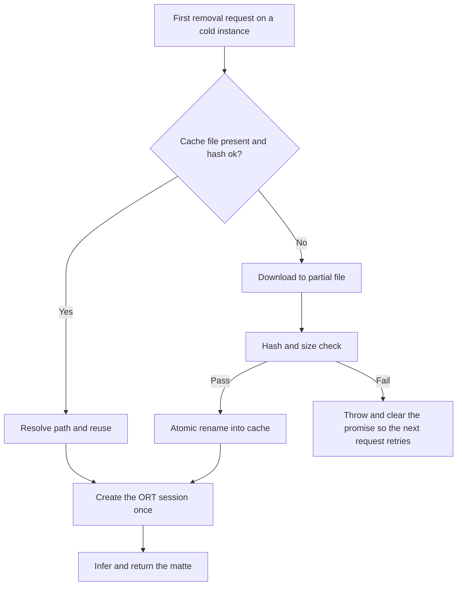
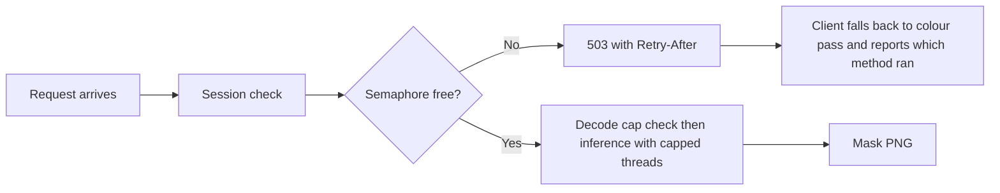

# AI Background Removal — Optimization Plan

> Follow-on to [`plans/logo-background-removal.md`](plans/logo-background-removal.md:524) (Phase 5).
> That plan decided **that** a segmentation model runs server-side and why. This one assumes the
> decision and optimizes the implementation: the shipped bytes, the number of loading paths, the
> immutability of the weights, the blast radius of CPU inference, and the amount of mask
> post-processing we own by hand.

Observed before anything below: a logo with a saturated red backdrop leaves residue under the
colour pipeline and comes out clean under the model. That is why the model stays and why the
colour pass is demoted to dry run plus degraded mode rather than being the thing to optimize.

## What this plan does not change

These are correct as they stand and every optimization below must preserve them:

- **The exchange contract.** The client uploads a downscaled derivative, the server returns the
  alpha matte, and the client applies it to its own full-resolution original
  ([`lib/ai-background-removal.ts`](lib/ai-background-removal.ts:1), [route](app/api/remove-background/route.ts:9)).
- **Matte as the alpha channel of an RGBA PNG.** A greyscale response is fully opaque and makes
  `destination-in` a silent no-op ([`lib/background-removal.server.ts:219`](lib/background-removal.server.ts:219),
  [`lib/ai-background-removal.ts:225`](lib/ai-background-removal.ts:225)). Any refactor of the encode
  path keeps this and keeps the assertion that proves it (see [Verification](#verification-harness)).
- **Two engines, one `RemovalResult`.** Downstream cannot tell which engine ran
  ([`lib/image-background-removal.ts:88`](lib/image-background-removal.ts:88)).
- **Auth required, size capped before decode** ([route:38](app/api/remove-background/route.ts:38), [route:60](app/api/remove-background/route.ts:60)).
- **Flatten-to-white on both sides, min-max normalisation of logits** ([`lib/background-removal.server.ts:249`](lib/background-removal.server.ts:249)).

## Baseline — the numbers being optimized

| Quantity | Value today | Source |
| --- | --- | --- |
| Weights on disk | 176,149,806 bytes ≈ 168 MB, fp32 | [`lib/background-removal.server.ts:54`](lib/background-removal.server.ts:54) |
| Route trace with weights | ~341 MB | [`next.config.js:54`](next.config.js:54) |
| Route trace without weights | ~173 MB | [`next.config.js:62`](next.config.js:62) |
| `onnxruntime-node` binaries in trace | ~287 MB across darwin 85, linux 68, win32 133 | [`next.config.js:55`](next.config.js:55) |
| Platform unzipped function limit | 250 MB | [`next.config.js:60`](next.config.js:60) |
| Inference plus PNG encode | ~3 s CPU | [`plans/logo-background-removal.md:581`](plans/logo-background-removal.md:581) |
| Model load | once per instance, memoised on `globalThis` | [`lib/background-removal.server.ts:81`](lib/background-removal.server.ts:81) |
| Weight URL today | `.../resolve/main/onnx/model.onnx` | [`lib/background-removal.server.ts:60`](lib/background-removal.server.ts:60) |
| Duplicate of that URL | also hardcoded in the fetch script | [`scripts/models/fetch-bg-model.ts:28`](scripts/models/fetch-bg-model.ts:28) |
| Loading modes | bundled path, `BG_MODEL_PATH`, `BG_MODEL_URL` plus `/tmp` cache = three | [`lib/background-removal.server.ts:121`](lib/background-removal.server.ts:121) |
| Concurrency guard | none; only `maxDuration = 300` | [`app/api/remove-background/route.ts:35`](app/api/remove-background/route.ts:35) |

## Payoff ranking

Ordered by benefit per unit of risk, and the order the work should ship in.

| # | Change | Ships less / saves | Risk | Effort shape |
| --- | --- | --- | --- | --- |
| 1 | Pin weights to an immutable revision plus a content hash, verify, write atomically | Removes a whole class of silent-corruption incidents | Very low | Small |
| 2 | Collapse three loading modes to one | ~168 MB off the trace, one failure path deleted | Low | Small, pure deletion |
| 3 | Smaller or fp16 weights | 2× on the dominant shipped bytes | Low to medium, measured | Medium |
| 4 | Thread caps plus an overload response | Protects the rest of the app from CPU starvation | Low | Small |
| 5 | `sharp`-based encode and a named mask output | Less owned code, one fewer 5 MB allocation per request | Low | Medium |

## 1. Immutable weights, content-verified, written atomically

### Problem

The weights are fetched from `/resolve/main/` ([`lib/background-removal.server.ts:60`](lib/background-removal.server.ts:60),
[`scripts/models/fetch-bg-model.ts:28`](scripts/models/fetch-bg-model.ts:28)) — a branch, not a
revision. The `/tmp` cache key is a SHA-1 of the **URL**, truncated to 10 hex characters
([`lib/background-removal.server.ts:128`](lib/background-removal.server.ts:128)), so a new upload
of different bytes to the same branch is reused silently. Meanwhile the guard that *is* careful —
the 99 % size check at [`lib/background-removal.server.ts:93`](lib/background-removal.server.ts:93)
and the ±1 KB check at [`scripts/models/fetch-bg-model.ts:41`](scripts/models/fetch-bg-model.ts:41) —
protects against truncation but not against substitution. The plan calls the model "pinned"
([line 604](plans/logo-background-removal.md:604)); it is not.

Two more hazards in the same area: the URL and the expected byte count are duplicated across the
script and the runtime, so they can drift; and the download writes directly to the destination
([`lib/background-removal.server.ts:110`](lib/background-removal.server.ts:110)), so a reader that
arrives mid-download can open a partial graph.

### Change

Move the model's identity into one module that both the script and the runtime import, and make
that identity a revision plus a hash rather than a filename.

New file: [`lib/background-removal-model.ts`](lib/background-removal-model.ts)

```ts
export const MODEL_REVISION = "<commit-sha>"; // not "main"
export const MODEL_URL =
  `https://huggingface.co/imgly/isnet-general-onnx/resolve/${MODEL_REVISION}/onnx/model.onnx`;
export const MODEL_SHA256 = "<hex>";
export const MODEL_BYTES = 176_149_806;
export const MODEL_CACHE_NAME = `pt-bg-model-${MODEL_SHA256.slice(0, 12)}.onnx`;
```

- The cache key becomes the content hash, not the URL, which is what the comment at
  [`lib/background-removal.server.ts:126`](lib/background-removal.server.ts:126) already intends.
- Download to `<target>.partial`, hash while streaming, then `rename()` into place. Rename is
  atomic on the same filesystem, so no reader ever sees a partial file and the `.partial` suffix
  makes an interrupted download self-identifying.
- Verify the hash and the byte count before the rename. On mismatch, delete and throw — the
  existing "do not memoise a failure" behaviour at
  [`lib/background-removal.server.ts:134`](lib/background-removal.server.ts:134) means the next
  request retries.
- `scripts/models/fetch-bg-model.ts` drops its private copy of the URL and expected size
  ([lines 28-41](scripts/models/fetch-bg-model.ts:28)) and imports the same constants, printing the
  revision and hash so a build log records exactly what was fetched.

### Acceptance

- Fetching twice is a no-op; fetching with a stale `.partial` present replaces it.
- A byte-flipped model file is rejected at startup with a message naming the hash mismatch.
- Grep proves exactly one definition of the URL and one of the byte count in the repo.

## 2. One loading path instead of three

### Problem

[`ensureModelFile()`](lib/background-removal.server.ts:121) implements bundled-path-first with a
env-overridable path, a separate env-overridable URL, and a temp-directory cache. But the bundled
path cannot ship on the target platform: the trace is ~341 MB against a 250 MB limit, and
[`next.config.js:57`](next.config.js:57) records that `outputFileTracingExcludes` does not remove
the foreign-platform ORT binaries in Next 14.2 — both glob forms tested, no change. So the first
branch is dead on Vercel while still costing:
`outputFileTracingIncludes: { "/api/remove-background": ["./models/**"] }`
([`next.config.js:67`](next.config.js:67)) pulls the model into a trace that cannot use it.

This is the "growing a second mode before the first is needed" pattern: conditional complexity
protecting a deployment shape that does not exist yet.

### Change



- Delete the bundled-vs-download branch. One resolution order: `BG_MODEL_PATH` if set and valid,
  else the content-addressed cache, else download into it. `BG_MODEL_URL` stays as a mirror
  override for air-gapped deploys.
- Remove `outputFileTracingIncludes["/api/remove-background"]` and the `./models/**` glob, so the
  route's trace returns to ~173 MB and fits the platform limit with headroom.
- Keep `models/` in [`.gitignore`](.gitignore:47). `pnpm run models:fetch`
  ([`package.json:12`](package.json:12)) becomes a developer and container convenience that
  pre-warms the same cache path, not a separate runtime mode.
- Fix the stale path in the [`.gitignore`](.gitignore:50) comment, which names
  `lib/server/background-removal.ts`; the module is
  [`lib/background-removal.server.ts`](lib/background-removal.server.ts:1).
- If a container deploy is ever adopted, reintroduce a single "resolve cache dir" switch, and let
  it select the directory rather than fork the whole flow.

### Acceptance

- `next build` and inspect the route's `.nft.json`: no model file, no `models/` entry.
- With no cache and no `BG_MODEL_PATH`, the first request downloads and every later request on the
  instance is warm. With `BG_MODEL_PATH` pointing at a valid file, nothing is downloaded.
- The number of code paths to `InferenceSession.create` is one.

## 3. Smaller or lower-precision weights

### Problem

176 MB fp32 is the largest possible version of this model, and it is the dominant term in the cold
start, the trace, and the disk read
([`lib/background-removal.server.ts:54`](lib/background-removal.server.ts:54),
[`scripts/models/fetch-bg-model.ts:38`](scripts/models/fetch-bg-model.ts:38)). A logo matte has far
less fidelity demand than a portrait, and the plan already concedes the swap is a URL change plus
precision-aware input ([line 604](plans/logo-background-removal.md:604)).

### Options, honestly assessed

| Option | Shipped bytes | Warm CPU | Peak RSS | Effort | Caveat |
| --- | --- | --- | --- | --- | --- |
| Published fp16 sibling | ~2× smaller | Usually no change | Usually no change | Trivial if it exists | On CPU the runtime upcasts to fp32, so the win is download and trace only |
| Locally converted fp16 | ~2× smaller | Same | Same | One-off conversion | Conversion normally needs a Python `onnx` toolchain; the artifact should be produced once and hosted, not generated in CI |
| Static int8 with a calibration set | ~4× smaller | Real win | Real win | Highest | Needs a folder of representative logos; edge quality must be measured, and the tolerance is per-pixel alpha, not a class label |
| Smaller input resolution, e.g. 512 | Model may be unchanged | ~4× less compute | Lower | Medium | The matte is upscaled, so edge softness at 1024 output must be validated |

Two implementation notes that matter whichever option is chosen:

- **Dynamic int8 quantisation is the wrong tool here.** ORT's `quantize_dynamic` targets
  MatMul, Gemm and Attention; a conv-heavy segmentation U-Net barely shrinks under it. Static
  quantisation with a calibration set is the version that pays, and it is the version that needs
  validation work.
- **The client is already resolution-agnostic**, which makes the smaller-input option cheaper than
  it looks: the mask canvas is sized from the returned image
  ([`lib/ai-background-removal.ts:195`](lib/ai-background-removal.ts:195)) and the trim box is
  scaled by the ratio of mask size to source size
  ([`lib/ai-background-removal.ts:237`](lib/ai-background-removal.ts:237)). Nothing on the client
  assumes 1024. The **server** does: the mask is found by a shape predicate built on `INPUT_SIZE`
  ([`lib/background-removal.server.ts:212`](lib/background-removal.server.ts:212)). So a smaller
  model requires either updating that constant or, better, doing item 5 first and identifying the
  mask by name.

### Change

1. Add a variant dimension to the manifest: `MODEL_VARIANT` (`fp32` | `fp16` | `int8`) alongside
   the URL, hash and byte count, so switching is a one-line edit plus a re-fetch.
2. Prefer a **published** fp16 artifact; if none exists, convert once offline, upload the result to
   an internal bucket, and point `MODEL_URL` at that pinned object. Do not add a Python step to the
   build.
3. Measure before committing: run the harness in [Verification](#verification-harness) against the
   fp32 baseline and compare mean absolute alpha difference and edge-band difference, not just
   visual inspection.

### Acceptance

- Shipped bytes halved or better, with the matte still a gradient rather than a threshold: corner
  alpha 0, centre 255, partial alphas on the rim.
- Edge-band mean absolute alpha difference against the fp32 baseline below the threshold chosen in
  the harness run, recorded in the manifest as data.
- Cold-start download and total first-request time both measurably lower.

## 4. Concurrency guard, thread caps, and overload behaviour

### Problem

[`app/api/remove-background/route.ts`](app/api/remove-background/route.ts:1) is auth-gated and
size-capped but unbounded in execution: `maxDuration = 300`
([line 35](app/api/remove-background/route.ts:35)) with no limit on how many inferences run at
once. ONNX Runtime defaults to using the machine's cores
([`lib/background-removal.server.ts:148`](lib/background-removal.server.ts:148) passes only
`executionProviders` and `graphOptimizationLevel`), so a handful of simultaneous presses inside the
app's shared function pool is a CPU-bound stall for every other request on that instance.

An aborted client request does not cancel an ORT run either, so a user who closes the modal while
waiting still pays for the inference.

### Change

- **Cap the session's threads.** Add `intraOpNumThreads` and `interOpNumThreads` to
  `InferenceSession.create` (1 to 2 each, and `executionMode: "sequential"`), so one inference
  cannot monopolize the instance.
- **Bound concurrency in the route.** An in-process semaphore around the inference call, sized to
  the instance's real capacity, held on `globalThis` for the same reason the session is
  ([`lib/background-removal.server.ts:81`](lib/background-removal.server.ts:81)); a module-level
  counter would be re-created on every development edit.
- **Reject rather than queue indefinitely.** When the semaphore is exhausted, return `503` with
  `Retry-After`. This is unusually safe here because the failure path is already designed: the
  client falls back to the colour pass and says which method ran
  ([`lib/ai-background-removal.ts:168`](lib/ai-background-removal.ts:168),
  [route:79](app/api/remove-background/route.ts:79)). Overload degrades to a slightly worse matte
  with an explanation, never a stack trace. Add a `describeFailure` branch for 503 so the message
  reads as capacity, not as a fault.
- **Per-user budget.** A simple in-memory counter keyed by session user id, with a short window,
  stops one authenticated caller from occupying the semaphore; this matters because the route is
  reachable from portal surfaces as well as the dashboard.
- **Fast-path rejection before decode.** The 8 MB cap is checked before `sharp` runs
  ([route:60](app/api/remove-background/route.ts:60)); keep that ordering and add the semaphore
  check *before* the `formData()` parse when possible, so a rejected request costs nothing.
- Log queue depth and rejection count. If rejections are frequent in production, the answer is a
  separate worker or a hosted inference endpoint, not a bigger timeout.



### Acceptance

- Three concurrent removals on one instance: each completes, none doubles the others' latency
  beyond the cap, and no request exceeds the median by more than a bounded factor.
- Saturating the semaphore returns 503 and the editor still removes the background, with the card
  naming the quick method.
- CPU on the instance returns to idle between requests rather than staying pinned.

## 5. Replace the hand-rolled mask post-processing

### Problem

Three pieces of bespoke code exist where a pinned graph output and an existing dependency would do:

- [`selectMaskOutput()`](lib/background-removal.server.ts:198) searches the session's outputs by
  shape on every request, hardcoding `INPUT_SIZE` into the predicate
  ([line 212](lib/background-removal.server.ts:212)). The reasoning is sound — ISNet exports carry
  intermediate score maps — but the search also silently couples the pipeline to 1024 and makes a
  smaller model a code change instead of a manifest change.
- [`buildInput()`](lib/background-removal.server.ts:168) hand-writes the NCHW `(v - 128) / 256`
  loop. This one is fine and cheap; the doc marks it as optional to touch.
- [`computeBackgroundMask()`](lib/background-removal.server.ts:228) allocates a 4 MB RGBA buffer
  and fills three of its channels with 255, then hands the whole thing to `sharp`
  ([lines 261-275](lib/background-removal.server.ts:261)).

### Change

- **Identify the mask by name.** Log `session.outputNames` once when the session is created and pin
  the mask's name in the manifest (`MODEL_MASK_OUTPUT`). Keep a shape assertion that **throws** with
  a message naming the expected and actual dims — the current code's "no mask found" error is
  already the right failure, so this is a simplification, not a new safety net. The
  resolution coupling at [line 212](lib/background-removal.server.ts:212) then becomes an assertion
  parameter rather than a hardcoded constant.
- **Let `sharp` build the alpha channel.** Quantise into a single-channel buffer and join it, rather
  than filling a 4-channel buffer by hand:

```ts
const alpha = Buffer.allocUnsafe(pixels);      // 1 byte per pixel, not 4
// min-max pass writes alpha[index] directly
const rgb = Buffer.alloc(pixels * 3).fill(255);
return sharp(rgb, { raw: { width: INPUT_SIZE, height: INPUT_SIZE, channels: 3 } })
  .joinChannel(alpha, { raw: { width: INPUT_SIZE, height: INPUT_SIZE, channels: 1 } })
  .png({ compressionLevel: 9 })
  .toBuffer();
```

  The `joinChannel` output is 4-channel and the fourth channel is alpha, which is what the plan
  requires ([line 562](plans/logo-background-removal.md:562)). **This is exactly the step that can
  fail silently** — if the joined channel is not treated as alpha, the response is fully opaque and
  the removal does nothing. The corner and centre pixel assertions in
  [Verification](#verification-harness) are what make this refactor safe, and they must be run
  before the change is merged.
- **Fuse the passes.** The min-max scan
  ([lines 252-259](lib/background-removal.server.ts:252)) and the quantise-and-write loop
  ([lines 262-269](lib/background-removal.server.ts:262)) stay two passes, but the second writes
  `alpha` directly instead of a 4-channel slice, removing the 4 MB allocation per request and
  roughly three quarters of the writes.
- Optional, lowest value: keep `buildInput()` as it is. It is correct, it runs once per request on
  3.1 M samples, and rewriting it for its own sake adds diff for nothing. Fold it in only if the
  NCHW loop is being touched for another reason.

### Acceptance

- The route returns the same bytes for the same input as before the refactor, or differs only by PNG
  filter choices.
- A deliberately wrong `MODEL_MASK_OUTPUT` throws a message naming both dims rather than returning a
  wrong matte.
- Peak allocation per request drops by about 4 MB, visible in a heap snapshot or in the harness.

## Verification harness

The plan already proves the matte shape by hand ([line 578](plans/logo-background-removal.md:578)).
Promote that to a runnable script so items 1, 3 and 5 can be tested rather than eyeballed.

New file: [`scripts/models/verify-bg-model.ts`](scripts/models/verify-bg-model.ts), run as
`pnpm run models:verify` ([`package.json:12`](package.json:12)).

It imports the real server module and asserts, per fixture:

| Fixture | Assertion |
| --- | --- |
| Synthetic disc, 512² | Mask 1024², 4 channels, corner alpha 0, centre 255, rim has partial alphas |
| Red-backdrop logo | Artwork colour shared by backdrop is preserved; no residue outside the trimmed box |
| White-backdrop JPEG | No pale rim in the edge band; artwork reaches the trim box on every side |
| Gradient or photo backdrop | Subject alpha above threshold, background below |
| Wireframe 1-2 px stroke | Mark survives at full opacity |
| Already-transparent PNG | `noChange` path taken, nothing removed |

Each row reports: mask dimensions, corner and centre alpha, mean alpha, edge-band mean alpha, and
wall-clock time. For items 1 and 3, the script runs both candidates and prints the mean absolute
alpha difference and the binary-mask intersection-over-union between them, so "the fp16 build is
good enough" is a number rather than an opinion.

Also record, before and after each change: cold-start time with no cache, warm request time,
route trace size from `.next/server/app/api/remove-background/route.js.nft.json`, and peak RSS
during a request.

## Sequencing

1. Item 1 (immutable, verified, atomic weights) and the manifest module — small, removes risk,
   and everything else edits the same file.
2. Item 2 (collapse to one loading path) — pure deletion, and it removes the `models/**` trace
   entry that currently makes the bundle unshippable on the platform.
3. Verification harness — before any precision change, so item 3 has a comparison to make.
4. Item 5 (named mask output, `sharp` encode) — do this before item 3, because pinning the mask
   output by name is what makes a non-1024 model a config change.
5. Item 3 (fp16 or a smaller model), guided by the harness numbers.
6. Item 4 (thread caps, semaphore, 503 path) — independent of the others and can ship at any point;
   the `describeFailure` branch for 503 should land with it.

## Risks

| Risk | Mitigation |
| --- | --- |
| A quantised model degrades edge softness and the residue problem returns in a new form | Items 3 and 5 are behind the harness; compare edge-band alpha against the fp32 baseline rather than trusting a visual check |
| `joinChannel` does not mark the fourth channel as alpha, so the matte arrives opaque and `destination-in` does nothing | The corner and centre pixel assertions run before merge; the RGBA contract is called out in "What this plan does not change" |
| Pinning a revision means a security or quality fix upstream is not picked up automatically | The revision and hash are recorded in the manifest and printed on fetch, so an update is a deliberate one-line change with a re-verification run |
| Deleting the bundled path breaks a deploy that was relying on it | The trace measurement at [`next.config.js:54`](next.config.js:54) shows that deploy cannot fit on the platform; a container deploy re-adds one directory switch, not the whole branch |
| The semaphore rejects legitimate bursts and users see the quick method instead of the model | 503 is the existing fallback path and the card already names the method used; tune the limit from logged queue depth rather than guessing |
| Removing `outputFileTracingIncludes` for the route surprises someone reading the config | The comment block at [`next.config.js:44`](next.config.js:44) is rewritten to state the single loading mode and why the glob is gone |

## Files touched

| Action | File |
| --- | --- |
| Create | [`lib/background-removal-model.ts`](lib/background-removal-model.ts:1) — URL, revision, hash, bytes, mask output name |
| Create | [`scripts/models/verify-bg-model.ts`](scripts/models/verify-bg-model.ts:1) |
| Modify | [`lib/background-removal.server.ts`](lib/background-removal.server.ts:1) — one loading path, hash verify, atomic rename, thread caps, named output, `sharp` encode |
| Modify | [`scripts/models/fetch-bg-model.ts`](scripts/models/fetch-bg-model.ts:1) — import the manifest, print revision and hash |
| Modify | [`app/api/remove-background/route.ts`](app/api/remove-background/route.ts:1) — semaphore, 503, per-user budget |
| Modify | [`lib/ai-background-removal.ts`](lib/ai-background-removal.ts:1) — 503 message only |
| Modify | [`next.config.js`](next.config.js:44) — drop the `models/**` trace entry, rewrite the comment |
| Modify | [`package.json`](package.json:12) — add `models:verify` |
| Modify | [`.gitignore`](.gitignore:47) — correct the stale module path in the comment |

## Deliberately out of scope

- **Replacing the model with a hosted API.** Rejected in the original plan for per-image cost and
  for the artwork leaving the browser; the evidence that the model works is not a reason to change
  that trade.
- **Removing the colour pipeline.** It is the dry run that decides whether to offer removal at all
  and the degraded mode that keeps the button useful when the route is unreachable. It also exposes
  the `uniformity` signal that made this whole evaluation empirical.
- **Making the colour key clear enclosed regions to fix the red-residue case.** That reintroduces
  hole-punching in white artwork and still loses on gradients and shadows. The model covers it.
- **Downloading the weights in the browser or shipping WebAssembly.** Every visitor would pay
  168 MB again; that is the design the server-side move exists to undo.
- **Mask caching.** A matte is per-image and per-request; the route already sets `no-store`
  ([route:76](app/api/remove-background/route.ts:76)).

## Open questions

- Which published artifacts exist for `imgly/isnet-general-onnx` — is there an fp16 file upstream, or
  must one be converted and hosted internally?
- What are the real cold-start and warm request times on the deploy target, as opposed to the
  development machine's ~3 s?
- What is the observed frequency of simultaneous removals? Below one per instance lifetime, the
  semaphore is cheap insurance; well above it, the answer is a dedicated worker rather than a
  bigger timeout.
- Which value of `intraOpNumThreads` keeps a single inference fast while leaving the instance
  responsive for other routes?
