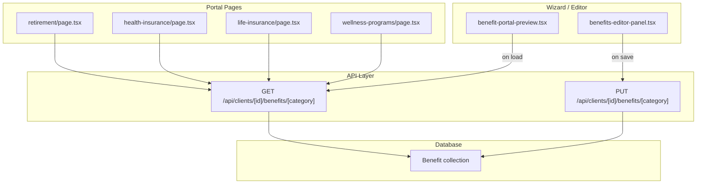
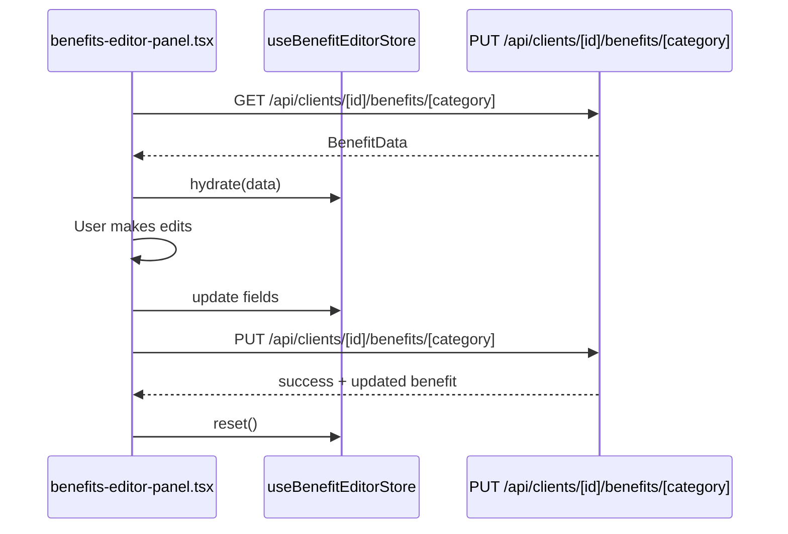

# Benefits Architecture Refactor Plan

> **Decisions (finalized 2026-08-03):**
> - **Hero overlay precedence:** `Benefit` row values override `Client`-level values per category.
> - **Migration safety:** Dual-write period — new API writes to both `Benefit` table AND old `employeePortalPreview` JSON until all consumers are migrated.
> - **Scope:** Already-completed work (`categoryDefaultThumbnail` → `categoryDefaultImage` rename, planVideo fallback image) is kept separate as a prerequisite.

---

## Problem Summary

The current architecture stores all benefit data for all categories inside a single monolithic JSON blob: `Client.employeePortalPreview Json?`. This causes several structural problems:

| Pain Point | Root Cause |
|---|---|
| `planVideo` leaks across sessions | JSON blob stores all categories' videos together; wizard loads entire blob, doesn't know which video belongs to which category |
| `(benefitData as any)?.planVideo` everywhere | No typed model — portal pages dig into raw JSON with `find()` |
| `PUT /api/clients/[id]` does fragile deep-merges | Must merge `benefits[]` arrays manually per-category |
| Zustand store persists stale data to localStorage | Wizard store and editor store are the same thing |
| No queryability | Can't `findUnique({ clientId, category })` — must load entire Client |
| No audit/versioning | Every save is a destructive overwrite of the entire JSON blob |

---

## Proposed Architecture

### 1. New `Benefit` Prisma Model

```prisma
model Benefit {
  id          String   @id @default(auto()) @map("_id") @db.ObjectId
  clientId    String   @db.ObjectId
  category    String   // "Retirement" | "Group Health" | "Group Life" | "Company / Plan Sponsor"

  // Core
  title            String
  shortDescription String?

  // Journey Section
  journeyHeader   String?
  journeySubtitle String?
  journeyBodyText String?

  // Plan Video (raw R2 key)
  planVideo         String?
  planVideoFileName String?

  // Branding
  partnerLogo     String?
  backgroundImage String?
  innerHeaderImage String?

  // Help Cards
  helpCards Json? // HelpCardData[]

  // Insurance / Portal Materials
  insurancePlanId               String?
  insuranceLoginUrl             String?
  insuranceBackgroundImage      String?
  insuranceContainerBlockOpacity Float?

  // FAQs & Support Contacts
  faqs            Json? // FAQItem[]
  supportContacts Json? // SupportContact[]

  // Closing & Signature
  signatureMode           String? // "user" | "custom"
  customClosing           String?
  customSignatureName     String?
  customSignatureCompany  String?
  customClosingBold             Boolean?
  customClosingItalic           Boolean?
  customSignatureNameBold       Boolean?
  customSignatureNameItalic     Boolean?
  customSignatureCompanyBold    Boolean?
  customSignatureCompanyItalic  Boolean?

  // Hero Overlay Settings (per-benefit, overrides client-level)
  heroBackgroundOpacity    Float?
  heroContainerBlockOpacity Float?
  heroContainerInverted     Boolean?
  heroBackgroundInverted    Boolean?
  heroUseGradient           Boolean?
  desktopHeroBackgroundPosition Json? // { x: number, y: number }
  mobileHeroBackgroundPosition  Json? // { x: number, y: number }

  // Visibility
  isEnabled Boolean @default(true)

  createdAt DateTime @default(now())
  updatedAt DateTime @updatedAt

  client Client @relation(fields: [clientId], references: [id])

  @@unique([clientId, category])
  @@index([clientId])
  @@index([category])
}
```

**Key decisions:**
- Disclaimers stay on `Client.disclaimers` (cross-cutting, keyed `byCategory` — a per-client concern)
- `categoryPortalVisibility` stays on `Client` (single map, not per-benefit)
- Each category gets its own `Benefit` row with a `@@unique([clientId, category])` constraint — no more array merging
- **Hero overlay precedence:** When both `Client` and `Benefit` have hero settings, the `Benefit` row wins per category. The rendering layer checks `benefit.heroBackgroundOpacity ?? client.heroBackgroundOpacity`.

---

### 2. Dedicated API Routes



| Route | Method | Purpose |
|---|---|---|
| `/api/clients/[id]/benefits` | GET | List all benefits for a client |
| `/api/clients/[id]/benefits/[category]` | GET | Get one benefit by category (R2 keys → presigned URLs) |
| `/api/clients/[id]/benefits/[category]` | PUT | Upsert a benefit by category |
| `/api/clients/[id]/benefits/[category]` | DELETE | Remove/disable a benefit |

---

### 3. Store Refactoring — Separate Concerns

**Remove** the `persist` middleware from the benefits wizard store. Split into two:

| Store | File | Purpose | Persists? |
|---|---|---|---|
| `useBenefitsWizardStore` | `lib/benefits-wizard-store.ts` | Navigation state only (currentStep, completed steps) | No |
| `useBenefitEditorStore` | `lib/benefit-editor-store.ts` (new) | Current editor session data per category | No |

**Data flow:**



**Delete all localStorage video backup patterns:**
- `localStorage.setItem("benefits-plan-video-key-" + cat, key)` in `benefits-editor-panel.tsx`
- `localStorage.getItem("benefits-plan-video-key-" + category)` in `benefit-portal-preview.tsx`

---

### 4. Portal Page Refactoring

Each page fetches its own benefit directly instead of rummaging through `employeePortalPreview.benefits[]`.

**Before** (every category page):
```tsx
const benefitData = useMemo(() => {
  const benefits = (clientData as any)?.employeePortalPreview?.benefits ?? [];
  return benefits.find((b: any) => b.category === "Retirement");
}, [clientData?.employeePortalPreview]);

// ...
planVideoUrl={(benefitData as any)?.planVideo}
```

**After:**
```tsx
const { data: benefit } = useSWR(
  clientId ? `/api/clients/${clientId}/benefits/Retirement` : null,
  fetcher
);

// ...
planVideoUrl={benefit?.planVideo}
```

No more `(benefitData as any)` casts. No more `find()` through JSON arrays.

**Pages to update:**

| Page | Category Key | `planVideoUrl` line |
|---|---|---|
| `retirement/page.tsx` | `Retirement` | Line 243 |
| `health-insurance/page.tsx` | `Group Health` | Line 321 |
| `life-insurance/page.tsx` | `Group Life` | Line 321 |
| `wellness-programs/page.tsx` | `Company / Plan Sponsor` | Line 321 |

---

### 5. `retirement-journey-section.tsx` Fix

Current fallback when `planVideoUrl` is absent:
```tsx
src={featuredVideo?.thumbnail || "/placeholder.svg"}
```

This `featuredVideo` comes from `dbFeaturedVideo` (fetched from DB videos table) — completely unrelated to the current benefit session.

**Fix:** Add a `planVideoFallbackImage` prop that receives a category-specific placeholder image:

```tsx
interface RetirementJourneySectionProps {
  // ... existing props
  planVideoUrl?: string;
  planVideoFallbackImage?: string; // NEW: category default image
}

// In the component:
{planVideoUrl ? (
  <video src={planVideoUrl} controls ... />
) : (
  <Image
    src={planVideoFallbackImage || featuredVideo?.thumbnail || "/placeholder.svg"}
    alt="Benefit placeholder"
    fill
    className="object-cover"
  />
)}
```

Each page passes its category default from helper lib:
```tsx
<RetirementJourneySection
  planVideoUrl={benefit?.planVideo}
  planVideoFallbackImage={CATEGORY_DEFAULT_BGS["Retirement"]} // from portal-category-hero-background.ts
/>
```

---

### 6. Migration Path

**Step 6a:** Add `Benefit` model to schema + run `prisma db push`

**Step 6b:** Migration script `scripts/migrate-benefits.ts`

For each `Client`:
1. Read `employeePortalPreview`
2. If `employeePortalPreview.benefits` is an array, iterate it
3. For each benefit entry, upsert into `Benefit` with `{ clientId, category }`
4. Also extract client-level fields that were set per-category (hero overlay, signature)

**Step 6c:** Dual-write strategy (SAFETY — NOT optional)

During transition, every write must go to both stores:

1. `PUT /api/clients/[id]/benefits/[category]` writes to `Benefit` table AND also updates `Client.employeePortalPreview` with the equivalent JSON structure.
2. `GET /api/clients/[id]` continues to return `employeePortalPreview` so legacy consumers don't break.
3. The dual-write stays in place until ALL consumers are migrated to the new API routes.
4. Once all portal pages, the preview, and the wizard use the new routes exclusively, the dual-write and the `employeePortalPreview` field are removed in a final cleanup PR.

Dual-write implementation in `PUT /api/clients/[id]/benefits/[category]`:
```ts
// After writing to Benefit table, sync back to employeePortalPreview JSON
const allBenefits = await prisma.benefit.findMany({ where: { clientId } });
const benefitsArray = allBenefits.map(b => ({ /* map Benefit fields → legacy shape */ }));
await prisma.client.update({
  where: { id: clientId },
  data: {
    employeePortalPreview: {
      ...existingPreview,
      benefits: benefitsArray,
    },
  },
});
```

**Step 6d:** Verification script

After migration + dual-write verify:
- Every `Client.employeePortalPreview.benefits[]` entry has a corresponding `Benefit` row
- No data loss (field-by-field sample comparison for 5 random clients)
- Dual-write consistency: after `PUT` to new route, both `Benefit` row and `employeePortalPreview` JSON contain identical data for that category

**Step 6e:** Cleanup (FINAL PHASE — after ALL consumers migrated)

After full migration and dual-write period:
- Remove dual-write code from `PUT /api/clients/[id]/benefits/[category]`
- Archive `employeePortalPreview` field from `Client` model (keep column temporarily, stop writing)
- Remove all `(benefitData as any)` casts across the codebase
- Remove `planVideo` → presigned URL conversion from `GET /api/clients/[id]`
- Drop `employeePortalPreview` column from `Client` in a follow-up migration

---

## Execution Order

1. [ ] Create `types/benefit.ts` with shared typed interfaces
2. [ ] Add `Benefit` model to `prisma/schema.prisma` + run migration
3. [ ] Create `app/api/clients/[id]/benefits/route.ts` (list all)
4. [ ] Create `app/api/clients/[id]/benefits/[category]/route.ts` (GET/PUT/DELETE)
5. [ ] Write and run `scripts/migrate-benefits.ts`
6. [ ] Create `lib/benefit-editor-store.ts` (new, non-persisted editor store)
7. [ ] Remove `persist` from `lib/benefits-wizard-store.ts`
8. [ ] Update `benefits-editor-panel.tsx` — use new store + API, remove localStorage backups
9. [ ] Update `benefit-portal-preview.tsx` — read from new store, remove localStorage fallbacks
10. [ ] Update `step-1.tsx` auto-save — use `PUT /api/clients/[id]/benefits/[category]`
11. [ ] Update `step-3.tsx` FAQ save — use `PUT /api/clients/[id]/benefits/[category]`
12. [ ] Add `planVideoFallbackImage` prop to `RetirementJourneySection` + implement fallback
13. [ ] Update 4 portal pages to use typed benefit fetches + `planVideoFallbackImage`
14. [ ] Remove `employeePortalPreview` from `ClientData` interface in `client-portal-context.tsx`
15. [ ] Cleanup: remove old JSON blob logic from `GET/PUT /api/clients/[id]`
