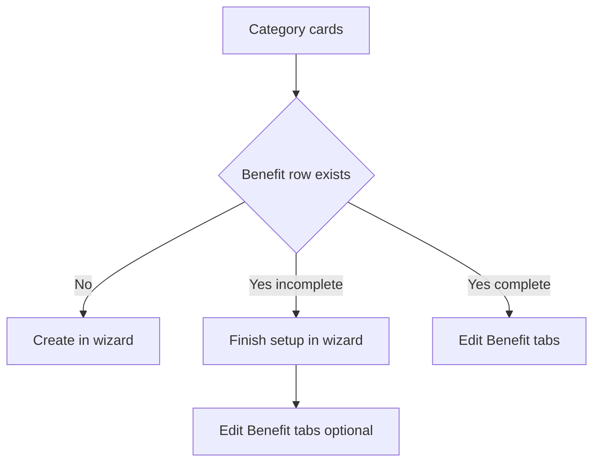

# Create Benefit: status-aware category step (Option A)

The Create Benefit category picker treats all four categories as "create", even
when some already have a Benefit row. Because `saveBenefit()` upserts, walking the
wizard for an existing category silently overwrites it. Make the picker state-aware.

## What the code already knows

`getCategoryStatus(catId)` in
[`step-1.tsx`](components/wizard/benefits-steps/step-1.tsx:1695) already returns
`exists` (from the `categoryBenefitByApi` snapshot), `isComplete`, `missing`,
`pendingSectionLabels`, and `logo`. The picker only renders a small badge and never
uses `exists`.

Only one thing is missing from it: the benefit's published state.

## Card states

| Condition | Card shows | Primary action |
|---|---|---|
| No Benefit row | Not created | Select category, continue in wizard |
| Row exists, `!isComplete` | Draft, N missing plus the missing section labels | Finish setup in wizard, or Edit |
| Row exists, `isComplete` | Published or Hidden | Edit Benefit |

## Overwrite guard

Selecting an existing category in the wizard opens a confirm dialog:

- **Edit existing** — routes to `/edit-benefit/[planId]/[category]`
- **Overwrite anyway** — continues in the wizard with today's prefill-and-upsert
- **Cancel**

## Changes

- Extend `getCategoryStatus()` to also return the benefit row's published state
  (`isEnabled !== false`), so the card can render Published vs Hidden.
- Extract the category card into a presentational component that renders state plus
  its action(s), keeping the picker's grid markup thin.
- Add the Edit route: `/edit-benefit/<planId>/<categorySlug>` using
  [`categoryToSlug()`](lib/benefit-category-slug.ts:39) (the route already exists).
- Add the overwrite confirm dialog to Step 1.
- Leave the `?category=` deep link behaviour intact, but route an existing category
  through the same guard so a deep link cannot silently overwrite.

## Out of scope
- Rebuilding the 5-step wizard.
- Changes to the `/benefits` browse list or the Edit Benefit page itself.
