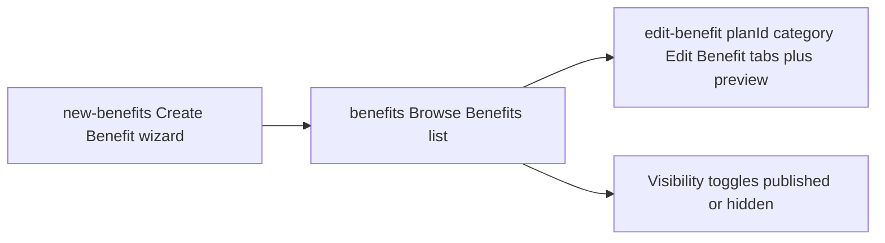

# Benefits: Create / Browse / Edit split

Mirror the Plans flow (`/new-client` create → `/clients` browse → `/edit-client/[id]` edit)
for benefits, so editing a benefit never means walking the 5-step wizard.

## Routes

| Route | Role | Mirrors |
|---|---|---|
| `/new-benefits` | Create Benefit wizard (the current `/benefits` page moves here) | `/new-client` |
| `/benefits` | Browse Benefits list, including per-category Portal Visibility toggles | `/clients` |
| `/edit-benefit/[planId]/[category]` | Edit Benefit: top tabs + persistent live preview | `/edit-client/[id]` |

A benefit's identity is `(planId, category)`, so the edit route carries both.

## Sidenav

Replace the single `Create Benefits` item ([`constants/data.ts`](constants/data.ts:1223)) with a
`Benefits` parent holding `View Benefits` → `/benefits` and `Create Benefit` → `/new-benefits`,
exactly like `Plans` → `View Plans` / `Create Plan`.

## Edit Benefit page

Reuses existing pieces rather than new UIs:

- Tabs: **Branding · Contacts · FAQs · Documents · Disclaimers**
- Branding → [`BenefitsEditorPanel`](components/wizard/benefits-steps/benefits-editor-panel.tsx:85)
  (`variant="inline"`), which already covers logo, header image, title, message, typography,
  plan video, help cards, and insurance.
- Contacts → [`BenefitsStep1`](components/wizard/benefits-steps/step-1.tsx:154) (no plan picker) plus
  [`BenefitsStep3`](components/wizard/benefits-steps/step-3.tsx:63) support contacts.
- FAQs → [`BenefitsStep3`](components/wizard/benefits-steps/step-3.tsx:63) FAQs.
- Documents → [`BenefitsStep4`](components/wizard/benefits-steps/step-4.tsx:35).
- Disclaimers → [`BenefitsStep5`](components/wizard/benefits-steps/step-5.tsx:297).
- Persistent preview → [`BenefitPortalPreview`](components/wizard/benefits-steps/benefit-portal-preview.tsx:47)
  plus `PortalHeader`, with a desktop/mobile toggle.

Requires a `mode`/section affordance on the step components so a step can render without wizard
chrome. Step 1 stays mounted (hidden off the Contacts tab) to run its benefit pre-fill.

## Shared save

Extract `submitBenefits()` from the wizard page into `lib/save-benefit.ts` so the wizard's Complete
and the edit page's Save run identical merge logic (hub defaults, the other three categories,
keyContacts merge, document dedupe/R2, disclaimer byCategory). The edit page skips the publishing
attestation.

## Browse list data

Add `GET /api/benefits` returning one row per plan x category:
`{ planId, planName, category, title, isEnabled, partnerLogo }`.
The visibility toggle reuses the two writes already in Step 1 — `PUT /api/clients/{id}`
(`categoryPortalVisibility`) plus `PUT /api/clients/{id}/benefits/{category}` (`isEnabled`).

## Links to repoint

Every `/benefits?...` deep link must move:

- [`dashboard-tasks.server.ts`](lib/dashboard-tasks.server.ts:82) ready-to-publish task → `/new-benefits?planId=…`
- [`plan-attention-actions.ts`](lib/plan-attention-actions.ts:38) View Benefit → `/edit-benefit/[planId]/[category]`
- [`incomplete-benefit-dialog.tsx`](components/pages/client-portal/sections/incomplete-benefit-dialog.tsx:36) → `/new-benefits?planId=…&category=…`
- [`new-client/page.tsx`](app/(dashboard)/new-client/page.tsx:674) Create Benefit → `/new-benefits?planId=…`
- [`layout-client.tsx`](components/layout/layout-client.tsx:36) stepper detection → `/new-benefits`
- [`middleware.ts`](middleware.ts:14) protected routes → add `/new-benefits` and `/edit-benefit`

## Out of scope
- Reworking the live client portal renderer.
- Changing the four fixed benefit categories.
