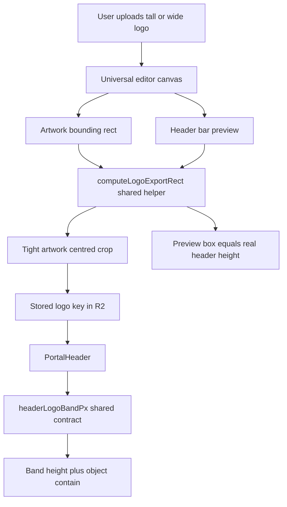

# Tall Logo → Header Band — One Coherent Fix Plan

## The three coupled defects

1. **The stored crop is not tight around the artwork.**
   [`handleSave()`](components/ui/universal-image-editor-modal.tsx:1924) splits on `ar > 2`:
   - `ar > 2` → crop is `photoWidth × solidHeight` (e.g. ≈456×440 on the 600×550 canvas). A wide wordmark is stored inside a tall, mostly empty box.
   - `ar <= 2` → crop is `photoWidth*1.1 × photoHeight*1.15`, centred on the **canvas**, not on the artwork.

   [`BrandingImage`](components/ui/branding-image.tsx:17) forces the wrapper to the `maxHeight` it is given, and the inner `` is `object-contain`. So the artwork's rendered height is
   `band × (artworkHeight ÷ boxHeight)`.
   A loose box does not make the logo bigger — it makes the artwork **smaller**. The wide path today renders a wordmark at roughly 5 px in a 48 px band; the `ar <= 2` path renders it at ≈42 px.

2. **The modal's header preview lies, and clips tall artwork.**
   [`isHeaderBarPreview`](components/ui/universal-image-editor-modal.tsx:3490) renders the whole-canvas export with `object-cover` at a fixed `150px` (compact `100px`) height inside a `122px` (compact `92px`) `overflow-hidden` box, vertically centred. The image is ~14 px taller than its container, so the top and bottom are sliced. Wide logos survive only because their stored box carries vertical slack; a tall logo's box is tight, so the slice eats the artwork. This is the visible "cropped tall header" in the editor.

3. **`PortalHeader` cannot express the height it asks for.**
   [`PortalHeader`](components/pages/client-portal/sections/portal-header.tsx:172) picks a band from the logo's aspect ratio (76 / 83 / 90 / 98) and then clamps every branch with
   [`maxHeight: min(${headerHeight}px, 48px)`](components/pages/client-portal/sections/portal-header.tsx:292).
   The four buckets are therefore dead, and the [`showTallTip`](components/pages/client-portal/sections/portal-header.tsx:507) line is rendered *inside* the measured header content, so tall artwork grows the header instead of being served by it.

## The contract (single source of truth)

Shipped as `lib/header-logo-band.ts`:

- `HEADER_LOGO_BAND_PX` (48) — the one height the logo may occupy in the header.
- `HEADER_LOGO_OUTLINE_RATIO` (0.06) — uniform padding around the artwork bounds when exporting, so the stored box is tight but not shaved at anti-aliased edges.
- `HEADER_LOGO_MAX_WIDTH_PX` (220) — widths the box whatever the aspect ratio. A consequence of a tight export is that an ultra-wide wordmark renders at its true size (a 9:1 mark at a 48px band wants ~430px of width), so the cap lets `object-contain` scale the whole mark down instead of crowding the nav.
- `HEADER_BAR_CHROME_PX` (32) and `HEADER_LOGO_BAR_HEIGHT_PX` (80) — the header's non-logo vertical chrome, so the editor preview is sized to the real header instead of a hard-coded 122px.
- `TALL_ARTWORK_ASPECT_RATIO` (0.85) — decides the advisory tip only, never the band.

There is deliberately no `headerLogoBandPx(ar)` function: with one band, an aspect-ratio-driven height would reintroduce the AR→height coupling the buckets were built on — and the dead 76/83/90/98 buckets are exactly what that coupling produced last time. The exported constants are the seam if a future band bump is wanted.

Extend [`lib/image-editor-crop.ts`](lib/image-editor-crop.ts:10) with a shared
`computeLogoExportRect({ artworkBounds, canvasWidth, canvasHeight, outlineRatio })`
returning `{ sx, sy, sw, sh, dw, dh }` (source rect + output size), artwork-centred and clamped to the canvas. Both the save path and the preview path call it, so **the preview is the stored image**.

## Decision taken

**One band at 48px**, keeping today's effective height, with the dead 76/83/90/98 buckets deleted and the tight crop guaranteeing the artwork actually fills the band. The header's height no longer varies with the logo's shape.

## Changes by file

| File | Change |
| --- | --- |
| `lib/header-logo-band.ts` | New. Band + outline + preview-chrome constants and `headerLogoBandPx`. |
| [`lib/image-editor-crop.ts`](lib/image-editor-crop.ts:52) | Add `computeLogoExportRect`; optionally a `padCanvasToAspectRatio` helper only if the band policy needs letterboxing. |
| [`universal-image-editor-modal.tsx`](components/ui/universal-image-editor-modal.tsx:461) | Opt-in `normalizeLogoForHeader` prop/config with the existing prop > `customConfig` > type-default precedence used by [`allowBackgroundRemoval`](components/ui/universal-image-editor-modal.tsx:519); save crop uses the shared helper; preview uses the same helper and a truthful box; delete dead [`headerMetrics`](components/ui/universal-image-editor-modal.tsx:1110). |
| [`brand-image-upload.tsx`](components/ui/brand-image-upload.tsx:44) | Forward the new opt-in alongside `universalModalAllowBackgroundRemoval`. |
| [`portal-header.tsx`](components/pages/client-portal/sections/portal-header.tsx:65) | Consume the shared band; drop the 48 px clamp per the decision; keep `object-contain`; move the tall tip out of the measured content and gate it to preview contexts. |
| Logo call sites | Opt in: [`company-logo-card.tsx`](components/wizard/new-client-steps/sections/components/company-logo-card.tsx:122), [`company-logo-section.tsx`](components/wizard/new-client-steps/sections/company-logo-section.tsx:319), [`step-1.tsx`](components/wizard/benefits-steps/step-1.tsx:3202), [`benefits-editor-panel.tsx`](components/wizard/benefits-steps/benefits-editor-panel.tsx:494), [`benefits-section-editor.tsx`](components/wizard/new-client-steps/sections/components/benefits-section-editor.tsx:453). |
| Non-logo `normalizer` call sites | Leave on current geometry (must **not** normalize): [`benefits-editor-panel.tsx`](components/wizard/benefits-steps/benefits-editor-panel.tsx:577) hero photo (`outlinePadding: 0`) and [`benefits-editor-panel.tsx`](components/wizard/benefits-steps/benefits-editor-panel.tsx:1124) 1920×1080 section background; verify [`video-steps/step-1.tsx`](components/wizard/video-steps/step-1/step-1.tsx:1273) and classify it. |

## Flow

## Consumers to re-verify

Tightening the crop changes the stored image for logos, so re-check every surface that renders `companyLogo` / partner logos:
[`primary-contact-card.tsx`](components/pages/my-benefits-team/primary-contact-card.tsx:239),
[`large-horizontal-card.tsx`](components/pages/my-benefits-team/large-horizontal-card.tsx:226),
[`key-contacts-section.tsx`](components/wizard/new-client-steps/sections/key-contacts-section.tsx:946),
[`company-logo-section.tsx`](components/wizard/new-client-steps/sections/company-logo-section.tsx:200),
[`contact-form-link.ts`](lib/contact-form-link.ts:136) (email/PDF link logo),
[`flyer-brand.ts`](lib/marketing/flyer-brand.ts:37),
[`preview-template.ts`](lib/video-steps/preview-template.ts:136), and the portal pop-up overlay.

## Risks

- **Existing stored logos stay loose/tall** — the fix applies to newly saved images. No destructive migration; note that re-editing a logo re-normalizes it. Optionally plan a one-time backfill separately.
- **Cropping artwork accidentally** — the artwork-centred rect removes the current canvas-centred failure mode (a shifted logo was cut because only the *size* came from the artwork while the *position* came from the canvas); the outside-safe-zone confirm still guards deliberate overflow.
- **Transparency** — a tight crop of a JPEG with a white backdrop keeps opaque margins; PNG transparency detection still decides the export format and is unaffected.
- **Global header height change** — depends on the band decision above; call it out in QA rather than discovering it in production.

## QA matrix

For each of: wide wordmark, square mark, tall/stacked mark, SVG, JPEG with white backdrop, background-removal then save —
check (a) the editor's header-bar preview, (b) the upload card preview, (c) the real portal header, (d) the scaled desktop preview in [`step-2.tsx`](components/wizard/benefits-steps/step-2.tsx:581) / [`edit-plan-preview-section.tsx`](components/wizard/new-client-steps/sections/edit-plan-preview-section.tsx:911), (e) the mobile preview, and (f) the card / email / flyer consumers listed above. Finish with `pnpm lint` and `npx tsc --noEmit`.
