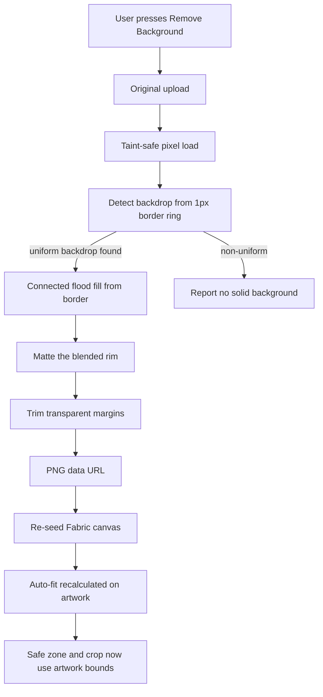
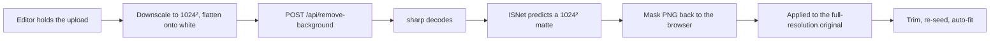

# Logo Background Removal — Implementation Plan

## Problem

A logo delivered as a full-frame image with a solid white or black backdrop is
sized by the **backdrop**, not the artwork. Every downstream behaviour in
[`UniversalImageEditorModal`](components/ui/universal-image-editor-modal.tsx:294)
derives from the Fabric object's natural pixel size:

| Behaviour | Derives from |
| --- | --- |
| Auto-fit on open | `img.width / img.height` — [line 1274](components/ui/universal-image-editor-modal.tsx:1274) |
| Auto-size button | `activeObject.width / height` — [line 2215](components/ui/universal-image-editor-modal.tsx:2215) |
| Safe-zone checks | `obj.getBoundingRect()` — [line 971](components/ui/universal-image-editor-modal.tsx:971) |
| Aspect-ratio cap warning | `img.width / img.height` vs `350/140` — [line 1236](components/ui/universal-image-editor-modal.tsx:1236) |
| Normalizer header metrics | `obj.getBoundingRect()` — [line 867](components/ui/universal-image-editor-modal.tsx:867) |
| Save crop rect | `activeObject.getBoundingRect()` — [line 1638](components/ui/universal-image-editor-modal.tsx:1638) |

So both the on-screen guidance **and** the saved crop are computed against the
backdrop frame. Removing the backdrop alone is not sufficient: the transparent
margins must also be trimmed, or the math stays wrong.

## Decision

No third-party service, no API key, no per-image cost. The colour pipeline runs entirely
in the browser; the segmentation model (Phase 5) runs in our own API route, because its
weights are 168 MB and no visitor should pay for them.

Two engines, one interface, one result type:

- **The model** (Phase 5) — ISNet segmentation in our API route, which is how a
  gradient, a shadow or a photo behind the subject gets removed at all. The default.
- **The colour key** — detect the backdrop colour from the image border → flood-fill
  it away → matte the blended rim. Instant, no download; the fallback when the model
  cannot run, and the dry run the offer dialogue asks its question with.

Both end the same way: **trim the transparent margins → re-seed the editor.**

**Button-driven, never automatic.** The pipeline proper runs only when the user
presses Remove Background, or confirms the one offer described in §2.6 — and that
offer is a question that edits nothing. Logos are brand assets; the editor never
alters one on its own initiative.

**No knobs.** Tolerance and trim are *not* exposed. This editor is aimed at people
who do not think in terms of colour distance, so both are fixed constants in the
modal — `BACKGROUND_REMOVAL_TOLERANCE = 12` and `BACKGROUND_REMOVAL_TRIM = true`.
The library still accepts them as options, which is what keeps the choice
reversible without touching the pipeline.



## Scope

In scope:

- `type="logo"` and `type="normalizer"` only — the two configs that edit logos.
- **Button-driven only.** The removal runs exclusively from the Remove Background
  button press, or from the offer dialogue's confirm, and the button lives in the
  card for these two types.
- Transparency-safe presentation of the result in the editor and previews.
- Photographic, gradient and textured backdrops — via the browser-side segmentation
  model in Phase 5.

Out of scope:

- `headshot` and `custom` — a face photo or a hero background has no backdrop to
  remove; the control stays hidden.
- Any hosted removal service. No API keys, no credits, no image leaving the browser:
  the model is downloaded once and the pixels never move.
- Subject-matter segmentation for its own sake (cutting a product out of a scene,
  say) — the control exists to fix a logo, not to become an editor.
- [`simple-image-editor-modal.tsx`](components/ui/simple-image-editor-modal.tsx:1).
  The helper library will be written so it can be adopted there later.

## Architecture

Follows the existing convention from
[`plans/shared-image-editor-core.md`](plans/shared-image-editor-core.md): stable
browser-only pixel/geometry code goes in `lib/`, presentational UI goes in
`components/ui/`, and the modal keeps only wiring.

### New file — `lib/image-background-removal.ts`

Browser-only, no server imports (same rule as
[`lib/image-editor-crop.ts`](lib/image-editor-crop.ts:1)).

```ts
export interface BorderDetection {
  /** Detected backdrop colour as [r, g, b], or null when the border is not uniform. */
  color: [number, number, number] | null;
  /** Share of border samples matching the detected colour, 0-1. */
  uniformity: number;
}

export interface RemovalOptions {
  /** 0-100. The editor passes a fixed default, not a user-facing slider. */
  tolerance: number;
  /** Remove the anti-aliased rim / colour fringe. Default true. */
  softEdge?: boolean;
  /** Keep the artwork edges clear of the safe-zone border. Default 2. */
  paddingPx?: number;
  /** Manual override; skips border detection. */
  colorOverride?: [number, number, number];
}

export interface RemovalResult {
  /** PNG data URL of the trimmed artwork. */
  dataUrl: string;
  width: number;
  height: number;
  detectedColor: [number, number, number] | null;
  /** Cleared pixels / total pixels, 0-1. */
  removedRatio: number;
  /** True when transparent margins were trimmed. */
  trimmed: boolean;
  /** Source already had alpha below 255 before processing. */
  alreadyTransparent: boolean;
}
```

Exports:

1. `loadSourceCanvas(src: string): Promise<HTMLCanvasElement>`
2. `detectBorderColor(ctx, size): BorderDetection`
3. `floodFillBackground(imageData, options): number`
4. `softenEdges(imageData, options): void`
5. `trimTransparent(imageData, paddingPx): { x, y, width, height } | null`
6. `removeImageBackground(src, options): Promise<RemovalResult>` — orchestrator

### The Background card — inline in the modal

The card is rendered inline in
[`universal-image-editor-modal.tsx`](components/ui/universal-image-editor-modal.tsx:1)
rather than extracted into its own component file, so the button is visible
alongside the rest of the editor wiring. It reads directly from the `bgRemoval`
state and the `handleRemoveBackground` / `handleResetBackground` handlers, with
no prop drilling. Styled to match the existing guideline and warning cards.

### Modified file — `components/ui/universal-image-editor-modal.tsx`

Wiring only. No change required at any of the 14 call sites.

## Phase 1 — Removal library

### 1.1 Taint-safe pixel load

`getImageData` throws `SecurityError` on a canvas tainted by a cross-origin
image. [`toFabricImageLoadUrl()`](lib/branding-image-url.ts:96) rewrites R2 keys
and legacy presigned `/org/` URLs to the same-origin `/api/r2/object` proxy, so
stored logos are safe — but a logo sourced from a company-suggestion result or
an external site is not.

Reuse the proven pattern from
[`extractColorsFromImage()`](lib/extract-colors-from-image.ts:47): for any
non-`data:` source, `fetch` the bytes, draw from a same-origin `blob:` object
URL, then revoke it. This makes every read safe regardless of source headers and
degrades to a friendly error when the fetch itself fails.

Cap the working canvas at a max dimension (4096 px longest side) to bound
processing time; logos are far below this in practice.

### 1.2 Backdrop detection from the border

- Sample the outer 1-2 px ring.
- Quantise each sample to 5 bits per channel and take the modal bucket, then
  average that bucket's samples — the same quantisation approach already used at
  [`extract-colors-from-image.ts:96`](lib/extract-colors-from-image.ts:96) so
  anti-aliasing doesn't split one colour across buckets.
- `uniformity` = share of ring samples within a small distance of the candidate.
- `uniformity < 0.85` → return `color: null` and let the UI report that no solid
  backdrop was found.

### 1.3 Connected flood fill from the border

This is the critical correctness detail. A naive global colour-key would erase
**every** pixel matching the backdrop colour, punching holes in white text
inside a coloured badge or a white highlight inside a mark. Instead:

- Seed the queue with every border pixel within detection distance of the
  backdrop colour.
- BFS with 4-neighbour connectivity; clear a pixel only when it is both
  **reachable from the border** and within `tolerance` of the backdrop colour.
- Expansion stops naturally at the artwork, so all enclosed regions survive.

Tolerance mapping: 0-100 → RGB Euclidean distance `4 + (t / 100) * 76`. The editor
passes 12 (~13/255), which covers JPEG compression noise around a nominally
white backdrop without eating light artwork.

### 1.4 Soft edges and the contaminated rim

Anti-aliased artwork edges leave a rim of half-backdrop pixels, which reads as a
grey halo on a white backdrop. After the fill, for each transparent pixel with an
opaque neighbour at distance `d` from the backdrop colour:

- `d < tolerance` → clear it as well.
- `tolerance <= d < tolerance * 2` → set
  `alpha = clamp((d - tolerance) / tolerance, 0, 1) * 255` — a cheap alpha-matte
  approximation that fades the halo out instead of leaving a hard step — **and**
  un-premultiply the colour at that coverage:
  `artwork = (observed - (1 - coverage) * backdrop) / coverage`.

The colour half is not optional. Lowering alpha alone leaves a pixel whose RGB is
still mostly backdrop, which is exactly the pale edge people report as "some of the
background is still there": at 40 % coverage on a white backdrop it stays white
wherever it is composited.

Neither rule reaches a pixel blended *heavily* with the backdrop. A 50/50 blend of
dark navy and white sits ~180 from white — and even a 95 %-artwork blend stays
~330 away — so no tolerance catches it, and cutting it away geometrically would shave
real artwork off the silhouette to hide the symptom.

What identifies such a pixel is the mix itself: `observed = coverage * artwork +
(1 - coverage) * backdrop`, solvable because the artwork colour is the colour of the
ring just inside it. `matteBoundaryRing()` projects the observed colour onto the line
from the backdrop to that colour, writes the coverage it finds as the pixel's alpha,
and un-premultiplies the colour. The pale, backdrop-tinged ring becomes the
anti-aliased edge the artwork actually has. It runs `EDGE_MATTE_PASSES` (2) rings
deep, so a wider JPEG fringe is worked inward — each pass takes its reference from the
next ring in and skips what it already solved. Nothing is ever removed: where there is
no interior colour to solve against (a 1-2 px wireframe, or artwork whose colour *is*
the backdrop colour) the pixel is left exactly as it was, and the artwork-risk warning
covers the latter. The soft edge above then runs only over what the matte deliberately
left alone.

### 1.5 Trim

Scan the alpha channel for the bounding box of pixels with `alpha > 8` (the
threshold ignores stray anti-alias specks), add `paddingPx` (default 2 so the
Fabric selection border doesn't clip the artwork), and crop into a fresh canvas.
Return `trimmed: false` when the box already matches the full frame.

### 1.6 Reporting

- `removedRatio < 0.005` → "Nothing could be removed automatically. This logo's
  edges may not be one flat colour." There is no tolerance for the user to raise,
  so the line explains rather than instructs.
- `alreadyTransparent && removedRatio < 0.005` → "This logo already has a
  transparent background." (still offer trim, which is independently useful)

Compute `alreadyTransparent` with the existing
[`detectTransparency()`](lib/image-editor-crop.ts:89) rather than adding a second
alpha scan.

## Phase 2 — Wire into the modal

### 2.1 Config flag

Add to [`ImageEditorConfig`](components/ui/universal-image-editor-modal.tsx:49):

```ts
allowBackgroundRemoval?: boolean;
```

Set `true` on [`logo`](components/ui/universal-image-editor-modal.tsx:120) and
[`normalizer`](components/ui/universal-image-editor-modal.tsx:143). Leaving it
`undefined` on `headshot` and `custom` hides the control entirely, so every
existing call site inherits the feature with no edits and no regressions.

#### Per-call-site override

Type-level defaults are convenient but they leak. Two slots in Benefits Step 2
borrow the `normalizer` type for images that are **not** logos — the Inner Header
Image and the insurance Background Image — so they inherited an action that would
have made a hero photo transparent. The modal therefore accepts an explicit prop
with three-level precedence, **call-site prop > `customConfig` > type default**:

```ts
allowBackgroundRemoval: allowBackgroundRemoval ?? baseConfig.allowBackgroundRemoval
```

`baseConfig` already folds in `customConfig`, so the single nullish coalesce gives
the prop the final say while every untouched call site keeps the type behaviour.
[`BrandImageUpload`](components/ui/brand-image-upload.tsx:1) forwards it as
`universalModalAllowBackgroundRemoval`, since that wrapper is what most slots use.

Audited call sites:

| Slot | Flag | Why |
| --- | --- | --- |
| edit-client Company Logo | `true` | `type="logo"`; opt-in stated, not inherited |
| edit-client Contact Company Logo | `true` | Portal-card logo |
| `CompanyLogoCard` (Benefits Logo via `EditPlanPreviewSection`) | `true` | Shared by the new-client wizard and edit-client |
| Benefits Step 1 Benefit Logo | `true` | Provider logo |
| Benefits Step 2 Provider Logo | `true` | Provider logo |
| Benefits Step 1 Headshot | `false` | Makes the headshot guarantee explicit at the call site |
| Benefits Step 2 Inner Header Image | `false` | Full-height hero photo; borrows `normalizer` only for the header-bar fit |
| Benefits Step 2 Background Image | `false` | 1920×1080 section background |

Every other slot falls back to its type default, so nothing else changed.

### 2.2 Re-seeding the canvas — the key mechanism

Rather than duplicating the ~168-line canvas init block (which is what
[`resetImage()`](components/ui/universal-image-editor-modal.tsx:1900) currently
does), add one helper that hands the new bitmap back to the existing effects:

```ts
const applySourceImage = (nextSrc: string) => {
  if (fabricCanvasRef.current) {
    fabricCanvasRef.current.dispose();
    fabricCanvasRef.current = null;
  }
  setPreviews({});
  isInitializedRef.current = true; // skip regenerating upload warnings
  setImageSrc(nextSrc);
};
```

The existing effects then do the right thing with no new code:

1. The mode-detection effect ([line 1186](components/ui/universal-image-editor-modal.tsx:1186))
   re-runs because `imageSrc` changed **and** `fabricCanvasRef.current` is null →
   recomputes `canvasMode` and the responsive canvas dimensions for the new
   aspect ratio.
2. The init effect ([line 1214](components/ui/universal-image-editor-modal.tsx:1214))
   re-runs on `isDetectingMode` → rebuilds the canvas, applies auto-fit against
   the trimmed artwork, recomputes `minScale`/`maxScale`/`baseScale`, redraws
   guidelines, and regenerates previews.

Net result: auto-fit, safe-zone checks, aspect-ratio cap, normalizer header
metrics, and the save crop all operate on the artwork bounds — the actual bug is
fixed by re-seeding, not by patching each consumer. Guard against double-dispose,
matching the existing cleanup at
[line 1415](components/ui/universal-image-editor-modal.tsx:1415).

### 2.3 State

Add `bgRemoval` state holding only what the last run reported: `isProcessing`,
`isRemoved`, `artworkRisk`, `info`, `error`. The locked settings are module
constants, not state — a control that cannot move is not state.

There is no effect, watcher, or on-load call anywhere in this state — the entry
points into the pipeline are the toolbar button and the offer dialog's confirm.

The pipeline always processes from the **original upload**, never from its own
output, so undoing and running again re-derives from a clean source instead of
compounding — it is never a second removal pass over already-cleared pixels. That
same ref makes
"Reset Background" a one-liner.

Reset all of this in the modal-close effect at
[line 1415](components/ui/universal-image-editor-modal.tsx:1415) alongside the
existing state resets.

### 2.4 UI placement

The **button** goes in the bottom action row, immediately after Auto-size, so it
sits alongside the other one-press actions rather than being buried in the
scrolling side panel. Auto-size lives inside the shared
[`ImageEditorControls`](components/ui/image-editor-controls.tsx:41), so that
component gains an optional `actions?: React.ReactNode` slot rendered after the
Auto-size button. It is opt-in, so
[`simple-image-editor-modal.tsx`](components/ui/simple-image-editor-modal.tsx:1)
is unaffected.

**The action row must wrap — this is load-bearing, not cosmetic.** The row is a
`justify-between` flex row, and the modal wrapper is `overflow-hidden`. Adding a
fourth button makes the left group exceed the available width; because the new
button is the last child of that group, it is clipped *before* the right-hand
Cancel/Save group is. The symptom is indistinguishable from the feature not
existing at all — it rendered, in the DOM, off the edge. `flex-wrap` plus `gap-2`
on the row is what keeps it visible; removing those classes silently hides the
button again.

The **status** stays in a card at the top of the right info panel, above the
existing Logo Guidelines card: the header, the one-paragraph explanation of what
the button does, and the warning/info lines — including the artwork-risk warning,
whose escape hatch is the toolbar undo. Splitting them this way keeps one primary
action (in the toolbar) while the panel explains it. The panel is already
`overflow-y-auto`; the toolbar is not scrollable, which is why the action belongs
there.

**The button is a two-state toggle.** One control, no separate undo affordance:

| State | Label | Action |
| --- | --- | --- |
| Nothing removed yet | **Remove Background** | Runs the pipeline, then auto-sizes |
| Removal applied | **Undo Background Removal** | Re-seeds the original upload |

Undoing restores the untouched original, so a second removal always re-runs from a
clean source rather than compounding on the first result. Nothing has to be
re-tuned between runs — the settings are fixed — so the card says only what the
button does, never what to adjust first.

**Reset undoes a removal too.** `resetImage()` already rebuilds from
`originalImageSrc`, so it undid the *image* — but it left `bgRemoval` untouched,
stranding the toolbar button on "Undo Background Removal" with nothing left to
undo. The state clear is therefore extracted into `clearBgRemovalState()` and
called from both the toggle's undo branch and Reset, so the two can never
disagree about whether a removal is applied.

The button uses the same `variant="outline" size="sm"` styling and the same
responsive height ramp as Center / Reset / Auto-size, so it reads as one of the
row rather than a special case. Only the icon changes with state (`Eraser` vs
`RotateCcw`).

**Removal also auto-sizes.** The trimmed artwork has a different aspect ratio, so
leaving it at the pre-removal scale would waste the whole point of the feature.
`autoSizeImage()` cannot be called straight after the re-seed because the Fabric
canvas is rebuilt asynchronously (mode detection, then the image load), so a
`pendingAutoSizeRef` flag is set at removal time and consumed by a dedicated
effect that waits for the new object to exist. That effect intentionally has no
dependency array — no piece of state signals canvas readiness — and its guards
make the repeat runs free.

Card contents:

- The **Background** header and one paragraph naming the button in whichever state
  it is in and saying what it does — including that the background may be a solid
  colour, a gradient or a photo, now that a model rather than a colour key decides.
- One line while a removal is in flight, saying it is running on the server and that the
  first time can take a few seconds — the honest version of a spinner, since there is no
  download to report progress for any more.
- Inline error/info line for the two reporting cases above, populated only from the
  last completed run, so the card says nothing extra until the first press.
- The artwork-risk warning, whose escape hatch is the toolbar undo.

Nothing the user can set. The card deliberately holds **no** action button either:
undo and re-run both live on the single toolbar control, so there is exactly one
press to find and no dials to wonder about.

### 2.5 SVG

The `logo` and `normalizer` configs accept `.svg`
([line 131](components/ui/universal-image-editor-modal.tsx:131)), but rasterising
an SVG through an `` yields its intrinsic size, which is often small, and
detection on vector art is unreliable. Recommended default: hide the control for
SVG sources and show a short note that SVG logos are already vector and carry
their own transparency. Revisit only if a real SVG case needs it.

### 2.6 The offer dialog — the one automatic path, and why it is safe

A logo picked with a solid backdrop is shown a **Background Detected** dialog. It
names the colour it found, states how much of the frame the backdrop covers, and
shows the removal as a before/after pair so the user sees the change being
described rather than taking the wording on trust.

This is the only feature code that runs without a press, so the safeguards are
load-bearing:

- **Detection is a dry run.** [`detectImageBackground()`](lib/image-background-removal.ts:700)
  reads pixels and reports (`hasBackground`, `color`, `uniformity`, `coverage`).
  [`removeImageBackground()`](lib/image-background-removal.ts:582) is still the only
  function that writes a pixel, and it is reached only from the dialog's confirm or
  from the toolbar button.
- **Asked once per picked file.** Gated on `fileSelectionRef` (a file chosen in
  this session) so re-opening the editor on a stored logo never asks, and on
  `bgPromptedForRef` so a re-seed or an undo back to the original does not re-ask.
  `applySourceImage()` records each processed source in the same ref, so a removal
  result never re-opens the prompt.
- **Declining changes nothing.** The dialog has two dismiss actions, because "no"
  carries two readings: **Keep Original** answers the offer, **Cancel** closes the
  question. Both leave the image exactly as uploaded and the toolbar button
  available for a manual press. (`ConfirmDialog.extraCancelText` exists for this
  second dismissive; it sizes beside the cancel button rather than replacing it.)
- **The pair and the applied image cannot diverge.** The preview runs the same call
  the confirm would, and the whole [`RemovalResult`](lib/image-background-removal.ts:88)
  is kept — confirming applies precisely what was previewed instead of processing
  the pixels a second time.
- **A failure is reported, never blocking.** The pair renders at its final height
  from the first frame, the "After" pane holds a spinner while the removal runs, and
  a failed preview says so; the offer still stands and the confirm falls back to
  running the pipeline itself.
- **A flat block is not offered.** `OFFER_MAX_COVERAGE` (0.985) suppresses the
  prompt when the backdrop is essentially the whole frame.

## Phase 3 — Transparency-safe presentation

The checkerboard already exists behind the editing canvas
([line 2555](components/ui/universal-image-editor-modal.tsx:2555)), but the
previews do not have it. After removal a transparent logo would be shown as
white-on-white. Required changes:

| Location | Current | Change |
| --- | --- | --- |
| Trigger preview box | `bg-white dark:bg-gray-700` ([line 2423](components/ui/universal-image-editor-modal.tsx:2423)) | checkerboard, shared style |
| Logo preview box | `bg-white` ([line 2870](components/ui/universal-image-editor-modal.tsx:2870)) | checkerboard, shared style |
| Normalizer header bar preview | `bg-white` ([line 2837](components/ui/universal-image-editor-modal.tsx:2837)) | keep white — it represents the real header |

Extract the existing inline checkerboard gradient into one shared constant so the
canvas and previews cannot drift apart.

Additionally, warn when the removal may have eaten artwork: if the detected
backdrop colour is close to the logo's dominant artwork colour (reuse
[`extractColorsFromImage()`](lib/extract-colors-from-image.ts:47) or the removal
result's colour histogram), surface "The logo artwork may share the background
colour. Check the preview." — with **Reset Background** as the escape hatch.

No changes are needed on the save path. `handleSave` already picks the format via
[`detectTransparency()`](components/ui/universal-image-editor-modal.tsx:1729) on
the export canvas, so a transparent logo exports as PNG with a `.png` filename
and uploads with `image/png` to the `advisor/logo` subpath
([line 1801](components/ui/universal-image-editor-modal.tsx:1801)). Because the
crop rect uses the bounding rect, the saved file is also tight to the artwork —
which is the point of the feature.

## Phase 4 — Optional polish

- Manual colour override (colour input or eyedropper) for the non-uniform case,
  wired to `colorOverride`.
- **Show original** toggle for before/after comparison.
- Adopt the helper in [`simple-image-editor-modal.tsx`](components/ui/simple-image-editor-modal.tsx:1)
  if banner or thumbnail artwork ever needs it.

Deliberately excluded: automatic removal, any tuning UI (tolerance, trim, colour
override, eyedropper), and any detection beyond the one-shot offer in §2.6. The
single default is meant to be right often enough that a dial would only add a way
to get it wrong. The offer is a *question*, asked once per picked file, and it edits
nothing: the dry run is the only reason it may run before the user asks.

## Phase 5 — The segmentation model (the remove.bg-grade path)

Everything above clears a backdrop by *colour*. That works on the flat backdrops the
feature was designed around, and it is instant and free — but it cannot touch a
gradient, a drop shadow, or a photo behind the subject, and no amount of tolerance or
edge matting changes that. A colour key assumes the background is one colour the user
can see; those cases have no such colour.

remove.bg solves it with a segmentation model, and so does this now — but **on the
server**, not in the browser:



The client applies the mask to the artwork it already holds, so **the file that gets
saved never leaves the browser**: only a downscaled derivative goes up, and only the
matte comes back. [`lib/background-removal.server.ts`](lib/background-removal.server.ts:1)
owns the model; [`lib/ai-background-removal.ts`](lib/ai-background-removal.ts:1) is the
client half, returning the same
[`RemovalResult`](lib/image-background-removal.ts:88) as the colour pipeline so nothing
downstream can tell which engine ran.

| Decision | Why |
| --- | --- |
| **Server, not browser** | The weights are ~168 MB. In the browser every visitor paid that once; here it is paid once per deployment, by the deployer, at a time they choose. That is the entire reason for the move. |
| **Model**: ISNet general-use, `imgly/isnet-general-onnx` | MIT weights, the same model class remove.bg's lineage uses. The IMG.LY *package* that ships it is AGPL-3.0 — a problem for a commercial product — so only the weights are used, from their MIT model repo. |
| **Runtime**: `onnxruntime-node` (Apache-2.0) plus `sharp` | Both already dependencies. `serverComponentsExternalPackages` lists ORT so its platform binding stays loadable — bundling rewrites the path it resolves the `.node` file by. |
| **Weights in `models/`, gitignored** | Fetched by `pnpm run models:fetch`; `outputFileTracingIncludes` adds them to the route's trace. 168 MB does not belong in git, and a truncated file is rejected rather than loaded — a partial graph fails deep inside the protobuf parser, where it reads like corruption. |
| **Fallback: download to temp, once per instance** | For deployments that cannot carry 168 MB inside the function (Vercel's unzipped limit is 250 MB, and the native runtime takes a sizeable bite of it). `BG_MODEL_PATH` and `BG_MODEL_URL` pick the path; either way a warm instance serves from disk. |
| **Input: a 1024² derivative, not the original** | The model's input is 1024², so uploading more buys no accuracy and would breach the platform's request-body limit. Transparency is flattened onto white client-side, mirroring the server, so a logo that already has alpha is segmented as the opaque image the model was trained on. |
| **Mask returned as the alpha channel of an RGBA PNG** | That is the channel `destination-in` composites with. A greyscale PNG would come back fully opaque and do nothing. |
| **Output normalisation: min-max → alpha** | The head emits logits, not probabilities. Min-max scaling is what the reference implementations do with it, and it is what keeps an anti-aliased edge soft. |
| **Engine order: model first, colour key as fallback** | The model handles strictly more cases. When the request fails — no session, route unreachable, weights missing — the colour pass takes over and **the card says so**, rather than quietly delivering a different result than the button promised. |

### The offer dialog stays honest

The dialog must never show one result and apply another, so the preview records which
engine produced it and the confirm reuses the precomputed pixels **only** when that
engine matches the one the confirm will run. The pair is captioned when it is the colour
pass, so an approximation can never be read as the model's work.

Detection (whether to *offer* at all) stays the cheap colour dry run in the browser: it
is a question, not an edit, and asking it should not need a round trip.

### Verified, which the browser version could not be

`npx tsx` against a synthetic 512² disc, through the real server module: the model loads
from `models/`, the mask comes back 1024×1024 with 4 channels, the corner is alpha 0,
the centre 255, and the rim carries partial alphas — a matte, not a threshold. Inference
plus PNG encode took ~3 s on this machine's CPU, including the first load.

## Risks and edge cases

| Risk | Mitigation |
| --- | --- |
| Tainted canvas throws on `getImageData` | Blob-fetch to a same-origin object URL before reading ([line 47](lib/extract-colors-from-image.ts:47)) |
| Global colour key punches holes in white artwork | Connectivity-scoped flood fill from the border only |
| Grey halo left on white backdrops | Soft-edge alpha ramp |
| Artwork colour equals backdrop colour | Post-removal warning plus the undo toggle |
| Non-uniform border (photo, gradient, textured) | `uniformity` gate → explicit "no solid background" message plus manual override |
| Double-dispose of the Fabric canvas during re-seed | Null the ref immediately after `dispose()`, mirroring the existing cleanup |
| Silent or surprise modification of a brand asset | Nothing runs without a button press — no detection on upload and none on modal open |
| Compounding removals on repeated presses | Every run re-derives from the original bitmap, never from the previous output |
| The one fixed tolerance is wrong for an unusual logo | The artwork-risk warning and the undo toggle are the escape hatch; the library still takes `tolerance` / `trim` / `colorOverride`, so exposing a dial later is additive and leaves the pipeline untouched |
| Trimmed artwork left at the pre-removal scale | `pendingAutoSizeRef` triggers a fit once the rebuilt canvas exists |
| Large source images | Cap the working canvas at 4096 px longest side |
| Cold start: the first request on a new instance loads 168 MB from disk (or downloads it, where the model is not bundled) | The card says "this can take a few seconds the first time"; every later request on that instance is ~3 s of inference |
| Function size limits (Vercel: 250 MB unzipped) | Measured, not estimated: the route's trace is **341 MB** with the weights present — 168 MB of model plus 287 MB of `onnxruntime-node` platform binaries (the package ships darwin, linux and win32 and the tracer follows all three). `outputFileTracingExcludes` does **not** remove them in Next 14.2; both glob forms were tested against a regenerated trace and changed nothing. So: a git-cloned Vercel build has no `models/` (it is gitignored), traces ~173 MB, and downloads the weights to `/tmp` once per instance; a container — or a function allowance above 341 MB — ships `models/` and skips that download |
| The uploaded derivative leaves the browser | Only a downscaled copy of the *input* is sent, at most 1024²; the artwork that gets saved is masked locally from the full-resolution original, and the response is a matte containing none of the image's pixels |
| An unauthenticated surface (a public portal) calling the route | NextAuth session required; the colour pipeline runs instead, and the card reports that the quick method was used |
| A hostile or oversized upload | Session required, multipart only, and an 8 MB cap enforced before `sharp` decodes anything |
| Vendor risk in the model or the runtime | Weights are MIT (Hugging Face), the runtime is Apache-2.0 `onnxruntime-node` — both already-pinned dependencies, with the weight URL overridable to a mirror |
| Model licence drift — re-uploads of the same weights carry different licences | Pinned to `imgly/isnet-general-onnx` (MIT); swapping to the fp16 sibling or a quantised build is a URL change plus precision-aware input, behind the same interface |
| Existing transparent PNGs | `alreadyTransparent` short-circuit with an informational message; the matte is gated on `removed > 0`, so an untouched transparent logo is never touched |
| Pale halo survives the fill (edge pixels blended heavily with the backdrop) | `matteBoundaryRing()` solves the blend — alpha from coverage, colour un-premultiplied — instead of trying to threshold it by colour distance |
| A fringe two pixels wide | A later matte pass works one ring further in, taking its reference from the ring below it; `EDGE_MATTE_PASSES` is the depth knob |
| Solving against a contaminated neighbour (a blend used as the artwork colour) | Candidates are ranked by how well they explain the pixel, and collinear candidates tie-break toward the one furthest from the backdrop — the uncontaminated colour |
| No interior colour to solve against (1-2 px wireframe, artwork the same colour as the backdrop) | The pixel is left exactly as it was — nothing is removed by guesswork |
| Aspect-ratio bucket changes after trim | Expected — the aspect-ratio cap warning and normalizer header bucket recompute on re-seed |

## Files

| Action | File |
| --- | --- |
| Create | [`lib/image-background-removal.ts`](lib/image-background-removal.ts:1) |
| Create | [`lib/ai-background-removal.ts`](lib/ai-background-removal.ts:1) |
| Create | [`lib/background-removal.server.ts`](lib/background-removal.server.ts:1) |
| Create | [`app/api/remove-background/route.ts`](app/api/remove-background/route.ts:1) |
| Create | [`scripts/models/fetch-bg-model.ts`](scripts/models/fetch-bg-model.ts:1) |
| Modify | [`next.config.js`](next.config.js:29) — ORT externalised, `./models/**` traced into the route |
| Modify | [`.gitignore`](.gitignore:44) — `models/` |
| Modify | [`components/ui/universal-image-editor-modal.tsx`](components/ui/universal-image-editor-modal.tsx:294) |
| Modify | [`components/ui/image-editor-controls.tsx`](components/ui/image-editor-controls.tsx:41) |

The modal holds the `bgRemoval` state, the removal/reset handlers, the reseed
helper, the Background card and the transparency-safe backdrops. The controls
component gains only the opt-in `actions` slot that hosts the button.

No call site changed: the feature is reached through the `logo` and `normalizer`
configs, which all 14 logo entry points already use.

## Verification

- Upload or open a logo with a solid white backdrop → the canvas, the previews,
  and the eventual export are unchanged until Remove Background is pressed.
- The card shows only the header, the explanation and — after a run — the status
  lines: no slider, no trim checkbox, no backdrop readout.
- Press the button → the locked defaults apply. There is no control to drag, and
  nothing re-runs on its own.
- White-backdrop JPEG logo → removal yields a PNG, the auto-fit scale jumps up,
  and the saved `.png` crop is tight to the artwork.
- Black-backdrop PNG logo → same, with the dark artwork preserved.
- White-backdrop JPEG logo → no pale white rim in the saved PNG: at 100 % zoom the
  edge is clean, and the artwork still touches the trim box on every side.
- Outline-only mark (a 1-2 px stroke on a white backdrop) → the mark survives intact
  at full opacity, because there is no interior colour to solve against and the matte
  leaves such pixels alone.
- Two-pixel JPEG fringe → both rings matte: the outer one to its own coverage and the
  artwork's colour, not to a wash of the backdrop.
- Transparent-background PNG → "already transparent" message; trim still tightens it.
- Logo with white text inside a coloured badge → text survives (connectivity check).
- Logo whose artwork touches the border → flood fill leaves the artwork intact and
  the trim box hugs it.
- Metadata-only image (no alpha) → JPEG export preserved, no PNG regression.
- Cross-origin logo URL → no `SecurityError`; friendly error if the fetch fails.
- SVG upload → control hidden; modal behaves exactly as before.
- Dark mode → no white-on-white or black-on-dark invisible preview.
- Every logo entry point listed in the plan for `type="logo"` and
  `type="normalizer"` (Step 1 company logo, banner editor, contact logo,
  contact form slide, benefits Step 1, summary edit modal, edit-client page,
  branding setup card, key contacts, video Step 1, company logo section,
  benefits section editor) renders the control and saves correctly.
- Re-open a saved logo → no offer dialog appears, and the removal is re-runnable
  from the stored original.
- Pick a white-backdrop logo → the offer appears with the colour named and the
  before/after pair; "Keep Original" changes nothing, "Remove Background" applies
  exactly the pictured result.
- Pick a logo on a photo or gradient → no offer (the dry run needs a uniform border to
  name a colour), and the manual button runs the model on it.

### Model engine (Phase 5)

- `pnpm run models:fetch` → the weights land in `models/`; running it again says it is
  already present rather than re-downloading.
- First removal → the card's "running on the server" line appears, the rest of the
  editor keeps painting, and the artwork comes back with a clean, soft edge.
- Second removal in the same instance → noticeably faster (the session and the file are
  both warm).
- Delete `models/` and set `BG_MODEL_URL` → the first request downloads to the temp
  directory and works; `BG_MODEL_PATH` pointing at a different file is honoured.
- Sign out (or hit the route unauthenticated) → 401, and the editor falls back to the
  colour pass with the card saying which method ran, rather than failing the removal.
- A logo on a gradient, a drop shadow, or a photograph → the subject survives with a
  clean edge, which is the case the colour pipeline could never do.
- WebAssembly unavailable, or the CDN blocked → the colour pipeline runs, the card says
  the quick method was used, and no removal is silently wrong.
- Open the offer dialog on a first visit → the pair is the colour pass and carries the
  "Quick preview" caption; confirm then applies the model, not the sample.
- Open it again with the model cached → the pair is the model's own result, and confirm
  applies exactly those pixels.
- 1-2 px wireframe logo → the mark survives: the model predicts a matte per pixel and
  does not shave edges to tidy a matte it never needed to tidy.
