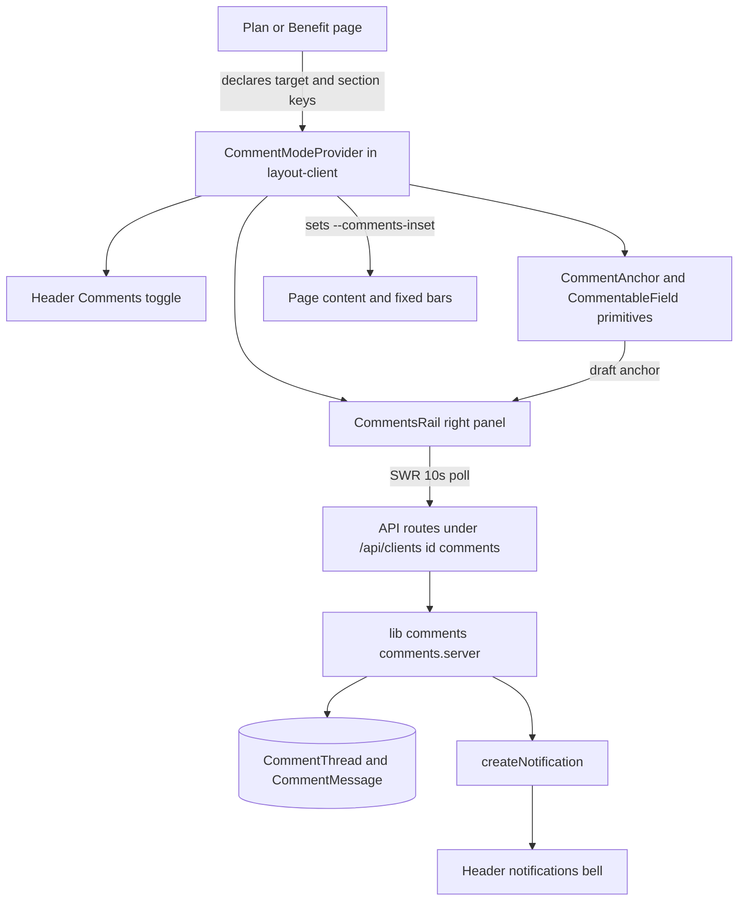

# Plan & Benefit Comments (Figma-style)

## Goal

Let every teammate who can view a Plan or Benefit leave threaded comments anchored to a
section (or a selected text range) of that Plan/Benefit workflow, read and reply to those
threads in a right-hand panel, and toggle a Comments on/off mode from the app header.

Applies to Plan Create/Edit/Draft and Benefit Create/Edit/Draft.

## Confirmed decisions

| # | Decision | Choice |
|---|----------|--------|
| 1 | Surfaces | Persisted rows only, **including Drafts**. In Create, the toggle unlocks once a draft row exists. |
| 2 | Anchor precision | **Section-level + free text-range selection** (Figma-style). |
| 3 | Who can comment | Implicit for anyone with **at least View** on the plan/benefit, **including Collaborators**. |
| 4 | Sync + notifications | **~10s polling** while the page is open, **header-bell notifications** on new threads/replies, and **@mentions** that notify the mentioned teammate. |

## Architecture overview



## Data model (Prisma)

Two models. Threads point at a `Client` (the plan) plus an optional benefit category, so a
thread survives a Benefit row being re-saved. Authors are `User` rows because every
commenter (owner or teammate login) has one.

```prisma
model CommentThread {
  id              String   @id @default(cuid())
  organizationId  String
  clientId        String
  targetType      String   // "plan" | "benefit"
  benefitCategory String?  // normalized key when targetType is benefit

  anchorKind String  // "section" | "text"
  sectionKey String  // "company" | "disclaimers" | "benefit:faqs" ...
  fieldKey   String? // for text anchors
  rangeStart Int?    // selectionStart
  rangeEnd   Int?    // selectionEnd
  quote      String? // selected text, for display and re-location

  resolvedAt       DateTime?
  resolvedByUserId String?
  createdByUserId  String
  createdAt        DateTime @default(now())
  updatedAt        DateTime @updatedAt

  messages CommentMessage[]

  @@index([organizationId, clientId])
  @@index([clientId, benefitCategory])
  @@index([clientId, resolvedAt])
}

model CommentMessage {
  id           String    @id @default(cuid())
  threadId     String
  authorUserId String
  body         String
  mentions     String[]  @default([]) // parsed at write time
  deletedAt    DateTime?
  createdAt    DateTime  @default(now())
  updatedAt    DateTime  @updatedAt

  thread CommentThread @relation(fields: [threadId], references: [id], onDelete: Cascade)

  @@index([threadId, createdAt])
}
```

- Real relation to `Client` with `onDelete: Cascade` so deleting a plan removes its threads.
- A benefit's threads are keyed by `clientId + benefitCategory`; the benefit hard-delete
  path (`purgeDraftBenefit` / benefit DELETE `purge=1`) removes that category's threads.
- Deletion helpers to update: `lib/delete-client-scoped-data.ts`,
  `lib/delete-user-plans-and-scoped-data.ts`, and the benefit purge path.

## Anchor contract

DOM coordinates are deliberately avoided. Every commentable region renders
`data-comment-anchor="{sectionKey}"`; text anchors carry field + range + quote.

- **Section anchor:** `{ anchorKind: "section", sectionKey }`. Highlight the whole region,
  pin it in the section margin, open a thread from the section affordance.
- **Text anchor:** `{ anchorKind: "text", sectionKey, fieldKey, rangeStart, rangeEnd, quote }`.
  - Inputs/textareas: capture `selectionStart/selectionEnd` in `CommentableField`.
  - Rendered copy: capture the selected string plus its field/section for re-location.
  - Highlight rendering: a mirrored overlay div under a transparent input/textarea for form
    fields, and a text-node wrapper for static copy. The stored `quote` validates the range
    still matches before highlighting.

A `CommentAnchor` primitive wraps a region; a `CommentableField` primitive wraps a single
field. Both are no-ops when comments mode is off, so the clean view is untouched.

## Server module and API

`lib/comments/comments.server.ts`:

- `listCommentThreads({ organizationId, clientId, benefitCategory? })`
- `createCommentThread({ organizationId, userId, clientId, benefitCategory?, anchor, body })`
- `addCommentMessage({ organizationId, userId, threadId, body })`
- `setCommentThreadResolved({ organizationId, userId, threadId, resolved })`
- `deleteCommentMessage({ organizationId, userId, messageId })`
- `deleteCommentThread({ organizationId, userId, threadId })`
- `resolveCommentAccess({ userId, clientId, category? })` wrapping
  `resolvePlanAccess` at `level: "view"` with no function row (implicit by view).

Mentions and notifications:

- `parseMentions(body)` matches `@name` against organization members that can access the plan.
- `notifyCommentEvent(...)` calls the existing
  `createNotification({ type, title, body, href, actorUserId })` for:
  - `comment_mention` — each mentioned teammate (excluding the author).
  - `comment_reply` — prior thread participants (excluding the author).
  - `comment_thread_created` — the plan owner (excluding the author).
- `href` deep links: `/edit-client/{clientId}?comment={threadId}` and
  `/edit-benefit/{clientId}/{categorySlug}?comment={threadId}`.

Routes (all scoped by session + organization + `resolvePlanAccess` view):

- `app/api/clients/[id]/comments/route.ts` — GET list (`?category=`), POST create thread.
- `app/api/clients/[id]/comments/mentionable/route.ts` — GET mention candidates.
- `app/api/comments/threads/[threadId]/route.ts` — PATCH resolve/reopen, DELETE thread.
- `app/api/comments/threads/[threadId]/messages/route.ts` — POST reply.

## Client architecture

- `CommentModeProvider` mounted in `components/layout/layout-client.tsx`:
  - `mode: "off" | "on"`, `activeThreadId`, `draftAnchor`, `target` (surface descriptor).
  - Reads `target` from a `useCommentSurface()` hook the Plan/Benefit pages call; the toggle
    only renders when a target exists.
- `useCommentThreads(clientId, category)` — SWR keyed by target, `refreshInterval: 10000`
  while mode is on and the document is visible, optimistic create/reply/resolve.
- `useCommentsLayout(isOpen)` — mirror of `lib/preview-editor-layout.ts`: sets
  `--comments-inset` on the document root and dispatches an event so fixed bars clear the rail.
- Toggle: header icon button beside the notifications bell, `aria-pressed`, tooltip
  "Comments on/off", persisted per user (and remembered per plan) in localStorage, plus a
  keyboard shortcut. Default OFF.
- `CommentsRail`: fixed right panel, ~22rem, under the header:
  - Header: title, open/resolved filter, resolve-all.
  - Thread cards: section label, anchor quote, author avatar, relative time, reply composer,
    resolve/reopen, delete (author or owner/admin).
  - Selecting a thread scrolls to and highlights its anchored section; clicking a highlighted
    section scrolls to its thread.
  - Reply composer with `@mention` autocomplete from the mentionable list.

## Layout integration

`--comments-inset` mirrors the existing `--editor-inset` contract. On open:

- Page content wrappers get `paddingRight: var(--comments-inset, 0px)`.
- Fixed bottom action bars in Edit Plan, Edit Benefit, and the wizards subtract it from
  their width so the rail never covers the Save bar.

## Permissions

Commenting is implicit by View (decision 3). Proposed moderation rules:

- Any viewer may create threads and reply.
- A message author may delete their own message.
- A thread author, a plan owner, or an org Owner/Admin may resolve/reopen or delete a thread.
- Enforcement lives in `comments.server.ts`; the UI only mirrors it.

## Surfaces to instrument

| Surface | File | Section keys |
|---------|------|--------------|
| Edit Plan | app/(dashboard)/edit-client/[id]/page.tsx | company, preview, contacts, documents, disclaimers |
| Create Plan | app/(dashboard)/new-client/page.tsx | wizard steps 1-5, unlocked after Draft save |
| Edit Benefit | app/(dashboard)/edit-benefit/[planId]/[category]/page.tsx | preview, contacts, faqs, scoped by category |
| Create Benefit | app/(dashboard)/new-benefits/page.tsx | wizard steps 1-5, unlocked once the Benefit row exists |

Draft unlocking: the page supplies a target only when a persisted id exists. Until then the
toggle is shown disabled with a "Save a draft to comment" tooltip.

## Edge cases

- Plan deleted → cascade delete of its threads and messages.
- Benefit hard-deleted → delete that category's threads.
- Account deleted → `authorUserId` is a plain scalar; render a "Removed user" fallback.
- Anchor drift: if a section key is no longer rendered, the thread still lists in the rail
  under an "Unanchored" group rather than disappearing.
- Text quote no longer matches → show the stored quote without inline highlighting.

## Phases

1. Data and server: models, migration, `comments.server.ts`, notifications, API routes.
2. Client shell: provider, `useCommentsLayout`, header toggle, empty rail, polling hook.
3. Anchoring: `CommentAnchor`, `CommentableField`, section highlights and pins.
4. Text ranges: selection capture and highlight overlays.
5. Instrument the four surfaces; wire draft unlocking.
6. Mentions, filters, moderation, polish, verification.
