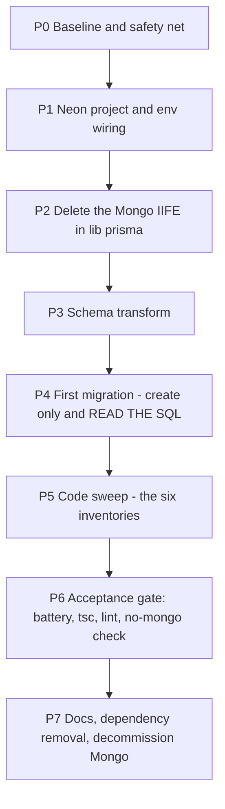

# MongoDB → PostgreSQL (Neon) migration — plan

**Goal:** move the whole app off MongoDB onto PostgreSQL hosted on Neon, via Prisma's
`postgresql` provider, before the MVP launch. Data is disposable: the Mongo database is
replaced, not migrated.

**Acceptance:** the existing 10-suite verification battery green on Postgres, `tsc` and lint
clean, and zero remaining Mongo coupling in the tree.

**Why now:** the migration is a *code* refactor, not a data migration. With no live users
there is no ETL, no dual-write, no backfill and no downtime window — and the 10-suite battery
([`plans/teammates-module-qa-checklist.md`](./teammates-module-qa-checklist.md)) is the test
oracle that makes a schema change of this size safe to attempt.

---

## 1. Locked decisions

| Decision | Choice | Why |
|---|---|---|
| Host | Neon (serverless Postgres) | No ops; **DB branching** gives a branch DB per preview deploy; region-selectable |
| Client | Prisma, provider `postgresql`, v5.22 (already pinned) | No client API changes — 135 importing files are untouched |
| Data | **Discarded.** No ETL, no backfill, no dual-write | No users; an ETL would be the single largest source of bugs |
| Ids | `cuid()` strings | ObjectId-shaped ids are deliberately **not** preserved (see §5) |
| Sequencing | **Port first, simplify second** | A port and a redesign in one change doubles the debugging surface |
| Semantics | Identical to today for the whole port | Any behaviour change is a follow-up, not part of the port |

### The correction that lowers the risk

An earlier assessment flagged "delete ordering" as a top risk. **It is not.** Prisma already
enforces required relations *in the client* even on MongoDB — that is why
[`lib/delete-client-scoped-data.ts:7`](../lib/delete-client-scoped-data.ts:7) says *"Required
relations are enforced by Prisma, so `prisma.client.delete*` throws (P2014) while any child row
still points at the client"*, and why
[`app/api/clients/[id]/route.ts:1316`](../app/api/clients/[id]/route.ts:1316) deletes Benefits
before the Client.

So the child-first ordering everywhere in this codebase is **already correct and already
tested**, and the port adds **no new foreign keys** — every relation is already declared on
both sides (Prisma's MongoDB connector requires it; see
[`prisma/schema.prisma:1145`](../prisma/schema.prisma:1145)). The port promotes an
application-level guarantee to a database-level one. That is the main thing it buys.

---

## 2. Work estimates from the actual inventory

| Coupling | Count | Effort |
|---|---|---|
| Files importing `prisma` | 135 | **Zero** — client API identical |
| `@db.ObjectId` | 54 | Delete the attribute; **no TS type change** (already `string`) |
| `@map("_id")` + `@default(auto())` | ~55 models | Mechanical |
| `Json` fields | 33 | **Zero** — `jsonb` verbatim |
| `String[]` fields | 16 | **Zero** — native; but 4 *indexes* need `type: Gin` |
| Files importing the `mongodb` driver | 22 (20 static + 2 dynamic) | Rewrite or delete |
| **Shape guards** (`ObjectId.isValid` + 24-hex regex) | **86 sites, 30 files** (measured — see §P5a) | **The real work — and the real risk** |
| `new ObjectId(x)` coercions | 13 | Mostly hidden behind `as any` — **invisible to `tsc`** |
| `{ field: null }` + `isSet: false` | 6 sites | `tsc` finds all six |
| Mongo-only scripts | 4 | Delete |

---

## 3. Phases



### P0 — Baseline and safety net

1. Record the current query counts before touching anything, so the port has a
   before/after number: temporarily log Prisma queries
   (`new PrismaClient({ log: ['query'] })` in [`lib/prisma.ts:41`](../lib/prisma.ts:41)) and
   count them for `/dashboard`, `/edit-client/[id]`, and `GET /api/clients/[id]?forPortal=1`.
2. Confirm the battery is green on Mongo and note the assertion totals
   (`verify-backfill` 7, T1 24, T2 35, T2a 25, T3 53, T4 62, T5 38, T6 35, T7 26, T9 41).
3. Branch: `git checkout -b chore/postgres-migration`.
4. Preserve the Mongo connection string outside the app (e.g. a local `.env.mongo.bak`, not
   committed) **and do not delete the Mongo cluster until P6 is green.** Rolling back means
   restoring one env var, so keep that option alive until the end.

### P1 — Neon project and env wiring  *(started — `.env` already points at Neon)*

**Status:** [`DATABASE_URL`](../.env:6) now targets the Neon **pooler** host
(`ep-solitary-bird-b42bu3dv-pooler.c-6.us-east-2.aws.neon.tech`). That is the right host for
the app. Three things are still missing.

1. **Add the Prisma pooler flags** to `DATABASE_URL`:

   ```
   ?sslmode=require&pgbouncer=true&connect_timeout=15
   ```

   `pgbouncer=true` is the important one: it is Prisma-specific and disables prepared
   statements, which Neon's PgBouncer in transaction mode cannot support. Dropping
   `channel_binding=require` is optional — it is a libpq concept and Prisma's Rust connector
   does not use libpq — but it means nothing here either.

2. **Add `DIRECT_URL`** — the same hostname **without** the `-pooler` segment, which is the
   unpooled endpoint migrations must use:

   ```dotenv
   DATABASE_URL=postgresql://neondb_owner:<password>@ep-solitary-bird-b42bu3dv-pooler.c-6.us-east-2.aws.neon.tech/neondb?sslmode=require&pgbouncer=true&connect_timeout=15
   DIRECT_URL=postgresql://neondb_owner:<password>@ep-solitary-bird-b42bu3dv.c-6.us-east-2.aws.neon.tech/neondb?sslmode=require
   ```

   Only the `-pooler` segment differs. Both come from the same Neon project.

3. **Update Vercel as well — in *both* projects.** [`.env`](../.env:20) states it plainly:
   *"Vercel does NOT read this file for deployments — it uses each project's dashboard
   environment."* And [line 28](../.env:28) says `DATABASE_URL` is shared between dev and
   production. So this edit fixes **local `next dev` only**; `plantel.pro` and
   `dev.plantel.pro` keep running against MongoDB until `DATABASE_URL` **and `DIRECT_URL`**
   are set in both Vercel projects. That is the risk-register item "stale URL in a hosting
   dashboard", and it is confirmed as a two-place change. `.env` is gitignored
   ([`.gitignore:35`](../.gitignore:35)), so the dashboard is the only home for deployed
   values.

4. **Region.** The Neon endpoint is `us-east-2` (Ohio). Set the Vercel functions to `cle1`
   (Cleveland) if the plan allows choosing, otherwise `iad1` (Washington DC). Region pairing
   matters more than any engine difference here — a cross-region hop erases every read gain
   this migration produces.

5. `datasource db` becomes:

```prisma
datasource db {
  provider  = "postgresql"
  url       = env("DATABASE_URL")
  directUrl = env("DIRECT_URL")
}
```

6. Migrations must use `directUrl`. `prisma migrate deploy` in CI/prod; `migrate dev`
   locally. Stop using `prisma db push`.

7. **Expect a deliberate local outage between now and P4.** With `.env` pointing at Postgres
   and [`prisma/schema.prisma:7`](../prisma/schema.prisma:7) still declaring
   `provider = "mongodb"`, the already-generated client will reject the URL (`the URL must
   start with the protocol mongodb://`). So `next dev`, every `scripts/teammates/*` command
   and the whole verify battery will fail loudly until P3 regenerates the client. **That is
   expected, not a mistake** — do not revert `.env`, and do not run the battery between P1
   and P4.

8. Note: `.env` parsing in [`scripts/teammates/shared.ts:16`](../scripts/teammates/shared.ts:16)
   handles a URL containing `=` and `&` correctly (it captures the whole remainder of the
   line), so the pooler query string is safe for the battery scripts.

### P2 — Delete the Mongo IIFE (do this first, it is a hard blocker)

[`lib/prisma.ts`](../lib/prisma.ts:14) reads `.env` by regex and **refuses any `DATABASE_URL`
that does not start with `mongodb`** — it logs a warning and then keeps the previous value.
On Postgres that silently points the app at the wrong database.

- Delete lines 5–34 (`ensureMongoUrl`) and the `fs`/`path` imports it needs.
- Keep the singleton + HMR reuse logic (lines 36–75); it is provider-agnostic and still
  needed.
- Result: a short module that constructs `new PrismaClient()` once.

### P3 — Schema transform

All mechanical. In [`prisma/schema.prisma`](../prisma/schema.prisma:1):

1. `provider = "mongodb"` → `"postgresql"`, add `directUrl` (§P1).
2. Delete every `@db.ObjectId` (54) and `@map("_id")` (~55).
3. `@default(auto())` → `@default(cuid())` (~55).
4. `String[]` **indexes** need an operator class — a B-tree cannot index `text[]`:

| Model | Index | Becomes |
|---|---|---|
| `WizardServices` | `@@index([services])` | `@@index([services], type: Gin)` |
| `WizardInsuranceLicensing` | `@@index([licenseTypes])` | `type: Gin` |
| `WizardInsuranceLicensing` | `@@index([statesLicensed])` | `type: Gin` |
| `WizardBenefitTypes` | `@@index([benefitTypes])` | `type: Gin` |

5. **Change nothing else.** Leave all 33 `Json` fields as `Json`, leave every relation,
   index and default as-is. In particular do **not** add `@unique` to `Client.slug` yet
   (§7).

### P4 — First migration: generate, read, then apply

```
npx prisma migrate dev --create-only --name init
```

**Read the generated SQL before applying it.** This is the one step whose output cannot be
predicted from the schema, because it contains the referential actions.

- Prisma's defaults are `Restrict` for required relations and `SetNull` for optional ones.
  Those match what Prisma already emulates today, so accept them unless you consciously
  choose otherwise.
- Spot-check the ones with real consequences: `Document.clientId` (required → Restrict),
  `Meeting.clientId` (optional → SetNull), `Video` (already declares `onDelete: Cascade` on
  both `plan` and `client`), and `Client.userId` (required → Restrict).
- Then `prisma migrate dev` to apply, and `prisma generate`.

### P5 — Code sweep

Six inventories. **Work from these lists, not from `tsc`** — `tsc` catches only one of the
six, because the dangerous sites are either runtime branches or hidden behind `as any`.

#### A. Shape guards — 86 sites in 30 files — the highest risk

> **Measured, not estimated.** The figure the first draft carried (~29 sites / ~20 files) was
> wrong by a factor of three, and the reason is worth keeping: the inventory grep was run with
> `file_pattern: *.ts`, so **every `.tsx` was invisible to it**. Twelve of the 24-hex guards
> live in `components/` — the client-side "is this a real persisted document id, or a local
> temp id?" checks. `npm run check:no-mongo` is now the authority; its output is the worklist,
> and it is why the gate was built before the sweep was finished rather than after.

These use "does this look like an ObjectId?" as a **routing decision**:

```ts
const isObjectId = ObjectId.isValid(clientId);
const client = await prisma.client.findFirst({
  where: isObjectId ? { id: clientId } : { slug: clientId },
});
```

A `cuid` is not 24 hex chars, so `isObjectId` is `false`, the lookup takes the slug branch,
returns `null` — and the user sees **"You don't have access to this plan/section"** or a 404.
No exception, no log. Silent authorization failure.

| File | Sites |
|---|---|
| [`lib/portal-access.ts`](../lib/portal-access.ts:60) | `isValid` ×2 — **the employee portal entry point** |
| [`app/api/clients/[id]/route.ts`](../app/api/clients/[id]/route.ts:119) | `isValid` ×3 (GET, PUT, DELETE) + 24-hex ×2 |
| [`app/api/webinars/[id]/route.ts`](../app/api/webinars/[id]/route.ts:70) | `isValid` ×4 |
| [`lib/teammates/access.server.ts`](../lib/teammates/access.server.ts:233) | 24-hex ×1 — **`loadPlanRow`, the T2 authorization core** |
| [`lib/teammates/plan-guard.server.ts`](../lib/teammates/plan-guard.server.ts:89) | 24-hex ×1 |
| [`lib/plan-contact-form-topics.ts`](../lib/plan-contact-form-topics.ts:75) | 24-hex ×1 |
| [`lib/map-plan-documents-for-benefit-hub.ts`](../lib/map-plan-documents-for-benefit-hub.ts:74) | 24-hex ×1 |
| [`app/api/clients/[id]/slugs/route.ts`](../app/api/clients/[id]/slugs/route.ts:18), [`benefits/route.ts`](../app/api/clients/[id]/benefits/route.ts:40), [`benefits/[category]/route.ts`](../app/api/clients/[id]/benefits/[category]/route.ts:61) | `isValid` ×3 |
| [`app/api/videos/route.ts`](../app/api/videos/route.ts:136) | `isValid` ×2 + 24-hex ×1 |
| [`app/api/videos/get-detail-video/route.ts`](../app/api/videos/get-detail-video/route.ts:32), [`get-by-placement/route.ts`](../app/api/videos/get-by-placement/route.ts:8), [`generate-from-previews/route.ts`](../app/api/videos/generate-from-previews/route.ts:219), [`create-video/route.ts`](../app/api/create-video/route.ts:106) | `isValid` ×5, 24-hex ×1 |
| [`app/api/webinars/bulk-delete/route.ts`](../app/api/webinars/bulk-delete/route.ts:33), [`app/api/marketing/assets/public/route.ts`](../app/api/marketing/assets/public/route.ts:12), [`app/api/documents/[id]/view/route.ts`](../app/api/documents/[id]/view/route.ts:43) | `isValid` ×1, 24-hex ×2 |

**The fix deletes the branch rather than porting it.** These guards exist to avoid a Mongo
`P2023 Malformed ObjectID` error on an invalid id — an error Postgres cannot raise. So:

```ts
const client = await prisma.client.findFirst({
  where: { OR: [{ id: clientId }, { slug: clientId }] },
});
```

`OR` on an indexed PK plus an indexed slug is cheap, and this is the form
[`lib/organization.ts:172`](../lib/organization.ts:172) already uses. Consider one shared
`resolveClientByIdOrSlug()` helper so the pattern exists once.

#### B. `new ObjectId(x)` coercions — 13 sites, mostly invisible to `tsc`

These exist because Mongo rejected a plain string for an `@db.ObjectId` field. They are
usually written `new ObjectId(plan.id) as any` — and **the `as any` is why the compiler will
not flag them**.

[`app/api/plans/create-plan-with-images/route.ts`](../app/api/plans/create-plan-with-images/route.ts:184) (×2),
[`create-plan/route.ts`](../app/api/plans/create-plan/route.ts:495),
[`update-plan/route.ts`](../app/api/plans/update-plan/route.ts:74),
[`sync-static-video/route.ts`](../app/api/plans/sync-static-video/route.ts:41),
[`delete-plan/route.ts`](../app/api/plans/delete-plan/route.ts:28),
[`create-video-template/route.ts`](../app/api/create-video-template/route.ts:103),
[`create-video/route.ts`](../app/api/create-video/route.ts:226),
[`videos/route.ts`](../app/api/videos/route.ts:137) (×2),
[`get-detail-video/route.ts`](../app/api/videos/get-detail-video/route.ts:33),
[`generate-from-previews/route.ts`](../app/api/videos/generate-from-previews/route.ts:452).

Fix: pass the string, drop the cast. Removing `as any` is the point — it restores type
checking on those call sites.

#### C. Id generation and dynamic driver imports

- `new ObjectId().toHexString()` in
  [`app/api/marketing/flyers/render/route.ts:109`](../app/api/marketing/flyers/render/route.ts:109)
  — generates a **new** flyer id. Replace with the project's cuid generator.
- `const { ObjectId } = await import("mongodb")` inside conditionals in
  [`app/api/videos/route.ts:135`](../app/api/videos/route.ts:135) and
  [:173](../app/api/videos/route.ts:173), and
  [`get-detail-video/route.ts:31`](../app/api/videos/get-detail-video/route.ts:31) — runtime-only
  failures that no compiler step will reveal.

#### D. The `isSet` idiom — 6 sites, all found by `tsc`

`{ field: null }` + `{ field: { isSet: false } }` collapses to `{ field: null }`. `isSet` is
Mongo-only, so `tsc` fails on each one — this inventory maintains itself:

| File | Line |
|---|---|
| [`lib/organization.ts`](../lib/organization.ts:145) | 145 |
| [`lib/auth-options.ts`](../lib/auth-options.ts:215) | 215 |
| [`lib/teammates/profiles.server.ts`](../lib/teammates/profiles.server.ts:99) | 99, 566 |
| [`lib/teammates/invites.server.ts`](../lib/teammates/invites.server.ts:771) | 771 |
| [`scripts/teammates/backfill-organizations.ts`](../scripts/teammates/backfill-organizations.ts:44) | 44 |

#### E. The 4 Mongo-only scripts — delete or replace

| Script | Fate |
|---|---|
| [`scripts/teammates/check-schema.ts`](../scripts/teammates/check-schema.ts:64) | Delete — `prisma migrate` + `information_schema` replace it |
| [`scripts/teammates/apply-indexes.ts`](../scripts/teammates/apply-indexes.ts:90) | Delete — indexes come from migrations |
| [`scripts/repair/apply-partial-unique-indexes.ts`](../scripts/repair/apply-partial-unique-indexes.ts:25) | Delete — the `partialFilterExpression` workaround has no Postgres equivalent because it is *unnecessary* |
| [`scripts/migrate-user-organization-type.ts`](../scripts/migrate-user-organization-type.ts:21) | Retire (a one-off that has already run) |

Also remove `npm run teammates:indexes` / `teammates:check-schema` from
[`package.json`](../package.json:18), and drop the `"mongodb": "^6.8.0"` dependency
([`package.json:99`](../package.json:99)) once the 22 importing files are clean.

#### F. `Json` null semantics — check, do not assume

Postgres distinguishes SQL `NULL` from the JSON value `null` (`Prisma.DbNull` vs
`Prisma.JsonNull`); MongoDB does not. Grep for writes of `null` into the 33 `Json?` fields.
Because there is no data to correct, this is a forward-correctness question only — but it is
the one semantic difference a green test suite will not necessarily catch.

### P6 — Acceptance gate

1. `npx prisma migrate reset` then `migrate deploy` on a clean database.
2. Re-run the full battery — `verify-backfill` plus T1, T2, T2a, T3, T4, T5, T6, T7, T9 —
   and `tsc --noEmit` and `npm run lint`.
3. **Add a mechanical completeness check** so the port cannot be 95% done: a
   `npm run check:no-mongo` script that fails on any remaining `@db.ObjectId`, `isSet`,
   `$runCommandRaw`, `MongoClient`, `from "mongodb"`, or `new ObjectId(` in the tree. This
   turns "I think I got them all" into a fact.
4. Smoke-test, working from the guard coverage map in §5. The battery reaches only 2 of the
   ~20 guarded files, so each of these exercises a shape guard the automated suites do not:
   - sign up → finish onboarding → create a plan (covers the plan-creation ObjectId coercions)
   - publish a portal, then open it **anonymously** ([`lib/portal-access.ts`](../lib/portal-access.ts:60))
   - GET, edit, rename and delete that plan **by id** (`clients/[id]` and its `slugs` route)
   - open Edit Benefit for one category (`clients/[id]/benefits/[category]`)
   - upload a document, then **view** it (`documents/[id]/view`)
   - open and delete a webinar (`webinars/[id]`, `webinars/bulk-delete`)
   - open a plan video (`videos/*`)
   - generate a marketing flyer (`marketing/flyers/render`)
   - open the contact form and a benefits hub (`plan-contact-form-topics`,
     `map-plan-documents-for-benefit-hub`)
   - accept a collaborator invite end to end (T9 — the one flow with its own public page)
5. Only now: decommission the Mongo cluster and remove the backup env var.

### P7 — Docs

- A new section in [`docs/teammates-module.md`](../docs/teammates-module.md:1), and rewrite
  §7.2 / §7.3 / §7.7, which document MongoDB-specific problems that no longer exist:
  the `dup key: { slug: null }` trap, the `null`-vs-absent filter semantics, and the
  fixture-sweep raw-command trips. Those sections become history, not guidance.
- Update [`plans/teammates-module-qa-checklist.md`](./teammates-module-qa-checklist.md):
  the pre-flight battery line for `verify-backfill` ("every User has an organizationId")
  still matters — the teammate models stay scalar, see §7.
- Record the before/after query counts from P0.

---

## 4. Deliberately out of scope

These are real improvements that are **not** part of the port. Doing them here would mean a
green battery could not tell you which change broke something.

1. **`Client.slug` → `String? @unique`.** Postgres treats NULLs as distinct in a unique
   index, so the trap that forced slug uniqueness into
   [`PortalSlug`](../prisma/schema.prisma:1120) and produced the partial-index script simply
   does not exist. This is the single cleanest win available — and it is a *design* change,
   so it lands after the port is green.
2. **Foreign keys for the teammate models.** `Organization.ownerUserId`,
   `TeammateProfile.organizationId`, `PlanAssignment.profileId` / `clientId` are plain
   scalars by explicit design ([schema:1145](../prisma/schema.prisma:1145)) because MongoDB
   forced it. Postgres would make them real FKs, which would retire a chunk of
   [`verify-backfill`](../scripts/teammates/verify-backfill.ts:66)'s job. **Highest-value
   follow-up**, but it changes every teammate write path — keep it separate.
3. **Removing the hand-rolled cascades.** Once FKs exist,
   [`lib/delete-client-scoped-data.ts`](../lib/delete-client-scoped-data.ts:1) and
   [`lib/delete-user-plans-and-scoped-data.ts`](../lib/delete-user-plans-and-scoped-data.ts:1)
   could be replaced by `onDelete: Cascade`. Only after the port is proven.
4. **Stale-workaround cleanup.** The comment at
   [`app/api/clients/[id]/route.ts:1306`](../app/api/clients/[id]/route.ts:1306) — "Delete
   webinars outside the transaction (raw command + MongoDB transactions can conflict)" —
   describes a hazard that stops existing. Delete the comment and reconsider the split.
5. **`Webinar.videoFileUrl`.** Multi-MB base64 in a text column is the one place Postgres
   will be measurably *slower* than Mongo (TOAST compression on every read and write). Move
   those payloads to R2 after launch.
6. **The ~300 `userId` → `organizationId` call sites.** Already tracked as
   [docs §10.1](../docs/teammates-module.md:1309). Orthogonal T1 debt — owed on either
   engine, so not part of this decision.

---

## 5. Id strategy — decided: `cuid()`

The choice is separable from the shape-guard problem, and separating the two is what makes
this decision easy.

### The key insight

The ~29 shape guards are not a consequence of the id format. They are a workaround for a
Mongo `P2023 Malformed ObjectID` error that Postgres cannot raise. Replacing each one with an
unconditional lookup:

```ts
where: { OR: [{ id: value }, { slug: value }] }
```

makes the id format **irrelevant to correctness**, because nothing inspects the value's shape
any more. So the question is not "which format keeps the guards working" — it is "delete the
guards, then choose the format on its own merits".

| Option | Shape guards | Verdict |
|---|---|---|
| **`cuid()`** | Deleted, replaced by `OR` | **Chosen** |
| `uuid()` (v4) | Deleted, replaced by `OR` | Passed over — index locality, below |
| Preserve 24-hex | Kept | Rejected — below |

### Why `cuid()` over `uuid()`

Both break every guard equally, so id length is not the differentiator. **Index locality** is.
Prisma's `cuid()` is v1 — timestamp-prefixed — so new ids sort near one another and inserts
land at the right-hand edge of the B-tree. `uuid()` is v4, uniformly random, so every insert
lands on an arbitrary leaf page, fragmenting the index and paying the fillfactor cost. At MVP
volumes this is a small effect, but it is free to avoid and it only gets worse. A time-ordered
UUID (v7) would match cuid, but that is not what Prisma's `uuid()` emits.

Note that `cuid()` ids are 25 characters, which means the `length !== 24` test in
[`app/api/videos/route.ts:118`](../app/api/videos/route.ts:118) belongs to the guard class
rather than being a separate concern.

### Why not preserve the 24-hex shape

This looks like the low-risk option — keep 24-hex ids and the guards keep returning `true` —
but it is weaker than it appears:

1. **It does not save the file count.** Those guards call `ObjectId.isValid()`, which lives in
   the `mongodb` package. Dropping the driver means replacing all 19 of those calls regardless
   (with a local `isObjectIdLike()` helper), so the same ~20 files change, the 10 hand-written
   regexes stay, and you either keep `mongodb` as a dependency or write a helper whose only
   purpose is to preserve a dead format.
2. **It preserves a latent bug.** A predicate meaning "looks like a Mongo id" is being used as
   "is an id", so a plan whose *slug* happens to be 24 hex characters resolves as an id
   instead of a slug. Vanishingly rare, but it is the wrong abstraction and it would outlive
   the reason for it.
3. **The risk it avoids is largely already covered.** The battery reaches only 2 of the ~20
   guarded files (map below), so a manual pass is required under *either* option. The format
   choice does not remove that requirement.

### The escape hatch, if QA disagrees

If the acceptance gate turns up a guard regression not worth chasing, the retreat is to
generate 24-hex ids in the database:

```prisma
id String @id @default(dbgenerated("substr(md5(random()::text), 1, 24)"))
```

Zero app changes, every guard preserved. Not chosen, because `md5(random())` is not monotonic
— it throws away the index locality that made `cuid()` preferable — and because it cements a
dead format into a brand-new schema. It is a one-line retreat, not a plan.

### Guard coverage map — this is what makes the smoke test non-optional

The battery reaches **two** of the guarded files. Everything else needs a manual path, which
is why P6 carries a specific list rather than a generic "smoke test".

| Guarded file | Reached by |
|---|---|
| [`lib/teammates/access.server.ts`](../lib/teammates/access.server.ts:233) (`loadPlanRow`, the T2 authorization core) | **Battery** — exercised on nearly every T2 assertion |
| [`lib/teammates/plan-guard.server.ts`](../lib/teammates/plan-guard.server.ts:89) | **Battery** — T2's `getAuthorizedClient` |
| [`lib/portal-access.ts`](../lib/portal-access.ts:60) | Manual — open a portal anonymously |
| [`app/api/clients/[id]/route.ts`](../app/api/clients/[id]/route.ts:119) | Manual — GET / PUT / DELETE a plan by id |
| [`app/api/clients/[id]/slugs/route.ts`](../app/api/clients/[id]/slugs/route.ts:18) | Manual — rename a plan |
| [`app/api/clients/[id]/benefits/route.ts`](../app/api/clients/[id]/benefits/route.ts:40) and `/[category]` | Manual — open Edit Benefit |
| [`app/api/documents/[id]/view/route.ts`](../app/api/documents/[id]/view/route.ts:43) | Manual — view a document |
| [`app/api/webinars/[id]/route.ts`](../app/api/webinars/[id]/route.ts:70) and `bulk-delete` | Manual — open and delete a webinar |
| [`app/api/videos/…`](../app/api/videos/route.ts:136) (route, detail, placement, previews) | Manual — open a plan video |
| [`app/api/marketing/flyers/render/route.ts`](../app/api/marketing/flyers/render/route.ts:109) | Manual — generate a flyer |
| [`lib/plan-contact-form-topics.ts`](../lib/plan-contact-form-topics.ts:75) | Manual — open the contact form |
| [`lib/map-plan-documents-for-benefit-hub.ts`](../lib/map-plan-documents-for-benefit-hub.ts:74) | Manual — open a benefits hub |
| [`app/api/marketing/assets/public/route.ts`](../app/api/marketing/assets/public/route.ts:12) | Manual — open a public asset link |

### Consequence for R2 keys

Keys are `org/{userId}/…`, and marketing-flyer keys embed a freshly generated 24-hex id
([`app/api/marketing/flyers/render/route.ts:109`](../app/api/marketing/flyers/render/route.ts:109)).
New ids mean new key shapes. Because every database object is being discarded, nothing
references the old keys — but the objects themselves stay in the bucket as orphans. Clearing
the bucket is optional tidy-up, never blocking.

---

## 6. Risk register

| Risk | Severity | Mitigation |
|---|---|---|
| A missed shape guard silently denies access | **High** — silent, and it looks like a permissions bug | Work from inventory A; the `check:no-mongo` script plus per-surface smoke tests |
| A missed `as any` ObjectId coercion writes garbage | Medium — a write-time error, usually loud | Inventory B is grep-based, not compiler-based |
| `lib/prisma.ts` keeps a stale URL | **High** — silent, whole app | P2 is the first code change |
| `pgbouncer=true` missing from the pooled URL | Medium — intermittent failures | §P1 item 2; migrations use `directUrl` |
| Neon cold starts make the app feel slower | Low | Region selection; consider a minimum compute size |
| Referential actions differ from Prisma's Mongo emulation | Low | P4's `--create-only` + read the SQL |
| Mongo cluster deleted too early | High | P0 keeps the backup env var; decommission only in P6 |

---

## 7. What the migration does *not* buy

Worth stating so it is not oversold later:

- **Not speed.** Per-request query counts drop (joins replace emulated multi-query
  `include`), which is what users feel — but raw point-read latency is a wash and cold
  starts may be worse.
- **Not integrity for the teammate models**, because those are scalars, not relations. The
  `verify-backfill` invariants stay app-enforced until §4.2 happens.
- **No user-visible change at all.** The payoff is migrations, real FKs on the `Client`
  relations, and the ability to fix N+1s cheaply.
