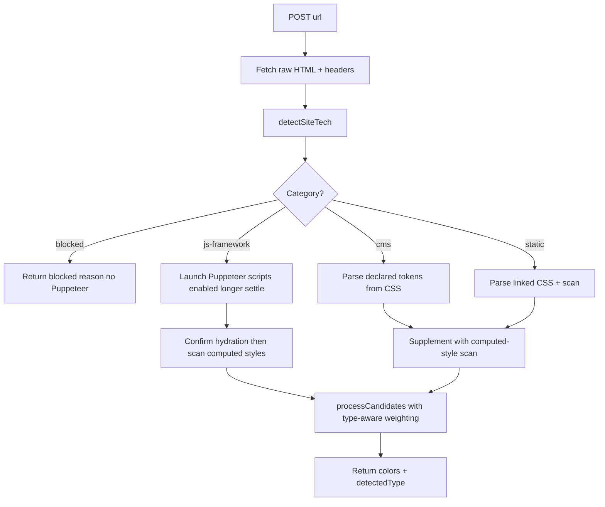

# Website Tech Detection & Per-Stack Color Extraction

## Objective

Make [`/api/extract-site-colors`](app/api/extract-site-colors/route.ts:675) detect **what kind of
site** it is dealing with first, then choose the extraction strategy that best
fits that site type — instead of always running one generic Puppeteer scan.

Site categories to classify:

1. **CMS / themed sites** — WordPress (incl. Elementor/Astra), Shopify,
   Squarespace, Wix, Webflow, HubSpot CMS, Ghost, Drupal, Joomla.
2. **JS / SPA frameworks** — Next.js, Nuxt/Vue, SvelteKit/Svelte, Remix,
   Gatsby, Astro, Angular, Vite / CRA.
3. **Static HTML/CSS** — no framework markers, simple served HTML.
4. **Blocked / unreachable** — WAF challenge, CAPTCHA, "Access Denied" (e.g.
   tesla.com), DNS failure, or empty body.

The detected type flows into the rest of the pipeline so the color candidates
are gathered from the most authoritative source for that stack.

## Detection signals

Two tiers, ordered by cost.

### Tier 1 — server-side raw HTML + headers (cheap, no browser)

Run before Puppeteer on the same fetched HTML/headers we already request:

| Site | Signal examples |
|------|-----------------|
| WordPress | `wp-content/`, `wp-includes/`, `<meta name="generator" content="WordPress">`, `wp-json`, `wp-` body classes |
| Elementor (on WP) | `elementor`, `--e-global-color-`, `data-elementor-type` |
| Astra (WP theme) | `--ast-global-color-` |
| Shopify | `cdn.shopify.com`, `myshopify.com`, `Shopify.theme` |
| Squarespace | `squarespace`, `static.squarespace.com` |
| Wix | `wixstatic.com`, `wix.com`, `X-Wix-Renderer` |
| Webflow | `webflow`, `w-webflow`, `webflow.io` |
| HubSpot CMS | `hs-scripts`, `hbspt`, `hubspot` |
| Ghost | `ghost`, `/ghost/`, `ghost-sdk` |
| Drupal | `drupal`, `/sites/default/files/` |
| Joomla | `Joomla`, `/templates/` |
| Next.js | `__NEXT_DATA__`, `/_next/static/`, `id="__next"` |
| Nuxt / Vue | `__NUXT__`, `data-server-rendered`, `data-v-` |
| SvelteKit / Svelte | `__sveltekit`, `data-sveltekit-`, sveltekit manifest |
| Remix | `__remixContext`, `_remixManifest` |
| Gatsby | `id="___gatsby"`, `gatsby` |
| Astro | `astro-island`, `data-astro-` |
| Angular | `ng-version`, `ng-app`, `<app-root>` |
| Vite | `/@vite/client`, `vite` |
| CRA / static React | `id="root"`, `/static/js/main.` |
| Static HTML | none of the above + standard `<link rel="stylesheet">` |
| Blocked | `Access Denied`, `Just a moment…`, CAPTCHA, Cloudflare challenge markers, empty body |

Also inspect response headers: `x-powered-by`, `server`, `x-generator`,
`x-shopify-stage` as supporting signals.

### Tier 2 — in-browser confirmation (only when Puppeteer runs)

After navigation, evaluate the page to confirm hydration state:

- `window.__NEXT_DATA__` (Next)
- `window.__NUXT__` (Nuxt)
- framework globals for SvelteKit / Remix / Gatsby / Angular.

This confirms the DOM is final before computed-style scanning and refines
Tier-1 confidence.

## Per-stack extraction strategy

| Detected type | Primary color source | Browser needed? |
|---------------|----------------------|-----------------|
| Elementor / Astra / Webflow / HubSpot / Shopify | Declared design tokens from inline + same-origin CSS (already partly done via `fetchPlatformGlobalColors`) | Supplement with Puppeteer computed styles |
| WordPress (no page builder) | `--wp--preset--color--*`, theme CSS variables, customizer CSS | Supplement with Puppeteer |
| JS frameworks | Full render with scripts enabled → computed styles of buttons/CTAs, nav, links, headings, SVG + CSS custom props | Required |
| Static HTML | Linked CSS parsed server-side + computed styles | Recommended, lightweight |
| Blocked / unreachable | None — short-circuit with explicit reason | Skip |

Current behavior note: scripts are already allowed (only image/media/font/
websocket are aborted), and `fetchPlatformGlobalColors` already performs a
server-side Elementor token pass. The new work formalizes this into an explicit
detection step that branches strategy.

## Proposed code structure

1. New server-only module [`lib/site-tech-detection.ts`](lib/site-tech-detection.ts:1)
   - `detectSiteTech(html, headers, url): SiteTechDetection`
   - Pure and unit-testable (no Puppeteer).
   - Returns:
     - `category`: `cms` | `js-framework` | `static` | `blocked`
     - `framework`: e.g. `wordpress`, `elementor`, `nextjs`, `sveltekit`, `static-html`
     - `confidence`: `high` | `medium` | `low`
     - `signals`: matched marker list (for debugging)
2. [`app/api/extract-site-colors/route.ts`](app/api/extract-site-colors/route.ts:675)
   - Fetch HTML/headers once, call `detectSiteTech`.
   - Add `detectedType` to the response `data`.
   - Branch:
     - `blocked` → return early with explicit reason, no Puppeteer launch.
     - `js-framework` → longer hydration settle + framework confirm + computed-style scan.
     - `cms` / `static` → token-priority scan + computed-style supplement.
3. [`lib/brand-color-extraction.ts`](lib/brand-color-extraction.ts:37) — extend
   `SiteColorResponse` with optional `detectedType` so callers/UI can show it
   (useful during rollout and debugging).

## Detection → extraction flow

## Open questions

- Should `detectedType` be exposed in the API response for UI/debug, or kept
  internal to the route only?
- Which site categories matter most for the product's actual client base
  (financial/benefits firms) so detection order/priority can be tuned?
- For JS frameworks, is the existing Puppeteer dependency acceptable to keep
  (vs. an HTML-only fast path where possible)?

## Work items

1. Create `lib/site-tech-detection.ts` with `detectSiteTech` + marker rules.
2. Add unit-style coverage for representative HTML fixtures per category.
3. Wire detection into `extract-site-colors` route and add `detectedType`.
4. Implement type-aware branching (blocked short-circuit, JS hydration confirm,
   CMS token priority).
5. Extend `SiteColorResponse` type and optionally surface type in UI.
6. Test against live sites per category (WordPress/Elementor, a Next.js site,
   a static site, and a blocked site such as tesla.com).
