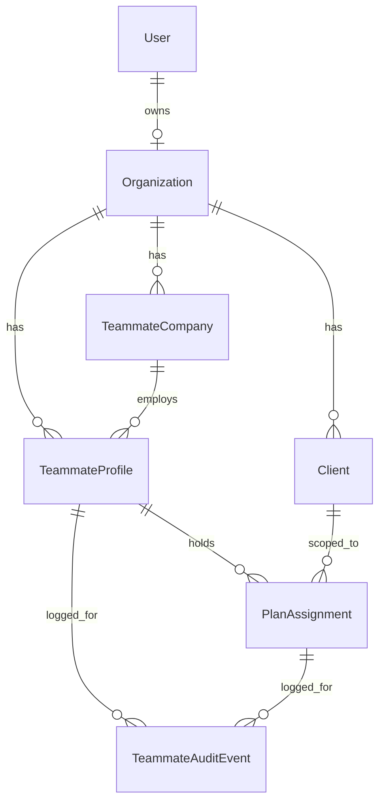

# Teammates Module — T1: Data Model: Profiles, Companies, Assignments

Source spec: `Team_Collaborator_Access_Developer_Spec (1).pdf`
Ticket: **T1** · Priority: Must Have · Status: Open
Sequence: T1 is foundation. Nothing else ships without T1 and T2.

---

## 1. Scope

T1 is backend only. The spec's Part A for T1 is explicitly "None. Backend only."

Deliverables:

1. A real `Organization` model (client decision: introduce now, additively) plus an
   `organizationId` anchor on `User` and `Client`.
2. Three new collections: `TeammateCompany`, `TeammateProfile`, `PlanAssignment`.
3. An audit collection `TeammateAuditEvent` (required by T2a and T6 acceptance criteria).
4. The canonical function-level permission-grid contract in `types/teammate.ts` plus its
   rules engine in `lib/teammates/permissions.ts`. T2a depends on this and explicitly
   states no schema change is needed for Custom roles, so the grid must exist by end of T1.
5. A scoped data-access layer under `lib/teammates/`.
6. A guard so partner companies never surface in the Plan Sponsor company picker.
7. An acceptance verification script.

---

## 2. Decisions already made

| Decision | Choice | Rationale |
|---|---|---|
| Org identity | Introduce a real `Organization` model now | Client decision. Plans will belong to it going forward. |
| Migration style | Additive only | `Client.userId` is the anchor for 300+ existing queries. Renaming it is out of scope for T1. |
| Login accounts | Store optional `loginUserId` on the profile; do NOT create accounts | Account creation belongs to T3/T4 invite flows. |
| Existing `Client.keyContacts` | Left untouched in T1 | Bridging legacy key contacts into profiles is T5/T7 work. |
| Permission set storage | JSON blob per assignment holding the FULL grid | Spec: "Store the full permission set on each assignment, never a reference to a preset." |
| Partner company exclusion | Enforced at the company picker API | Spec acceptance: "Partner companies never appear in Plan Sponsor search." |

---

## 3. Blast radius (why the refactor is additive)

`userId` currently doubles as the organization anchor in well over 100 route files. Notable
non-obvious couplings:

- R2 object keys are prefixed `org/{userId}/` and validated by prefix
  (`app/api/r2/signed-url/route.ts`, `app/api/r2/delete/route.ts`, `app/api/r2/presign-upload/route.ts`).
- R2 key builders receive `orgId: session.user.id`
  (`app/api/marketing/flyers/render/route.ts`, `app/api/files/upload/route.ts`).
- The JWT/session carries only `id` (`lib/auth-options.ts`).
- Public portal requests derive the owning advisor from `Client.userId` (`lib/portal-access.ts`).
- Middleware gates app routes on the JWT only (`middleware.ts`).

Therefore: add `organizationId` alongside `userId`, funnel all NEW teammate code through
`lib/organization.ts`, and track the legacy migration as debt (see §9).

---

## 4. Data model

### 4.1 Organization

- `id` ObjectId
- `name` — defaults to the owner's `organizationName`
- `ownerUserId` — the creating `User.id`
- `organizationEmail`
- `branding` — Json mirror of owner branding at creation time
- `createdAt`, `updatedAt`
- Index on `ownerUserId`

### 4.2 TeammateCompany — spec Part B item 2

Per spec: "Fields: name, logo, branding. Entity type: Partner/Provider. Must never appear in
Plan Sponsor pickers. One company can have many profiles."

- `organizationId`
- `name`
- `logo`
- `branding` Json
- `entityType` — Partner/Provider (stored as String union or enum; see §7)
- `createdAt`, `updatedAt`
- Index on `organizationId`; index on `organizationId + name` for reuse lookup

### 4.3 TeammateProfile — spec Part B item 1

Per spec: "Fields: name, job title, designation, email, phone, headshot, benefits specialty.
Type: Team Member or Collaborator. State: Contact, Invited, or Active. Linked Partner Company
is optional for Team Members."

- `organizationId`
- `loginUserId` (nullable) — global login link. Spec: "email links a profile to one global
  login. A person who collaborates with two User Organizations has two separate profiles and
  one login."
- `type` — TeamMember | Collaborator
- `state` — Contact | Invited | Active
- `firstName`, `lastName`
- `jobTitle`, `designations` String[]
- `email`, `phone`, `phoneExtension`
- `headshot`
- `benefitsSpecialty` String[]
- `companyId` (nullable) — partner company
- `allPlans` Boolean default false — spec Part B item 4: "Org-level All Plans flag on Team
  Member profiles. When set, an assignment is generated automatically for every new plan."
- `invitedByUserId`, `invitedAt`
- `createdAt`, `updatedAt`
- Index on `organizationId`; index on `organizationId + email`; index on `companyId`

### 4.4 PlanAssignment — spec Part B item 3

Per spec: "One record per person per plan."

- `organizationId`
- `profileId`
- `clientId` (the plan)
- `categoryScope` — All | Selected
- `categories` String[] — used when scope is Selected
- `role` — Owner | Admin | Editor | Viewer | Contributor | Reviewer | Custom
- `permissionSet` Json — the full function grid
- `showOnBenefitsHub` Boolean default true
- `invitedByUserId`, `invitedAt`
- `lastChangedByUserId`, `lastChangedAt`
- `createdAt`, `updatedAt`
- Unique compound index on `profileId + clientId`
- Index on `clientId`, index on `organizationId`

### 4.5 TeammateAuditEvent

Backs T2a "Log who set Custom access, when, and which warnings were confirmed" and T6 "Every
change is logged."

- `organizationId`
- `profileId` (nullable)
- `assignmentId` (nullable)
- `actorUserId`
- `action` — e.g. assignment_created, assignment_updated, role_changed, custom_access_set,
  assignment_removed, profile_deactivated, profile_deleted
- `warningsConfirmed` Json (nullable)
- `details` Json
- `createdAt`
- Index on `assignmentId`, index on `profileId`, index on `organizationId + createdAt`

---

## 5. Permission-grid contract (`types/teammate.ts`)

The spec's grid table lists these function rows with `No Access / View / Edit`, except
Benefits Hub Preview which is `No Access / View`:

1. Plan Details and Branding
2. Create Benefits — within category scope
3. Key Contacts
4. Documents
5. Meetings
6. Marketing
7. Video
8. Disclaimers / Compliance
9. Benefits Hub Preview
10. Publish — Not Allowed / Allowed
11. Invite Team or Collaborators — Not Allowed / Allowed
12. Delete — content, plans — Not Allowed / Allowed

The "What the invitee type allows" table adds two more functions:

13. Org Settings — No Access / View / Edit
14. Billing — No Access / View / Edit

Contract contents:

- `PersonType`, `ProfileState`, `AssignmentRole`
- `PermissionFunction` union of the 14 functions
- Access level unions: `TristateAccess`, `BinaryAccess`
- `TeammatePermissionSet` — record of function to level
- `PRESET_PERMISSION_GRIDS` — default grid per preset role
- `COLLABORATOR_LOCKED_FUNCTIONS` — Publish, Invite, Delete, Org Settings, Billing
- `TEAM_MEMBER_PLAN_SCOPES`, `COLLABORATOR_PLAN_SCOPES` — collaborator has no All Plans

## 6. Rules engine (`lib/teammates/permissions.ts`)

Spec T2a Part B:

- Auto-enforced, applied silently: Edit on a function turns on View for it; Delete requires
  Edit on the same function; Publish requires View on all categories in the plan plus View on
  Disclaimers.
- Hard blocks, cannot be overridden: Collaborators cannot be given Publish, Invite, Delete,
  Org Settings, or Billing, including by direct API call. All Plans is disabled when per-plan
  tabs are on.
- Soft warnings, user confirms and proceeds, checked per plan. The ten conditions and their
  warning strings are enumerated in the spec table on page 8.
- Save and audit: store full permission set per assignment, changing a preset must not alter
  Custom users, log who set Custom access, when, and which warnings were confirmed.

Exported surface should include at minimum:

- `getPresetGrid(role)`
- `applyAutoEnforcedRules(permissionSet)`
- `applyHardBlocks(permissionSet, personType)`
- `validatePermissionSet(permissionSet, personType)` returning violations
- `evaluateSoftWarnings(context)` returning the fired warnings
- `summarizePermissionSet(context)` producing the plan-aware summary line from spec T2a UI step 5

---

## 7. Prisma / MongoDB notes

- The datasource is MongoDB and the schema already uses enums (`AuthProvider`, `VideoStatus`),
  so enums generate today. T1.10 must still confirm the new enums generate cleanly.
- MongoDB does not support `@unique` on a compound index in the same way SQL does at the
  schema level in all Prisma versions. T1.10 must verify the `PlanAssignment(profileId, clientId)`
  compound unique index is accepted; if it is not, enforce one-assignment-per-person-per-plan
  in the data layer and document it.
- There are no SQL migrations here. Applying schema changes means `prisma generate` plus a
  schema push. Confirm the team's preferred command before running it.

---

## 8. Data-access layer

`lib/teammates/`

- `companies.server.ts` — find-or-create partner company by normalized name within an org
- `profiles.server.ts` — find by email within org, create profile, upgrade Contact to Invited
  to Active, link login, set/clear All Plans
- `assignments.server.ts` — upsert assignment, list assignments for a plan, list assignments
  for a profile, remove assignment, recompute access
- `audit.server.ts` — append audit events
- `index.ts` — barrel

Every function takes `organizationId` explicitly. No function may read the session.

`lib/organization.ts`:

- `resolveOrganizationId(userId)` — reads `User.organizationId`, backfilling if absent
- `requireOrgSession()` — returns `{ userId, organizationId }` or throws/returns unauthorized

---

## 9. Residual debt to record (not T1 work)

- Migrating the 300+ `userId` call sites to `organizationId`.
- R2 key prefix scheme migration from `org/{userId}/` to a stable org id. Note that changing
  this prefix invalidates existing object keys, so it needs a copy/alias plan.
- Portal owner resolution via `Client.organizationId`.
- Whether `Organization` should later hold membership and roles itself rather than
  `ownerUserId`.

---

## 10. Acceptance criteria (spec, verbatim intent)

Must be asserted by `scripts/teammates/verify-t1.ts`:

1. Jane holds assignments on three plans from one profile.
2. Editing Jane's profile in Org A does not change her profile in Org B.
3. Partner companies never appear in Plan Sponsor search.
4. Two collaborators from ABC Benefits share one company record.

---

## 11. Definition of done

- Schema updated, client generated, `organizationId` backfilled for existing users and plans.
- New signups always receive an Organization.
- Session carries `organizationId`.
- Permission-grid contract and rules engine exported and unit-checked.
- Data-access layer complete and org-scoped.
- Company picker excludes partner companies.
- Verification script passes all four acceptance criteria.
- Docs updated, debt recorded, T1 presented for review before T2 begins.
